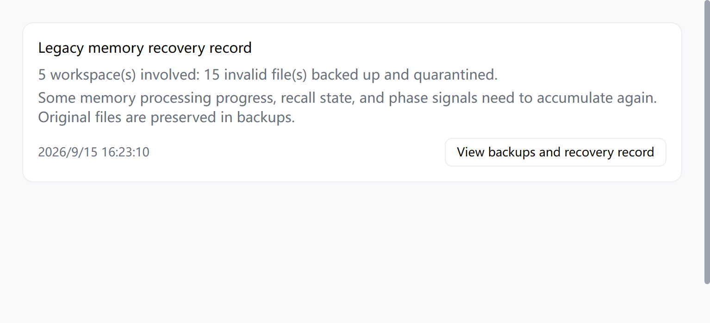

# 旧版 Memory Core JSON 导致网关启动失败修复设计文档

创建日期：2026-09-15。状态：已实现，定向验收通过。

## 1. 概述

### 1.1 问题

用户升级后出现 “OpenClaw gateway failed to start after 5 attempts”，多次重启和一键修复仍不能启动。

现场日志显示：5 个配置工作区中有 15 个旧版 Memory Core JSON 源文件无法解析，错误为 `SyntaxError: Unexpected non-whitespace character after JSON ...`。损坏最早出现在 2026-09-09 的应用 `2026.8.26` 日志中；升级到应用 `2026.9.14`、OpenClaw `v2026.8.1` 后，相关迁移失败成为启动阻断项。

```text
旧 memory/.dreams JSON 解析失败
→ Memory Core 迁移报告 warning，损坏源仍在
→ 启动检查拒绝 ready，进程退出码 1
→ LobsterAI 重复启动 5 次
→ 通用启动失败提示；一键修复重建配置仍无法消除坏源
```

### 1.2 根因与已有能力

触发终止的信息为：

```text
OpenClaw startup migrations did not complete cleanly; refusing to report the gateway ready.
```

日志包只有日志，没有原始 JSON，无法据此确认最初写坏文件的操作或重建全部历史状态。

设计前核对了 `release/2026.9.15` 的提交 `29afdb8f3bfb5a74dc2ae929b87e1768986f2f3d`。应用版本仍为 `2026.9.14`，固定运行时为 `v2026.8.1`。已有以下能力，但均未覆盖本次损坏源：

| 已有能力 | 范围及局限 |
| --- | --- |
| PR #2676 启动兼容恢复 | 处理 `plugins.bundledDiscovery` 旧配置及 `current_conversation_bindings` 旧列；可复用 helper、维护锁和恢复循环 |
| 启动前状态迁移 | auth profiles、device auth、device identity、exec approvals、workspace；不处理 dreaming JSON |
| Memory sidecar 多代归档补丁 | 处理旧 SQLite 的 `.migrated` 归档冲突；不处理 JSON 内容 |
| Workspace attestation 隔离补丁 | 处理空或全 NUL 的特定标记文件；不处理 `.dreams` |
| 一键修复的来源保留分支 | 已识别的启动兼容错误保留配置；本次故障缺少分类 |
| PR #2677 技术错误详情 | 处理会话错误展示；不增加启动恢复规则 |

原始实现可核对：[兼容模式](https://github.com/netease-youdao/LobsterAI/blob/29afdb8f3bfb5a74dc2ae929b87e1768986f2f3d/src/shared/openclawEngine/startupCompatibility.ts)、[启动恢复循环](https://github.com/netease-youdao/LobsterAI/blob/29afdb8f3bfb5a74dc2ae929b87e1768986f2f3d/src/main/libs/openclawEngineManager.ts)、[一键修复](https://github.com/netease-youdao/LobsterAI/blob/29afdb8f3bfb5a74dc2ae929b87e1768986f2f3d/src/main/libs/openclawGatewayRepair.ts)。

## 2. 用户场景

| 场景 | 预期行为 |
| --- | --- |
| 正常启动，包括恢复成功后的后续启动 | 不调用新的恢复 helper，不扫描工作区；只读取已有恢复记录的固定索引用于展示 |
| 升级后首次遇到明确的旧 dreaming JSON 启动失败 | 自动备份并隔离实际损坏源，然后重走标准迁移和启动 |
| 旧版本已失败或已多次一键修复 | 按当前配置检查工作区，仍可进入相同恢复流程，不依赖首次升级标记 |
| 部分合法状态已迁入 SQLite | 保留已有数据，仅隔离仍然存在的损坏源 |
| 权限、磁盘空间或来源变化导致恢复未完成 | 停止本轮恢复，保留实际错误、已有备份和每项进度 |
| 旧程序后来重新写出损坏源 | 新的明确启动失败可触发新一代备份，不覆盖旧记录 |

**修复成功且后续启动正常时，不会再次执行这项恢复。** 每个启动请求最多尝试一次 dreaming 恢复；这不是永久禁用后续恢复的“一次性升级标记”。

## 3. 功能需求

1. 只处理当前启动失败中明确关联的旧版 Memory Core JSON 语法错误，不根据历史日志或一般 warning 修改文件。
2. 处理范围由当前配置及固定版本工作区解析器确定，不根据日志中的路径或 `workspace-*` 通配扫描决定。
3. 全部待处理源完成原始字节备份、刷新和回读校验后，才开始隔离；不猜测、拼接或截断 JSON。
4. 合法 JSON、配置、历史归档和已有 canonical SQLite 数据交由原迁移逻辑管理；恢复不写私有数据库表或迁移凭据。
5. 同一次启动的 dreaming 与既有 binding 恢复预算独立，各最多一次；取消后不启动替代进程。
6. 引擎设置保留最近一次恢复记录，准确展示已完成及未完成数量、状态影响和备份入口，中英文同步。

恢复只检查配置工作区 `memory/.dreams/` 下四个固定文件：

| 文件 | 隔离后可能需要重新积累的状态 |
| --- | --- |
| `daily-ingestion.json` | 尚未迁入 SQLite 的日记摄取进度 |
| `session-ingestion.json` | 会话摄取位置、内容指纹、已见消息；部分内容可能再次摄取 |
| `short-term-recall.json` | 尚未迁入的召回计数、评分、查询指纹、候选片段 |
| `phase-signals.json` | 尚未迁入的 light/REM 等阶段信号及时间 |

保存原始字节不等于恢复所有活动记忆状态，不能将上述文件统一描述为可无损删除的缓存。

## 4. 实现方案

### 4.1 集成边界

扩展已有 `openclaw-startup-compat.mjs`，增加 `repair-dreaming-state` 模式，复用 `withLegacyMigrationStateLock()`。打包时通过 alias 引入固定版本 `src/memory-host-sdk/dreaming.ts` 的 `resolveMemoryDreamingWorkspaces()`，与 Memory Core 使用同一工作区解析规则。

恢复不修改上游“迁移 warning 阻止启动”的全局规则；完成隔离后，仍由固定版本 Memory Core 完成标准迁移。新增解析、报告及文件处理放在独立模块，既有 engine manager 只接入启动处理。

### 4.2 故障识别与启动循环

同时满足以下条件才分类为 `MemoryDreamingMigrationFailed`：

1. 当前 CLI 失败，或当前网关在首次 ready 前以非零退出码结束。
2. 本次终止详情包含启动迁移拒绝 ready 的固定信息。
3. 该终止段包含上述四类 Memory Core 源文件导入或比较失败的 `SyntaxError`。

每个子进程独立收集 stderr，处理跨块 UTF-8、跨行分块及超过 80 行的终止详情，限制单行长度；等待 `close` 确认输出已排空再分类。已 ready 的进程、旧进程迟到事件和历史日志不能触发恢复。

session/startup CLI 适配层在截断错误展示文本前，从完整输出分类，优先采用结构化 CLI 的最终原因。日志只提供分类信号，helper 必须重新检查真实文件；分类摘要不包含原始 JSON 片段。

```text
正常启动
→ 明确 dreaming 迁移失败，停止普通 5 次崩溃重试
→ 当前子进程已关闭，且没有停止/取消请求
→ helper 检查、备份、隔离并验证
→ 仅验证完成后重走正常迁移和启动
→ 引擎设置保留处理记录
```

没有可处理文件、恢复被阻断或重复出现同类故障时，保留实际错误。并发启动调用复用已有启动 promise；内部重启不刷新各规则预算。取消会等待 helper 结束，保存已返回的处理摘要，不再启动替代进程。

一键修复识别新错误码时保留 `openclaw.json`，复用同一启动流程。

### 4.3 文件检查、备份和隔离

1. 在维护锁内验证 state/config/home 及运行时版本，读取当前配置原始字节，再解析配置工作区。
2. 合法工作区根链接通过真实路径解析；物理路径去重，覆盖多个 agent 共用目录及 Windows 大小写。工作区内的 `memory`、`.dreams` 和目标文件拒绝异常链接及非预期类型。
3. 仅读取四个固定文件，执行严格 `JSON.parse`。只将实际 `SyntaxError` 列入隔离清单；合法但未知结构交还原迁移逻辑。读取错误不能当作内容损坏。
4. 限制单文件 16 MiB、总读取量 64 MiB、异常文件 128 个、报告 1 MiB；超限或 I/O 错误返回阻断原因。
5. 创建唯一备份代次，排他写入原始字节，使用私有文件权限、`fsync` 及 SHA-256 回读校验。全部备份、manifest 及索引成功持久化后才开始移除固定源路径。
6. 每项隔离前复核配置摘要、目录边界、来源身份、内容摘要及链接数。同目录先排他建立唯一隔离硬链接，再移除固定源路径，以免覆盖旧目标；不支持硬链接时停止并保留来源。
7. 验证固定源路径已不存在，隔离件和备份摘要一致，更新该项 manifest。不写 `{}` 占位、虚假 `.migrated` 文件或 SQLite migration receipt。

备份结构：

```text
<stateDir>/startup-recovery-backups/memory-dreaming/
  latest.json
  <runId>/
    manifest.json
    <sourceId>.original.json
```

manifest 保存运行时/报告版本、来源及备份路径、agentIds、文件类型、长度、SHA-256、阶段和阻断原因，不保存可能含记忆正文的 JSON 解析错误文本。自动日志包不自动收集原始备份。

### 4.4 中断恢复与报告

每项有 `backed_up`、`isolated`、`verified` 三个阶段。`isolated` 可能表示隔离链接已建立、固定源路径尚未移除；只有 `verified` 计入界面的完成数量。

中断后以磁盘状态、路径身份和摘要为准继续：备份后中断可复核后隔离；链接建立、原路径移除或进度写入之间中断均可重入。部分失败不回滚整个工作区或数据库，已完成内容保留独立记录。

helper 返回 `not_applicable`、`recovered` 或 `blocked`，主进程严格检查模式、版本、状态及文件进度。仅确认隔离完成的 `recovered` 允许继续启动；即使锁清理在隔离完成后报错，也保留处理摘要及真实错误。

摘要经现有引擎状态 IPC 传到设置页。初始化只读取固定索引和 manifest，不扫描工作区。展示涉及工作区数、已完成/未完成文件数、时间及“查看备份与处理记录”；打开入口复用既有 `shell.showItemInFolder`。

### 4.5 涉及文件

| 文件或模块 | 职责 |
| --- | --- |
| `src/shared/openclawEngine/{constants,startupCompatibility,dreamingRecovery}.ts` | 错误码、模式、报告契约及共享常量 |
| `src/main/libs/openclawDreamingStartupFailure.ts` | 当前尝试的输出收集和故障分类 |
| `scripts/openclaw-dreaming-state-recovery.mjs` | 配置工作区内的文件检查、备份、隔离和中断恢复 |
| `scripts/openclaw-startup-compat.mjs`、`bundle-openclaw-startup-migration.cjs` | 在现有维护锁中分派恢复，打包固定版本解析器 |
| `scripts/electron-builder-hooks.cjs` | 安装包必须包含兼容恢复 helper |
| `src/main/libs/openclawDreamingRecovery.ts`、`openclawStartupCompatibility.ts` | 严格校验、恢复摘要和持久记录读取 |
| engine manager、session/startup migration adapters、gateway repair | 故障分类、恢复预算、取消和保留配置 |
| `DreamingRecoveryNotice.tsx`、`Settings.tsx`、状态类型及 main/renderer i18n | 引擎设置的恢复记录和中英文提示 |
| 对应单元测试及 `tests/openclawDreaming*.test.ts` | 文件异常、启动生命周期、实际 helper 和网关回归 |

## 5. 边界情况

| 场景 | 处理方式 |
| --- | --- |
| 完整 JSON 后有尾随内容、两个 JSON 拼接、截断、BOM/NUL | 严格解析失败后保全完整原字节，不启发式提取前半段 |
| 合法 JSON 但结构或版本不受支持 | 不隔离，保留原迁移逻辑的错误 |
| 自定义工作区、共用目录、非 ASCII 路径 | 由固定版本配置解析器枚举并按物理路径去重 |
| 未配置目录、已有 `.migrated` 或隔离代次 | 不作为本轮待修复源，不覆盖旧档案 |
| 已有部分 canonical 数据 | 恢复不改写；正常迁移继续管理合法数据 |
| gateway 存活或另一维护进程占锁 | 维护锁拒绝并发恢复 |
| 权限不足、磁盘满、超限、目标已存在 | 停止并保留可用来源/备份，报告真实阶段 |
| 配置、来源内容、文件身份或目录边界改变 | 一致性检查拒绝继续隔离 |
| helper 进程中断 | 根据持久计划和磁盘状态继续，不仅相信阶段字段 |
| 运行中 dreaming warning、其它 JSON/SQL/模型错误 | 不触发本定向处理 |
| 旧程序重新创建损坏固定源 | 新故障允许创建新代次；已完成历史记录不触发扫描 |

## 6. 验收标准与结果

### 6.1 行为验收

- 健康启动不新增恢复 helper 或工作区扫描，恢复成功后的第二次启动正常。
- 单次 helper 处理 5 个配置工作区、15 个异常源，备份及隔离件与原字节一致，共用目录不重复处理。
- 合法 JSON、配置、历史归档及已迁入 SQLite 的状态保持正确；未配置目录不被修改。
- dreaming 与 binding 各最多恢复一次；无适用源或失败时不循环恢复，取消有效。
- 分类覆盖长输出、跨块 UTF-8、退出后的尾部输出、结构化 CLI 最终原因及旧进程事件。
- 文件异常及中断测试覆盖备份、链接、源路径移除、manifest 更新和重新创建损坏源。
- 实际网关恢复后 `/startupz` 返回 `started`，认证 `config.get`、`agents.list`、`sessions.list` 成功。
- 中英文界面准确显示完整/部分处理结果，重建引擎后记录保留，备份入口可定位 manifest。

### 6.2 验证结果

| 检查 | 结果 |
| --- | --- |
| 定向 Vitest：dreaming、engine manager、gateway process/lock/repair、startup compatibility/state、session migration | 193 项通过 |
| 固定版本、重新打包的兼容 helper 集成回归 | 12 项通过，覆盖原有 discovery/binding 行为 |
| 新 dreaming helper / 真实网关集成 | 2 项通过 |
| 修改和新增 TypeScript 文件的 CI 等价 ESLint | 通过，无警告 |
| `npm run compile:electron`、`npm run build` | 通过；构建仍有项目已有 Vite/CJS、Browserslist、依赖 eval 和大 chunk 提示 |
| `node --check scripts/electron-builder-hooks.cjs`、`git diff --check` | 通过 |
| 隔离 Electron 组件验证 | 真实组件、中英文、部分完成、持久记录和备份入口 IPC 通过，已检查截图 |

默认定向测试中 34 项需运行时的用例跳过，其中本次相关 14 项已设置运行时路径单独执行通过；其它既有 startup-state 集成用例未在本次完整重跑。

真实运行时验证使用 Node `24.15.0`、OpenClaw `2026.8.1`，隔离 HOME/state/config/temp 和合成数据，关闭 cron、浏览器、dreaming 任务及外部嵌入模型调用。先复现网关退出码 1，确认合法 phase signals 已部分迁入 SQLite；再执行 helper 隔离 15 个损坏源，验证数据及配置保留、启动和认证 RPC 成功、存活锁拒绝恢复，以及第二次启动正常。Windows 冷加载集成测试的就绪限时为 180 秒，产品原有 300 秒启动限时保持不变。

### 6.3 复验命令

```powershell
npm test -- openclawDreaming openclawEngineManager openclawGatewayProcess openclawGatewayLock openclawStartupCompatibility openclawStartupStateMigration openclawSessionLegacyMigration openclawGatewayRepair
npm run compile:electron
npm run build

# 使用当前分支构建固定版本运行时及 helper，再运行实际集成测试。
npm run openclaw:runtime:host
$env:OPENCLAW_STARTUP_COMPAT_RUNTIME = (Resolve-Path 'vendor/openclaw-runtime/current').Path
$env:OPENCLAW_STARTUP_COMPAT_SOURCE = (Resolve-Path '../openclaw').Path
$env:OPENCLAW_DREAMING_GATEWAY_RUNTIME = $env:OPENCLAW_STARTUP_COMPAT_RUNTIME
npm test -- tests/openclawDreamingRecovery.integration.test.ts tests/openclawStartupCompatibility.integration.test.ts
```

若通过 `OPENCLAW_SRC` 使用自定义源码路径，`OPENCLAW_STARTUP_COMPAT_SOURCE` 也应指向同一固定版本源码。测试运行时必须包含本分支重新打包的 helper。

### 6.4 界面截图

下列截图来自隔离 Electron 环境中的真实组件和合成恢复数据。

中文完整处理：


中文部分处理：


英文完整处理：



### 6.5 验证限制

- 未取得现场原始坏 JSON，使用同类损坏样本验证错误机制和恢复流程，未操作现场用户数据。
- 备份保留原始字节，未承诺恢复所有历史召回或摄取状态；后续人工恢复应在副本中验证并由所属迁移逻辑导入。
- 已验证固定运行时及隔离 Electron 组件；本次未生成安装包，也未做完整桌面安装或升级验收。
