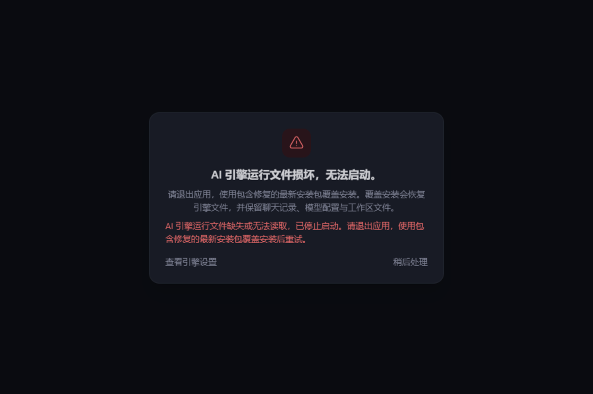

# Windows 旧插件清理导致运行时损坏

## 基线与结论

- LobsterAI：`feat/openclaw-v2026.8.1`，`18c54e8ccf045579be001ed1e3c1f2bbdeb5de8f`。
- 修复分支：`fix/openclaw-junction-safe-plugin-cleanup`。
- OpenClaw：`v2026.8.1`，`ea806575e6450e4d1efdfc72c19f04be982a1b9b`。
- 原生验证环境：Windows，Electron 43.5.0 / 内嵌 Node 24.19.0；另用相同版本的普通 Node 对照。

新日志中，内存库已成功归档为 `.migrated.2`。随后旧 npm Discord 插件清理报 `ENOTEMPTY`，下一轮启动才出现全部 12 个 dist worker 入口缺失。这与之前的损坏 attestation、内存归档命名冲突不同。

OpenClaw 的合法插件 peer link 可以将插件的 `node_modules/openclaw` junction 指向宿主运行时。上游 `doctor-plugin-registry.ts` 使用同步递归 `fs.rmSync` 退休旧插件。当前 Electron 下，这个操作会穿过 junction 删除宿主文件；LobsterAI 的旧扩展清理入口有相同风险。普通 Node 不复现，因此只运行默认 Vitest 或普通 Node 文件系统测试会漏掉问题。

本机已证明破坏机制，尚未取得故障 QA 机器事发前的完整 npm 目录和 junction 元数据；不能将本机模拟等同于该机器的逐字节复现。原 workspace 数据包不包含 npm 插件目录、相关安装记录或宿主运行时，无法覆盖这个触发条件。

## 修改

### 上游版本补丁

`openclaw-managed-npm-junction-cleanup.patch` 修复 OpenClaw 内部的 npm 退休 owner，不使用全局文件系统 monkey patch，也不只针对 Discord：

1. 对整批包先备份各 npm 项目的 `package.json` 和已有 `package-lock.json` 原始字节。
2. 将旧包 rename 到 npm 项目下的 `.openclaw-npm-cleanup-*` 隔离目录。隔离目录位于 `node_modules` 外，避免下次插件/host-link 扫描再次发现。
3. 整批隔离成功后才更新 npm 清单。目录移动或清单发布失败时回滚整批；特别覆盖 Windows JSON 替换已删除原文件后失败的情况。
4. 退休完成后用 `lstat`、`unlink`、非递归 `rmdir` 清理，只删除链接本身。
5. 最终删除隔离残留失败时保留残留并记录路径，不阻止调用方持久化退休结果。回滚自身失败仍抛出错误，并保留原始清单等恢复材料。

这是进程内异常回滚，不是跨文件系统与 SQLite 的崩溃事务。后续安装索引 SQLite 持久化仍由原调用方负责；强杀进程或回滚失败可能需要根据隔离目录人工恢复。

### LobsterAI 集成

- 旧扩展清理使用 `removeTreeNoFollowSync`，覆盖嵌套链接、根链接和 dangling junction；失败记录具体路径。
- `OpenClawEngineManager` 启动 bundled gateway 前检查 12 个必需 dist 入口。缺失时返回 `runtime_files_missing`，停止五次无效重试，并保留具体诊断日志。
- 错误界面提示退出应用并重新安装包含修复的版本，隐藏不能恢复二进制文件的“重启网关 / 一键修复”按钮。

这个检查保护网关启动入口；不替代完整的安装包哈希校验，也不验证所有依赖、零字节文件或全部应用初始化行为。已有运行时文件损坏必须通过安装包恢复，重建配置不能补回文件。

下图在隔离 fixture 中渲染实际 `EngineFailureOverlay` 组件、项目 CSS 和中英文词典中的中文文案；不包含 QA 用户数据。

## 本机行为验证

全部破坏性场景使用新建沙盒，链接只指向沙盒内的合成文件或独立物理运行时副本。

| 操作 | Electron 43.5.0 保留的 worker | 普通 Node 24.19.0 保留的 worker |
| --- | --- | --- |
| 原始同步递归 rm | 0 / 12 | 12 / 12 |
| 原 LobsterAI 旧扩展清理入口 | 0 / 12 | 12 / 12 |
| 修复后 LobsterAI 旧扩展清理入口 | 12 / 12 | 12 / 12 |
| 原生异步 `fs.promises.rm` | 12 / 12 | 12 / 12 |

没有因同步入口的证据扩大修改异步删除入口。

OpenClaw 修复 helper 在真实 Electron 下的补充验证：

- 普通旧插件：成功退休，宿主 12 / 12 入口内容不变。
- 宿主 worker 被 Windows 文件锁占用：仍成功退休旧插件，12 / 12 入口内容不变。
- 旧插件自身文件被占用：rename 报 `EPERM`，保留旧包及清单原始字节，12 / 12 宿主入口内容不变。此错误码与 QA 日志的 `ENOTEMPTY` 不同，但证明失败路径不再破坏宿主。
- 已损坏运行时：调用真实编译后的 EngineManager，两次手动启动均返回 `runtime_files_missing`，没有启动网关进程或生成 token，测试配置原字节不变。

完整链路使用当前分支 31 个补丁重新构建的 OpenClaw `qaRuntime`、真实 Electron、真实 EngineManager 和独立用户目录。运行时路径含中文与空格；模型服务为本机合成 OpenAI API。覆盖旧 npm 插件及其 peer junction、NUL attestation、旧会话 JSON/JSONL、旧内存库和已有 `.migrated`：

- 旧插件退休后，12 个运行时入口 SHA-256 不变。
- attestation 进入隔离目录，旧会话迁移后 `chat.history` 可读。
- 内存库归档为 `.migrated.2`，原 `.migrated` 内容不变。
- 网关就绪和 WebSocket token 鉴权、`config.get` 成功。
- 首次模型回复成功；真实 read 工具读取沙盒文件，内容进入下一次模型请求。
- 正常退出后再次启动成功，配置可读，12 个入口哈希仍不变。

依赖来自本机已有 runtime 的物理副本，核心 dist、gateway bundle 和 startup migration helper 均重新构建；这不是完整 NSIS 安装器验收，也不是最新 QA 全量数据重放。

完整源构建回归耗时 141.6 秒；执行现有 `prune-openclaw-runtime.cjs` 后，在另一份全新状态 fixture 上重跑相同链路，耗时 132.7 秒，全部通过且 Matrix 缺依赖警告消失。两轮测试进程均正常退出。

## 额外确认的后续现象

1. **插件清理后的迁移输入变化**：上游会拒绝该次启动，要求重新收敛。本机首次启动确实触发一次；现有 EngineManager 自动重试后成功，调用方最终收到 `running`。不能把这一条临时退出直接认定为永久启动失败。
2. **FTS 迁移结果误报**：旧内存库迁入 per-agent SQLite 并归档后，`openclawMemoryIndexMigration.ts` 的 `findStaleTargets` 仍检查原 `memory/main.sqlite`；旧路径消失被当成验证失败。本机观察到 `post-reindex verification failed`，随后网关和消息链路成功。只读查询新库确认 `memory_index_meta` 为 `fts-only/none`、有 2 条索引 chunk，全文检索命中测试记忆。这是另一个已确认的集成检查遗漏，本次保留为后续项，不把它作为 runtime 文件损坏的根因。
3. **未裁剪构建的可选插件警告**：第一次完整源构建包含未配送的 Matrix 扩展，复用的打包依赖不包含 Matrix SDK，产生非致命 doctor-contract 警告。正式回归应先执行现有 runtime pruning；不能将这个测试装配差异当作产品故障。

## 自动化检查

- LobsterAI 定向 Vitest：8 个文件，75 / 75 通过，包括 Windows 原生 Electron 回归、运行时阻断、错误界面和补丁清单。
- 修改的 TypeScript 文件严格 ESLint：通过。
- `npm run compile:electron`：通过。
- OpenClaw 定向测试：27 / 27 通过，其中新增 8 个真实 registry 边界用例，覆盖批量隔离失败、清单破坏性发布失败、回滚失败、链接保护和清理残留。
- OpenClaw core tsgo、type-aware oxlint、格式检查：通过。
- 从 pristine pinned checkout 应用完整 31 个补丁及强校验：通过；应用后的三个上游修改文件与构建源码逐文件哈希一致。
- OpenClaw `qaRuntime` 构建及两个 LobsterAI bundle 构建：通过。
- 邻近 `doctor-plugin-host-links` 测试在旧源码与修复源码中均有相同的 Windows 临时目录清理失败（7 个 EPERM，2 个跳过），未将该组报告为通过。

本地逐步日志、fixture、哈希与结果保存在 `.work/junction-fix/`，不将 QA 私有数据提交到仓库。
