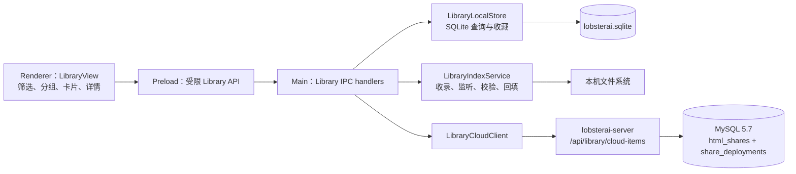

# 资料库功能详细设计文档

> 创建日期：2026-08-17
> 最近更新：2026-09-04
> 状态：资料库基础能力及「本地产物 / 云端」双页签 UI 已实现；云端页统一管理分享文件与部署站点，并已完成测试环境列表基础验证；零有效任务关系的本地产物隐藏、有效任务回退及关系写入竞态保护已在客户端实现；分享文件访问分析已完成详细设计，客户端与 owner 接口待实现；分享文件永久删除已完成客户端、服务端与管理员后台实现，数据库内容清理和 NOS 删除意图已可靠落库，NOS 对象物理删除消费者仍是正式发布阻断项；订阅升级后的普通用户限时资源恢复已按无新增表方案完成客户端与服务端实现；免费过期资源“订阅恢复”入口、恢复能力投影、公网页和客户端转化埋点已完成客户端与服务端实现；Windows 首次进入本地产物时的回填闪屏修复已完成客户端实现，待 Windows 大数据集压力验证；来源页签、收藏、筛选和搜索切换时的线条加载态闪烁已完成客户端详细设计，待实现与回归
> 涉及仓库：`LobsterAI`、`lobsterai-server`、`lobsterai-admin`；`lobsterai-portal` 经核对无需改动
> 产品入口：LobsterAI 左侧栏「我的文件」（内部功能名仍为 Library）

## 0. 实施状态（2026-09-04）

资料库基础方案已在客户端与服务端两个仓库完成首期实现；表中单独标为“待实现”的增量不包含在该结论中：

| 范围 | 实施结果 |
| --- | --- |
| 本地索引 | 新增 SQLite 资料、会话关系、收藏和显式来源表；按 Artifact 事件增量收录，不在进入页面时扫描 cwd |
| 会话关系 | 支持一会话多产物、一个产物多会话，查询最新有效会话；删除会话时显式删除关系 |
| 任务依赖展示 | 本地产物页只展示至少关联一个仍存在任务的文件；零有效关系时保留文件、内部索引与收藏但退出列表；删除最新任务时回退到其他有效任务，同一路径重新关联后恢复展示 |
| 文件生命周期 | 支持监听、有限重试、空闲分批 `stat`、同目录可靠重命名、缺失墓碑和权限状态；真实文件删除统一交给系统文件管理器 |
| 历史数据 | 首次进入后按会话分批复用现有 Artifact 识别逻辑回填，游标和策略版本保存在 `kv` |
| 首开与后台刷新稳定性 | 已实现单次初始骨架、300ms/1,000ms 事件合并、按 ID 定向增量读取、任务删除定向失效、加载窗口静默校验和滚动锚点恢复；待 Windows 100/1,000/10,000 文件压力验证 |
| 查询切换加载态稳定性 | 已确认新 `queryKey` 被按首次加载处理，且本地/云端列表骨架仅由空行分隔线构成，快速请求时形成横线闪烁；本 Spec 已冻结延迟显现、查询过渡态、内存快照和无分隔线骨架方案，客户端待实现 |
| 收藏 | 全部写客户端 SQLite；本地产物使用设备 scope，云端收藏按发布账号 scope 隔离 |
| UI | 新增侧栏入口、顶部「本地产物 / 云端」双页签、类型下拉/搜索/收藏、网格/列表、单列紧凑列表、分组和沉浸式中央预览弹窗，使用现有管理页宽度、主题 token 和中英文 i18n |
| 云端管理页 | 分享文件和部署站点进入同一扁平管理列表；站点作为独立类型，统一提供类型、搜索、可访问性和刷新筛选；点击后分别进入分享设置或网站设置，分析均由设置页标题栏进入 |
| 云端列表 | 服务端新增 `GET /api/library/cloud-items`，聚合普通分享和部署站点，使用三字段游标和 MySQL 5.7 SQL |
| 分享文件访问分析 | 复用现有 V52 访问统计表与采集链路；owner 只读接口、客户端分析页和跨内容版本汇总待实现，不新增 DDL |
| 分享文件永久删除 | 已完成客户端、服务端与管理员后台实现：仅允许当前 owner 永久删除已停止的普通分享，主记录保留最小 `deleted` 墓碑，同事务清理文件/统计/敏感审核内容并先记录 NOS 删除意图，免费用户历史创建名额不释放；NOS 对象物理删除消费者仍待确认或补齐 |
| 订阅升级自动恢复 | 已实现且不新增表；复用 `html_shares.access_expires_at` 识别普通用户限时资源，订阅生效后主动恢复，无 cursor 云端第一页兜底检查；分享文件和在线网站直接转换，已停止静态网站恢复现有静态发布状态，已停止 Node 服务须由用户主动重新部署 |
| 订阅恢复入口 | 已完成客户端与服务端实现；服务端新增可选恢复能力投影和公网暂停文案，客户端在任务弹窗、云端列表及详情增加黑白反色 CTA、转化埋点和账号级协调器，订阅返回后执行权威刷新；无数据库变更，Portal/Admin 无改动 |
| lineage | 分享更新接口新增可选 `sessionId/artifactId`，旧客户端缺失参数时保留原值 |
| 联调合同 | 新增 `docs/server-integration/2026-08-17-library-cloud-items.md` |

前序已实现功能的历史自动校验包括客户端 TypeScript、changed-file ESLint、目标 Vitest、Renderer/Main/Preload 生产构建，以及服务端在 JDK 17 下的 `compileJava`、`compileTestJava` 和 Mapper XML 语法检查。管理员后台历史上已通过 `vue-tsc`、目标 ESLint 和生产构建。2026-09-04 订阅恢复入口增量已通过客户端目标 ESLint、目标 Vitest、`npm run build`、`npm run compile:electron`，以及服务端 `compileJava`、`compileTestJava` 和 Mapper XML 语法检查；按约定未运行依赖 Redis/外部发布服务的服务端测试套件，未连接数据库，也未执行 Electron 手工 UI 或真实测试环境联调。

本次永久删除实施落点：

- `LobsterAI`：分享设置页增加危险区域、完整文件名确认、删除 IPC/API、错误恢复、列表计数与收藏清理；删除只影响云端分享，本地原文件和相关任务不参与；
- `lobsterai-server`：新增 `DELETE /api/html-shares/{shareId}/permanent` 与独立事务服务；owner 条件行锁、普通来源白名单、`disabled` 前置校验、同 owner 重复删除幂等、`deleted` 查询隔离、迟到统计/审核写保护均已落地；
- `lobsterai-admin`：默认列表排除 `deleted`，显式“已删除”筛选仅显示最小审计详情，预览、审核、恢复及其他写动作禁用；
- `lobsterai-portal`：没有分享文件管理入口，本功能不修改；
- 存储边界：现有仓库没有可确认的 NOS 删除 API 或队列消费者，因此当前完成定义是“数据库内容已清理、NOS 删除意图已与墓碑同事务提交”。在测试环境观察到对象实际不存在、失败可重试且有积压告警前，不得对外宣称 NOS 字节已完成物理删除。

已完成 Electron 基础手动验收：侧栏入口和本地索引可用；历史回填后可展示本地产物；列表按日期/任务使用单列布局；索引支持同一文件关联多个任务并选择最新有效任务分组；真实 HTML 文件可使用现有预览链路渲染；云端接口不可用时本地产物保持可浏览、可预览，并显示弱打扰的独立错误状态。测试 MySQL 5.7 实库查询、真实分享/部署联调、深色主题回归，以及 Windows 文件打开/显示行为仍属于上线前验收项。

## 1. 概述

### 1.1 背景

LobsterAI 已经能够在会话中识别和预览 HTML、图片、SVG、视频、Markdown、Mermaid、Office/PDF、文本和部分代码文件，也已经具备文件分享、静态站点部署、动态服务部署及站点管理能力。但这些资源目前分散在会话 Artifact 卡片、分享弹窗和独立站点页中，用户缺少一个稳定入口回答以下问题：

1. 龙虾在本机生成过哪些仍可预览的文件？
2. 一个文件由哪些会话生成或修改，应该返回哪个会话？
3. 已分享的文件和已部署的站点当前是什么状态？
4. 会话或本地文件被删除后，资料库应该如何变化？
5. 本地产物是否会上传或同步到云端？

本功能在客户端增加「资料库」入口，以「本地产物 / 云端」两个页签统一呈现本地文件、分享文件和部署站点。云端页不再按后端来源拆页：分享文件与站点使用同一列表，站点只是资源类型之一。视觉布局综合参考 ChatGPT Library 与 Manus Library 的信息组织方式，但组件密度、颜色、主题、侧栏行为和交互反馈必须遵循 LobsterAI 现有规范。

### 1.2 已确认的产品边界

| 资料类型 | 权威数据源 | 存储位置 | 跨设备同步 | 首期稳定标识 |
| --- | --- | --- | --- | --- |
| 本地产物 | 本机文件 + 本地索引 | 文件系统 + 客户端 SQLite | 否 | 本地生成的 `artifactId` |
| 分享文件 | `html_shares` 中非部署来源记录 | 云端 MySQL/NOS | 是 | `shareId` |
| 部署站点 | `html_shares` 部署来源 + 最新 `share_deployments` | 云端 MySQL/部署平台 | 是 | 稳定 `shareId` |
| 收藏 | 客户端本地偏好 | 客户端 SQLite | 否 | `ownerScope + itemKind + itemId` |

必须遵守以下边界：

1. 本地产物的绝对路径、文件内容、缩略图、本地索引和完整会话关系不上传服务端。
2. 分享和部署继续通过现有发布流程主动上传；进入资料库本身不得触发上传。
3. 服务端不新增“本地产物镜像表”，也不承担本地文件是否存在的判断。
4. 收藏是本地逻辑；首期不提供跨设备收藏同步。
5. 本地资料库不是目录扫描器，不扫描整块磁盘、用户 Home 或每个会话工作目录。
6. 每次进入资料库直接读取持久化索引，不执行全量重扫。
7. 「本地产物」是任务产物视图，不是所有已知本地文件的集合；只有至少关联一个仍存在任务的本地索引记录才进入列表、搜索、收藏筛选和计数。

### 1.3 现状核对

本设计基于当前两个仓库的代码核对，关键现状如下：

| 能力 | 当前状态 | 设计结论 |
| --- | --- | --- |
| 会话和消息 | 客户端 SQLite 已有 `cowork_sessions`、`cowork_messages` | 复用，不复制会话主体 |
| 会话删除 | `CoworkStore.deleteSessionRows()` 显式删除消息和会话 | 资料库关系也必须在同一事务显式删除，不能只依赖外键级联 |
| Artifact 列表 | `artifactSlice` 只维护会话/Renderer 运行态 | 不能充当持久资料库索引 |
| Artifact 识别 | `artifactParser.ts`、`artifactDetection.ts` 已能识别可预览文件 | 复用识别结果，避免重新发明文件类型规则 |
| 文件监听 | 当前 `artifact:watchFile` 只服务已打开的预览面板 | 新增独立、持久的资料库监听服务 |
| 本地缩略图 | Electron 原生文件缩略图能力和现有预览渲染器 | 可复用，失败时回退类型封面，不直接批量启动外部预览进程 |
| 文件分享 | `/api/html-shares` 已有创建、更新、查询、停止/恢复 | 复用写接口，新增适合资料库的只读聚合接口 |
| 分享旧 DELETE | `DELETE /api/html-shares/{shareId}` 当前调用 disable，不删除记录或文件 | 保持兼容；永久删除必须使用新的 `/permanent` 接口 |
| 分享访问统计 | V52 已有每日访问、IP 去重和维度统计表；公共入口已有采集，当前查询只供后台且趋势绑定当前内容版本 | 新增 owner 只读分析接口；首期只返回访问次数、独立访客和每日趋势，按 `shareId` 汇总分享生命周期内所有内容版本 |
| 站点管理 | `/api/sites` 已有列表、详情、设置、分析和删除 | 资料库复用站点动作和详情，不重写站点生命周期 |
| 站点删除 | 当前是 `status = deleted` 墓碑 + 子文件/统计清理，并非物理删除主行；NOS 删除意图在事务提交后异步记录 | 分享文件沿用用户侧不可恢复语义，但队列意图改为与墓碑同事务落库 |
| NOS 清理队列 | 仓库内已有 `html_share_nos_delete_files` 写入器，未发现消费者；测试库存在长期 pending | 确认外部消费者或补齐可靠 Worker 是永久删除发布 Gate |
| 免费历史分享计数 | `countHistoricalFilesByUserId` 使用 `status <> 'failed'` | 保持该口径，让 deleted 继续占用免费累计创建名额 |
| 分享列表 | `GET /api/html-shares/my` 混合普通分享和部署，按创建时间排序 | 不适合直接支撑统一资料库 |
| 分享归属更新 | 客户端更新 FormData 已携带 `sessionId/artifactId`，服务端 PUT 和 Mapper 未持久化 | 服务端必须补齐“最新会话归属”更新 |
| 生产数据库 | MySQL 5.7 | 新 SQL 不使用 CTE、窗口函数、`JSON_TABLE` 或函数索引 |

### 1.4 目标

1. 在 LobsterAI 客户端提供统一、稳定、支持主题的资料库入口。
2. 顶层只区分本地与云端数据边界；两个页签使用一致的类型筛选和搜索布局，云端额外提供可访问性筛选。
3. 本地产物以“一个物理文件一条记录”呈现，不因多个会话而重复。
4. 正确表达“一会话多产物、多个会话修改同一产物”的多对多关系。
5. 列表只展示至少关联一个仍存在任务的本地产物，并默认归组到最新有效任务；多对多关系继续保存在本地数据层。
6. 删除任务不删除文件和内部索引，但删除最后一个有效任务关系后，该产物立即退出本地产物列表；删除文件不删除任务。
7. 进入页面快速返回本地数据，并在云端离线或异常时保持本地产物可用。
8. 云端列表接口统一普通分享与站点的读取语义，现有写操作保持兼容。
9. 所有数据库、分页和查询设计兼容 MySQL 5.7。
10. 分享文件提供与网站分析一致的入口和视觉结构，但按文件语义展示访问次数、独立访客和趋势，不展示无意义的热门页面。
11. 分享文件支持从分享设置页永久删除：公共分享、云端文件和访问分析对用户不可恢复地移除，但本地主文件与本地任务不受影响；免费用户的历史创建名额不因删除而释放。
12. 为后续增加音频、更多文档格式、显式目录和跨端能力保留扩展点，但首期不提前实现。

### 1.5 非目标

| 非目标 | 说明 |
| --- | --- |
| 自动同步本地产物 | 不上传内容、路径、索引、收藏或完整会话关系 |
| 全盘文件管理器 | 不扫描 Home、磁盘、项目目录或任意文件夹 |
| 文件内容全文检索 | 首期只检索名称、扩展名、分享标题和站点 URL |
| 云端文件版本管理 | 分享更新和站点重新部署沿用现有版本语义 |
| 会话云同步 | 本地会话删除不会通知服务端清理 `sessionId` |
| 在线编辑 Artifact | 资料库负责发现、预览和管理，不新增编辑器 |
| 把本地服务作为本地产物 | `local-service` 是瞬时运行态；导出文件后进入本地产物，部署后进入站点 |
| 服务端收藏接口 | 收藏仅保存在当前客户端 |
| 删除本地原件或任务 | 删除云端分享不得删除、移动或修改本机文件、Artifact 索引、会话及会话消息 |
| 通过删除规避免费分享上限 | 永久删除只清理用户可见资源，不减少免费用户累计创建数，也不复用原 `shareId` |
| 首期持久化云端列表缓存 | 断网时显示本地产物和云端错误态，不把云端元数据复制为长期本地数据源 |
| 单独发布演示站点 | Web Demo 只用于本机原型验证，不属于正式产品部署范围 |

## 2. 核心概念与模型决策

### 2.1 资料项联合模型

资料库对 UI 暴露三种互斥的资料项：

```text
LibraryItem
├── LocalArtifactItem   本地产物
├── SharedFileItem      分享文件
└── DeployedSiteItem    部署站点
```

三类资料项可以使用相同 `title/category/sortTime/isFavorite/latestSession` 基础字段，但必须保留各自的来源字段和动作，不能用一个模糊状态对象抹平生命周期差异。

### 2.2 “一个本地产物”的定义

首期一个本地产物就是一个可预览的本地文件：

- 同一路径被同一或不同会话多次识别，仍是一条资料；
- 同一内容复制到两个路径，是两条资料；
- 同一路径被原子覆盖，保留原资料 ID，并更新修改时间和文件信息；
- 能可靠识别的重命名/移动，保留原资料 ID 并更新路径；
- 无法可靠关联的移动按“旧文件消失、新文件出现”处理，不能仅凭相同文件名合并；
- 目录不作为本地产物，HTML 依赖目录只在预览/分享时由现有能力处理；
- 内联 Artifact 没有实际 `filePath` 时不进入本地产物；用户保存成文件后再进入。

本地资料 ID 使用首次收录时生成的随机 UUID，不使用路径哈希作为主键。路径会变化，路径哈希会在重命名时制造新资料；内容哈希又会错误合并两个有意保留的副本。

### 2.3 本地产物与会话是多对多

关系定义为：

```text
一个会话 ── 产生/修改/引用 ── 多个本地产物
一个本地产物 ── 被产生/修改/引用 ── 多个会话
```

一个会话对同一文件出现多次时，只保留一条会话关系，并更新：

- `relationKind`：`created | modified | referenced`；
- `lastRelatedAt`：该会话最后一次明确关联该文件的时间；
- `lastMessageId`：最后一次关联消息；
- `sessionArtifactId`：该会话中最后一个对应 Artifact ID。

`relationKind` 的强度为 `created > modified > referenced`，更新时不把已知“创建”降级为“引用”。文件监听只更新文件状态，不把外部编辑器产生的修改错误归因到当前打开的会话。

### 2.4 最新有效会话

列表中的会话归属按以下确定性规则计算：

1. 只考虑本地 `cowork_sessions` 中仍存在的关系；
2. 按 `lastRelatedAt DESC` 选择；
3. 时间相同时按 `cowork_sessions.updated_at DESC`；
4. 仍相同时按 `session_id DESC`；
5. 没有有效关系时，该索引记录不具备本地产物列表展示资格。

因此，“返回最新的”指最新发生实际产物关系的有效会话，而不是最近被用户随便打开或继续聊天的会话。

点击本地产物卡片默认直接打开沉浸式预览；点击任务组头打开上述最新有效任务，并尽量定位到 `lastMessageId/sessionArtifactId`。本地产物条目和预览菜单不展示完整关联任务列表，历史多对多关系仅用于索引、分组和最新任务回退。

#### 2.4.1 本地产物展示资格

`library_local_artifacts` 是内部持久索引，不等同于用户当前可见的本地产物集合。一个本地索引记录只有同时满足以下条件，才进入本地产物列表：

1. `availability = available`；
2. 至少存在一条 `library_artifact_sessions` 关系；
3. 该关系指向的 `cowork_sessions` 任务仍然存在。

展示资格必须在关键词、类型、收藏、游标和 `LIMIT` 之前判断，并统一作用于列表、网格、搜索结果、收藏结果和任何总数/空态判断。客户端不能先分页再从 Renderer 过滤无任务项，否则会产生短页、重复续页、数量不一致和错误空态。

删除最后一个有效任务关系只让产物退出当前资料库视图，不删除真实文件、内部索引、缩略图或本地收藏。以后若同一路径再次被一个有效任务明确产生、修改或引用，原索引记录恢复展示，并沿用原 `itemId` 和收藏状态。当前产品不提供独立于任务的本地文件导入入口；历史手动来源或修复过程中留下的零关系记录继续保留为内部数据，但不可进入本地产物列表。若未来重新引入独立文件管理能力，应单独定义其集合与生命周期，不能复用「未关联任务」兜底组。

### 2.5 本地资料与云端发布不合并

同一个本地文件可能同时存在：

- 一条 `LocalArtifactItem`；
- 一条或多条历史上重新创建的 `SharedFileItem`；
- 若它是项目产物，还可能对应一个 `DeployedSiteItem`。

首期不把它们折叠成一张卡，因为删除、状态、权限和可用性完全不同。`clientSourceKey` 只用于在详情中显示「本地原件/云端版本」关联和提供跳转，不改变三类资料项的独立身份。

### 2.6 数据归属与收藏隔离

本地收藏虽然不上传，但仍需防止同一设备切换账号后互相看到云端收藏：

- 本地产物使用固定 `ownerScope = device`；
- 云端资料使用发布账号上下文生成的不可逆本地 scope，例如对 `accountMode + enterpriseId + userId` 做 SHA-256；
- scope 中不得包含 JWT、Cookie、分享码或其他凭证；
- 登出后不展示云端收藏，重新登录同一账号可恢复；
- 云端记录确认删除后清理对应收藏。

## 3. 用户场景

### 场景 1：首次进入资料库

**Given** 客户端已有会话和本地 Artifact，但尚未完成资料库历史回填。

**When** 用户第一次进入资料库。

**Then** 页面立即展示已建立索引的数据；初始查询最多出现一次列表骨架。历史回填在后台分批进行并增量补充，不阻塞首屏，也不递归扫描任何工作目录；一旦已有内容或初始查询已经完成，任何 `recorded/file_changed/repair/session_deleted` 事件都不得把列表重新替换成整页骨架。回填项可以按稳定 ID 分批插入，但当前滚动位置、筛选、已打开菜单和预览状态保持不变。

### 场景 2：一个会话生成多个文件

**Given** 一个会话生成 HTML、PDF 和图片三个文件。

**When** 这些 Artifact 在会话中被确认可预览。

**Then** 本地索引生成三条资料、三条会话关系；资料库按文件分别展示。

### 场景 3：多个会话修改同一文件

**Given** 会话 A 创建 `proposal.docx`，会话 B 后续修改同一路径。

**When** 用户进入资料库。

**Then** 只展示一条 `proposal.docx`；默认归组到 B，数据层继续保留 A、B 两条关系用于后续回退。

### 场景 4：删除最新关联会话

**Given** 一个文件依次关联 A、B、C 三个会话，C 最新。

**When** 用户删除本地会话 C。

**Then** 在同一 SQLite 事务中删除 C 的资料关系，文件和资料主体保留；列表自动回退到 B。若 A、B 也被删除，则该文件立即退出本地产物列表、搜索和收藏结果，但磁盘文件、内部索引和收藏状态仍保留。

### 场景 5：文件在系统中被删除

**Given** 本地产物仍在资料库索引中。

**When** 用户在 Finder/资源管理器删除该文件。

**Then** 监听服务二次确认文件不存在，将其从默认列表移除并保留短期内部墓碑用于重命名识别；不删除任何会话。

### 场景 6：云端断开

**Given** 本地产物可用，但网络、鉴权或服务端异常。

**When** 用户进入资料库。

**Then** 本地产物正常加载和预览；分享文件和部署站点区域展示可重试错误，不把整个页面替换成失败页。

### 场景 8：从另一个会话更新分享

**Given** 分享文件最初来自会话 A，后在会话 B 更新内容。

**When** 更新请求完成。

**Then** 服务端把该分享的 `sessionId/artifactId` 更新为 B 的最新值；资料库默认“查看会话”返回 B。

### 场景 9：收藏不同来源资料

**Given** 用户收藏一个本地 PDF、一个分享文件和一个站点。

**When** 用户分别在本地产物页和云端页使用「仅看收藏」，并打开云端资源的更多菜单。

**Then** 本地筛选只过滤本地产物；云端筛选只过滤当前发布账号收藏的分享文件和网站，各行更多菜单同步显示收藏状态。三类收藏都只写本地 SQLite，不发收藏接口，也不提供跨本地/云端的聚合收藏页。

### 场景 10：重启和再次进入

**Given** 资料库已有 1,000 条本地产物。

**When** 用户重启客户端并再次进入资料库。

**Then** 首屏直接读取 SQLite；只优先校验可见项，其余在空闲时间分批校验，不进行 1,000 个文件的同步阻塞扫描。

### 场景 11：管理云端资源

**Given** 当前账号有已打开和已关闭的不同类型分享文件。

**When** 用户进入「云端」并组合切换可访问性、资源类型和关键词。

**Then** 客户端把普通分享和部署站点按统一游标混排为扁平管理列表，保留资源、状态、访问权限和操作四个有标题语义列，并在状态与访问权限之间设置无标题恢复入口列；将原始状态归一为「可访问 / 不可访问」，不按本机会话分组，也不显示访问量、文件大小或更新时间。

### 场景 12：修改分享设置

**Given** 用户点击一条分享文件记录。

**When** 设置页加载完成并修改公开访问/分享码或允许访问状态。

**Then** 客户端复用现有分享详情和写接口；成功后同步更新详情、列表行和状态数量，失败则回滚，不能只改变本地 UI。

### 场景 13：系统关闭的分享

**Given** 一条分享被管理员、审核、活动分享数量限制或系统关闭。

**When** 用户打开分享设置页。

**Then** 页面显示已关闭和对应原因，状态控件不可恢复；列表菜单不提供「重新打开」或「删除分享记录」，但所有者仍可从分享设置页底部的危险区域永久删除该普通分享。

### 场景 14：永久删除分享文件

**Given** 当前账号拥有一条来源为普通分享、状态已经是 `disabled` 的文件记录。

**When** 用户在分享设置页危险区域点击「永久删除」，阅读影响说明，准确输入当前显示文件名并再次确认。

**Then** 分享地址立即不可访问，记录从资料库与普通 owner 接口中消失，云端文件和访问分析进入可靠清理流程，本地原文件、任务和本地索引保持不变；重复请求得到幂等成功，原 `shareId` 永不复用。

### 场景 15：免费分享名额不因删除释放

**Given** 免费用户累计已创建 10 个分享，达到当前历史创建上限。

**When** 用户停止并永久删除其中一个分享。

**Then** 用户可见列表减少一条，但免费分享计数仍为 10/10，不能再创建第 11 个分享；若删除前是 9/10，删除后仍为 9/10。

### 场景 16：切换来源、收藏、筛选和搜索时不闪线

**Given** 用户已看到本地产物或云端列表/空态，列表请求通常可在一个很短的时间窗口内完成。

**When** 用户切换「本地产物 / 云端」、切换「仅看收藏」、修改类型或可访问性筛选，或者搜索关键词在 300ms 防抖后生效。

**Then** 工具栏和内容区域尺寸保持稳定；150ms 内完成的请求直接提交新结果，不挂载加载骨架；较慢请求使用低干扰进度或无分隔线的结构化骨架，不出现整行横线、错误空态或“旧内容—骨架—新内容”的瞬时往返。快速连续切换时只有最后一个 `queryKey` 可以提交结果。

## 4. 功能需求

参考产品只提供信息架构启发，不直接复制视觉：

| 来源 | 采用 | 不采用 |
| --- | --- | --- |
| ChatGPT Library | 顶部搜索、来源/类型筛选、网格/列表切换、统一资料入口 | “所有资料都在云端”的默认假设和大面积上传空态 |
| Manus Library | 按任务/会话理解资料来源、以预览为核心、操作收敛到卡片菜单 | 宽屏仍只占单列、超大预览卡和与 LobsterAI 不一致的品牌样式 |
| LobsterAI | 现有侧栏、管理页框架、主题 token、Artifact 预览、分享和站点动作 | 新建第二套发布状态机或硬编码单一主题 |

### FR-1：入口与既有站点页迁移

在左侧栏固定功能区增加「资料库」入口，主视图新增 `library`。

资料库的「云端」页在统一列表中展示部署站点，并复用现有 `SitesView` 的详情、权限、访问状态、分析和删除能力。达到功能等价后：

1. 默认只保留「资料库」入口；
2. 旧 `sites` 内部路由重定向到 `library?source=cloud&category=site`；
3. 灰度期间可暂时保留旧入口，但不能长期维护两套站点管理 UI；
4. 企业配置增加 `ui.library = hide | readonly`；只读模式禁止改变收藏以外的资源状态；
5. 原有 `ui.sites` 在过渡期继续控制站点动作权限，最终迁移到资料库的细粒度权限。

### FR-2：页面信息架构

页面从上到下分为：

1. 顶部管理页标题栏中的来源页签：本地产物、云端；
2. 本地产物页提供文件类型、搜索、收藏和视图控制；云端页提供类型、搜索、收藏、可访问性和刷新；
3. 本地产物固定按「日期 → 会话 → 资料」组织；云端使用不按会话分组的统一管理列表，分享文件和部署站点按最近更新时间混排；
4. 滚动到底部时自动续页；
5. 本地产物进入沉浸式中央预览；云端条目按资源类型进入分享设置页或网站设置页，分析通过设置页标题栏的独立图标进入。

来源页签下不再常驻显示「统一查看…」产品说明或「本地/云端已连接」状态行，避免重复页签语义并占用首屏。云端异常、未登录等可操作状态仅在相关来源页中以上下文提示展示。

资料库页面不提供「通过会话创建」或「添加本地文件」按钮。产物继续由会话生成链路和现有索引机制进入资料库，资料库本身保持浏览与管理定位。

### FR-3：来源页签与数量

| 页签 | 数据范围 | 未登录行为 |
| --- | --- | --- |
| 本地产物 | 当前设备本地索引 | 正常可用 |
| 云端 | 当前发布账号的普通分享与部署站点 | 显示登录提示 |

默认进入「本地产物」。首期不提供「全部资料」聚合页，避免混合本地与云端分页、错误状态和存储边界。

顶部来源页签不显示数量。分页结果数量、服务端总数和当前缓存条数都不作为页签文案，避免切换筛选或续页时出现数字闪烁及语义误解。服务端 counts 仍可保留用于诊断和后续能力，但不参与首期页签渲染。

### FR-4：分类映射

首期分类遵循当前可预览能力：

**术语约定：** 用户界面统一使用更易理解的「网站」，包括类型筛选「网站」、资源类型「部署网站」和操作「管理网站」。本文的技术模型、接口、枚举和数据库语义仍使用 `site`、`deployed_site` 和「站点」，不因界面文案调整而迁移。

| 分类 | 本地文件/Artifact | 云端来源 |
| --- | --- | --- |
| 幻灯片 | `.pptx` | `document_file` 且入口为 `.pptx` |
| 网页 | `.html`、`.htm` | `html_file` 分享 |
| 文档 | `.docx`、`.pdf`、`.md`、`.txt`、`.log` | 文档、Markdown 分享 |
| 表格 | `.xls`、`.xlsx`、`.csv`、`.tsv` | `document_file` 且入口为对应扩展名 |
| 图片 | `.png`、`.jpg`、`.jpeg`、`.gif`、`.webp`、`.bmp`、`.avif`、`.svg` | 图片、SVG 分享 |
| 音视频 | `.mp4`、`.webm`、`.mov` | 首期没有可分享音视频记录时为空 |
| 网站 | 不显示 | 所有 `deployed_site` |
| 其他 | Mermaid、当前支持预览的代码文件 | Mermaid 分享及未归类可预览文件 |

类型和分类必须通过共享常量/纯函数集中定义。首期不因 UI 存在「音视频」分类就宣称支持尚未实现的音频格式。

本地产物固定显示顺序为：全部、幻灯片、网页、文档、表格、图片、音视频、其他。云端在「其他」之前增加「网站」，顺序为：全部、幻灯片、网页、文档、表格、图片、音视频、网站、其他。网站不能继续归入「网页」，否则用户无法区分文件分享和可部署服务。

两个来源页签均使用相同的「类型 + 当前值」单选下拉，不在工具栏左侧平铺全部类型，也不显示漏斗图标或额外的「筛选」组标题。默认值显示「全部」；展开菜单使用上述固定顺序并勾选当前项，切换类型后关闭菜单并刷新第一页。云端可隐藏网站能力时，同时从下拉选项中移除「网站」。

### FR-5：搜索、排序和筛选

搜索规则：

- 本地仅匹配显示文件名、扩展名和用户可见的相对/显示路径；
- 云端匹配标题、URL、入口文件名和资源 ID；
- 不读取文件内容，不建立全文索引；
- 本地绝对路径和本地搜索结果不得发往服务端；
- 本地产物搜索只查询本地 SQLite；云端搜索只把关键词发送给云端列表接口。

首期统一按「最近更新」排序：

| 本地产物 | 分享文件 | 部署站点 |
| --- | --- | --- |
| 文件 `mtime`，缺失时回退首次收录时间 | `contentUpdatedAt/updatedAt/createdAt` | 最新部署或站点更新时间 |

名称和创建时间排序需要本地、云端使用相同排序和游标语义，首期不展示空壳选项；后续增加时扩展明确的共享 `LibrarySort` 枚举和服务端白名单，不能由客户端传任意列名。搜索输入 300ms 防抖；旧请求结果不得覆盖新关键词结果。

云端统一使用可访问性筛选：`全部 / 可访问 / 不可访问`。归一化规则如下：

- 新服务端返回 `effectiveAvailable` 时，以该只读投影为访问权益事实；`effectiveExpiresAt <= effectiveNow` 时立即归为「不可访问」；
- 旧服务端没有投影字段时，分享文件 `status = live` 为「可访问」，其他状态为「不可访问」；
- 部署站点还必须同时满足 `siteStatus = online` 与 `shareStatus = live`；部署中、停止访问、需重新部署、被阻止或失败均为「不可访问」；
- 「已打开 / 已关闭 / 部署中 / 发布失败」等原始状态只在各自详情页展示，不在统一列表制造两套词汇。

列表和状态筛选菜单均使用明确的状态文字，不显示状态圆点：`可访问` 使用绿色文字，`不可访问` 使用符合主题对比度的次级灰色文字，颜色只作为辅助信息。`全部` 是筛选复位项而不是资源状态，使用普通前景色。不可访问不使用红色或橙色，避免把用户主动停止访问误表达为异常。

不展示「处理失败」或「已过期」筛选。筛选必须参与完整游标结果，不能只过滤当前已加载页面；客户端在服务端尚未提供统一 availability 参数时，可以有界地继续读取服务端页并按上述规则归一化，直到填满一页、来源耗尽或达到安全上限。状态或类型变化时重置游标并重新请求第一页。

### FR-6：收藏

1. 星标点击立即乐观更新，失败时回滚并提示；
2. 收藏仅写客户端 SQLite；
3. 本地产物收藏不随登录账号变化；
4. 云端收藏按发布账号 scope 隔离；
5. 云端资源被永久删除或服务端确认不存在时清理收藏；
6. 停止分享、停止访问或部署失败不等于删除，收藏继续保留；
7. 收藏不影响服务端排序、配额或资源生命周期。

云端工具栏与本地产物一样提供收藏筛选按钮，仅筛选当前发布账号 scope 下保存在本地 SQLite 的云端收藏。分享文件和网站的收藏/取消收藏仍位于「更多」菜单，不改变云端生命周期，也不发送服务端收藏请求。

### FR-7：简约资料项

本地产物的列表和网格卡片只显示做决策所需信息。列表进一步压缩为文件导航，网格保留便于快速识别的摘要：

| 区域 | 常驻信息 |
| --- | --- |
| 预览 | 列表使用稳定的类型图标，网格使用缩略图或类型封面 |
| 主信息 | 列表标题单行；网格标题最多两行 |
| 次信息 | 列表不展示；网格展示来源 + 类型/状态，最多两项 |
| 时间 | 列表移到任务组头；网格展示资料最近更新时间 |
| 操作 | 条目仅保留更多菜单；本地产物菜单收敛分享、收藏及文件来源动作，不常驻独立按钮或相关任务入口 |

资料库图标按资源语义区分：蓝色地球图标只表示已经部署的网站（`deployed_site`）；`.html`、`.htm` 等网页文件无论位于本地产物还是云端分享，都使用与普通 HTML 文件一致的紫色代码文件图标。不得通过修改全局 `FileTypeIcon` 映射把所有 HTML 场景改为网站图标，避免混淆“网页文件”和“已部署网站”。

文件绝对路径、分享码、完整 URL、历史任务关系、部署详情、失败原因等不在卡片堆叠元数据；需要操作路径或链接时，通过条目或预览弹窗「更多」菜单中的复制、定位或管理动作完成；最新任务通过任务组头进入。

为解决宽屏列表单项过长、右侧空白的问题：

- 内容区沿用专家套件和技能页规范，最大宽度 1120px，左右内边距 32px；
- 资料项区域最小宽度 680px，窗口更窄时由滚动容器承载，避免标题和操作被过度挤压；
- 列表始终使用单列，避免分组标题和阅读顺序被左右拆分；
- 列表项使用 52～60px 的无卡片行式布局，以分隔线组织，不展示大缩略图；
- 列表图标建议 32～36px，标题保持单行；条目行不重复展示来源、可用状态或更新时间，最后修改时间统一在预览标题栏查看；
- 网格视图按可用宽度展示 2～4 列；
- 预览弹窗使用独立遮罩层，不改变背后列表或网格布局；
- 宽屏列表仍保持单列，但使用无边框行式布局降低横向空旷感。

列表工具栏不展示当前已加载条数，避免将分页缓存量误解为资料总数。列表底部也不提供「加载更多」按钮；距离滚动容器底部约 320px 时自动请求下一页，并在请求期间使用轻量加载指示。发生请求错误后停止自动续页，由用户通过错误提示中的「重试」恢复加载。

本地产物空状态区分资料库为空和查询无结果：类型为「全部」、搜索为空且未启用「我的收藏」时，显示「还没有本地产物」并说明任务中生成的可预览文件会自动出现；只要启用了类型、搜索或收藏筛选，则显示「没有符合条件的本地产物」，引导更换关键词或调整筛选。基础空态不能错误提示用户调整尚未启用的筛选条件。仅存在零有效任务关系的内部索引记录时，页面仍属于「还没有本地产物」，这些记录不计入可见结果。本地产物和云端搜索框在输入非空时都显示尾部清空按钮；点击后立即清空输入与生效关键词、重新查询默认结果并把键盘焦点留在搜索框，按钮提供本地化 Tooltip 和 `aria-label`。

云端页不复用本地产物的卡片或会话组样式，而使用单行统一管理列表。列表保留四个有标题语义列，并在状态列右侧增加一个无标题恢复入口列：

| 列 | 内容 | 明确不显示 |
| --- | --- | --- |
| 云端资源 | 文件类型/站点图标 + 名称；第二行统一显示按客户端语言格式化的 `sortTime`，不附加「最后修改」标签 | 域名、“分享文件/部署站点”来源标签、文件大小、创建时间 |
| 状态 | `可访问` 或 `不可访问`，文字与状态样式同时表达 | 访问量、原始部署/分享状态 |
| （无标题恢复入口） | 仅对符合订阅恢复策略的行显示紧凑 CTA；不符合条件的行保留空占位以维持列对齐 | 其他状态操作、说明文案 |
| 访问权限 | `公开访问` 或 `分享码` | 分享码明文 |
| 操作 | 仅一个「更多」按钮 | 常驻星标、打开、复制或状态按钮 |

状态列保持 180px 并独立居中展示，状态文字与有效期仍为上下布局；恢复入口不得并入状态单元的纵向或横向 flex。恢复入口列位于状态和访问权限之间，无可见表头，列宽收紧为 120px；按钮在列内单行左对齐，并向状态列方向利用 48px 空白，使按钮紧邻状态/有效期但不重叠。入口列显式允许横向可见溢出，保证较长英文按钮不被裁切，同时必须与访问权限列保持空隙。列表采用 `320px/180px/120px/120px/44px` 的最小列轨道和至少 900px 的总宽度；窗口不足时由既有滚动容器横向承载，不把 CTA 折回状态下方。

云端列表不显示访问量和文件大小；文件与网站名称下方统一以元信息字号显示最近更新时间，不显示说明性前缀，网站也不显示域名。域名仍可参与搜索，并保留在设置页和链接操作中。分享/网站设置页只展示完成管理决策所需的分享时间、最后修改时间和原始状态；文件大小仅在本地产物详情等确有文件操作价值的场景出现，不能回填到云端列表或分享设置形成第二套信息密度。列表不提供网格切换，也不按会话或日期插入组头。

### FR-8：本地产物的日期与任务两级分组

本地产物列表不提供分组模式切换，固定使用「日期 → 任务 → 资料」两级分组；数据层字段继续使用 `sessionId`：

- 一级按资料 `sortTime` 所在的本地自然日分组；今天、昨天使用友好名称，更早记录显示具体日期，跨年日期包含年份；
- 日期组按组内最新资料倒序，最近日期始终在前；
- 二级按资料的最新有效任务分组，组头左侧显示任务标题，右侧显示组内最近资料的更新时间；日期已由一级标题表达时，右侧只显示时分；
- 同一日期内的任务组按各组最新资料倒序，资料在组内也按 `sortTime` 倒序；
- 有效任务的组头标题本身是「查看任务」入口，不再额外展示操作文案；
- 同一任务的资料如果分布在不同日期，分别进入对应日期组；同一日期内只生成一个任务组头；
- 跨页加载到同一「日期 + 任务」时追加到已有组，不生成重复组头；
- 每个资料只出现在一个日期下的一个任务组；
- 所有返回项都必须带有一个最新有效任务；Renderer 不生成「未关联任务」组，收到缺少 `latestSession` 的本地产物应视为契约异常并忽略该项、记录不含路径和标题的诊断日志；
- 本规则不应用于分享文件和部署站点；两类资源在统一云端管理列表中混排。

云端资料仅在「相关会话」菜单中尝试解析本机会话，解析顺序：

1. 服务端返回的最新 `sessionId` 在本地仍存在；
2. 否则 `clientSourceKey` 精确匹配本地产物时，使用该本地产物的最新有效会话；
3. 否则不关联会话，也不展示空的「相关会话」入口。

### FR-9：预览与动作

本地产物使用一个沉浸式中央预览弹窗，不再经过「详情弹窗 → 预览弹窗」两层跳转。弹窗必须小于当前应用窗口并保持居中：所有平台统一保留上下各 48px 安全边距；窗口宽度小于 1024px 时左右各保留 16px，达到 1024px 后左右各保留 32px；最大宽度 1320px、最大高度 820px。弹窗尺寸由安全区域约束，不使用整体 `transform: scale()`，也不设置可能撑出可用区域的固定最小宽高。标题栏左侧只展示文件图标、文件名和最后修改时间，主体区域全部用于实际预览或明确的不可预览状态。分享文件不进入该预览弹窗，点击条目直接进入 FR-11 定义的分享设置页；部署站点进入网站设置页，网站分析通过设置页标题栏进入。

预览弹窗根节点和内容区必须同时使用 `min-width: 0`、`min-height: 0` 与受控溢出，滚动只发生在各 Artifact 预览器内部，不能由 PPTX、PDF、图片、网页或视频内容反向撑大弹窗。窗口缩放时使用 CSS 重新计算弹窗边界，由现有预览器的容器尺寸监听完成内容适配，不给弹窗宽高添加过渡动画。统一 48px 顶部安全边距用于避开 macOS 原生交通灯和 Windows/Linux 窗口控制区，不再为每个平台维护独立弹窗尺寸分支。

交互约束：

1. 单击条目主体或按 Enter 直接打开预览，不再为双击定义另一套行为；
2. 列表和网格条目不常驻独立分享或收藏按钮；本地产物条目「更多」仅提供分享、收藏/取消收藏及文件来源动作，并且只打开菜单、不能打开预览；
3. 本地产物复用 `ArtifactRenderer` 和现有分享 Controller；云端资料没有安全内嵌能力时展示链接预览态，不直接使用普通 iframe；
4. 预览标题栏和条目菜单使用同一动作策略和菜单视觉规范；两处「更多」面板统一为 288px 宽，并共用背景、边框、阴影、字号、行间距和悬停态。预览标题栏固定为紧凑的 48px 高度，只把文件分享、收藏/取消收藏提升为右上角无文字图标按钮，其余系统应用打开和文件定位进入「更多」浮层；不展示独立的文件详情或相关任务按钮；本地产物不提供低频且偏开发者用途的“复制路径”；
5. 预览标题栏图标在鼠标悬停时显示本地化 Tooltip，并保留 `aria-label`；
6. 资料库不提供删除真实文件或“仅隐藏索引、保留文件”的用户操作；需要删除时由用户通过「在文件夹中显示」进入系统文件管理器处理；
7. 不展示占用预览空间的底部按钮区，也不展示常驻详情侧栏；
8. 右上角、Esc 和点击遮罩关闭预览。打开会话或操作浮层时，第一次 Esc 只关闭浮层；打开分享等二级对话框时不得连带关闭预览；
9. 关闭预览后焦点返回原资料条目。
10. 本地产物的多任务关系保留在数据层，用于日期/任务分组、最新任务跳转以及任务删除后的回退；条目菜单和预览菜单均不读取或展示完整相关任务列表。

| 资料类型 | 主要动作 | 次要动作 |
| --- | --- | --- |
| 本地产物 | 预览、分享、收藏/取消收藏 | 系统应用打开、在文件夹中显示 |
| 分享文件 | 分享设置、打开链接、复制链接 | 收藏/取消收藏、查看本机可识别的相关会话 |
| 部署网站 | 管理网站、打开链接、复制链接 | 收藏/取消收藏、查看本机可识别的相关会话 |

动作必须复用既有 Controller、站点客户端和权限/订阅校验。资料库不得另写一套分享、部署、分享码或站点状态机。

### FR-10：状态、主题与可访问性

1. 页面使用现有 Tailwind/Skin 主题 token，不硬编码只适合白色或黑色背景的颜色；
2. 跟随客户端浅色、深色和系统主题切换，不刷新页面；
3. 当前页签、收藏、状态不能只用颜色表达；云端状态必须保留「可访问 / 不可访问」明确文案，颜色仅用于增强扫读；
4. 图标按钮提供 `aria-label`、Tooltip、键盘焦点和 28px 以上点击热区；
5. 卡片、搜索、筛选和视图按钮支持键盘导航；
6. 缩略图提供可读替代文本，装饰图标使用 `aria-hidden`；
7. 骨架屏只用于页面冷启动或切到从未解析过且超过显现阈值的来源查询；来源、类型、收藏、可访问性、关键词和账号 scope 的查询变化先进入 `transitioning`，不得立即挂载整页骨架。已有列表、已确认空态、精确 query 快照或历史回填中的后台刷新必须保留稳定内容区域；自动续页只在底部显示局部加载提示；
8. 本地可用、云端连接、索引回填等状态使用低干扰提示，不占据卡片主信息；
9. 所有可见文案同时提供中英文 i18n。

### FR-11：统一云端管理页

#### FR-11.1 产品定位与数据边界

云端页是当前发布账号下分享文件和部署站点的统一管理入口，不是本地产物预览页，也不是按本机会话组织的文件历史。其权威数据来自云端 `html_shares` 及部署元数据：

1. 页面请求 `kind = all`；选择「网站」时转换为 `kind = deployed_site, category = all`，选择其他具体类型时转换为 `kind = shared_file`；
2. 服务端负责 owner 隔离、类型/关键词过滤、稳定排序和游标，客户端负责将两类原始状态归一为可访问性；
3. 本地只补充收藏偏好和能够精确识别的会话跳转，不把本机会话当成云端列表成立的前提；
4. 页签顶部不再重复显示「云端管理」大标题、文件大小说明、连接说明或总条数说明；来源页签本身已经表达页面语义；
5. 当前 Web Demo 是交互与信息密度基准，不是接口事实来源；Demo 中没有服务端能力的控件必须按本节约束降级或隐藏。

#### FR-11.2 筛选、搜索与列表

云端页从上到下依次为：

1. 资料库来源页签：本地产物、云端；
2. 单行工具栏左侧依次为「类型 + 当前值」和「状态 + 当前值」两个紧凑单选下拉框；默认值均显示「全部」，不额外展示漏斗图标、「筛选」组标题或「清除筛选」按钮；用户通过各下拉框的「全部」分别复位；
3. 同一行右侧依次为搜索框、「仅看收藏」图标按钮和刷新按钮；
4. 云端统一管理列表；
5. 自动续页哨兵及必要的加载/错误反馈。

列表列定义固定为「云端资源 / 状态 / 访问权限 / 操作」。状态与类型筛选共同作用，搜索匹配文件名、分享标题、站点名称、域名、入口文件名和资源 ID；搜索采用 300ms 防抖。状态、类型、关键词、发布账号 scope 任一变化时：

- 取消或忽略旧请求；
- 重置目标查询的游标，但不先把当前可见内容提交为空数组；同来源可暂时保留上一快照，来源切换优先复用目标来源的精确 query 内存快照；
- 从第一页重新请求；
- 新结果返回前保留工具栏和稳定内容区域，不把未解析查询误显示为最终空态，也不立即挂载线条骨架；
- 迟到响应必须通过 `requestId/queryKey` 丢弃。

来源、状态和文件类型筛选均不展示数量。列表默认按 `sortTime DESC, itemKind DESC, itemId DESC` 排序，每行名称下方直接显示与排序一致的 `sortTime` 格式化结果；滚动续页规则沿用 FR-7，不显示「加载更多」按钮。

#### FR-11.3 状态与访问权限语义

| 统一 UI 文案 | 原始条件 | 行为 |
| --- | --- | --- |
| 可访问 | `effectiveAvailable != false` 且未到 `effectiveExpiresAt`；分享 `live`；站点还需满足 `online + live` | 公共链接按访问权限正常访问 |
| 不可访问 | 有效状态投影不可访问或已到截止时间；分享非 `live`；或站点未同时满足 `online + live` | 公共链接当前不可访问，记录继续保留在资料库 |
| 公开访问 | `public` | 不要求分享码 |
| 分享码 | `code` | 访问时要求分享码；列表绝不返回或展示明文分享码 |

普通固定时限资源通过 `accessExpiresAt` 显示剩余时间；权益型资源通过 `effectiveAvailable/effectiveExpiresAt/effectiveUnavailableReason` 判断当前是否可访问，但不额外增加「已过期」筛选，统一归入「不可访问」。客户端使用列表级 `serverNow` 和单调时钟计算边界，不根据本地订阅状态推导单条资源是否可访问，也不为每条资源轮询服务端。客户端可以监听已有订阅/额度变更事件来失效云端查询并重新拉取，但最终状态仍以服务端投影为准。`failed` 是创建/处理异常而不是正常可管理状态：分享文件常规列表和状态 facet 只统计 `live/disabled`，不展示「处理失败」筛选；异常记录若因历史数据被详情接口返回，应展示不可操作错误态并允许刷新，不能伪装成「已关闭」。

`disabled` 还需要区分 `disabledSource`：

- `user`：用户主动关闭，可以在分享设置页恢复；
- `admin/moderation/active_limit/system`：不允许客户端直接恢复，状态开关禁用，并显示经过 i18n 的原因；
- 未知值：按不可恢复处理，避免越权恢复。

`disabledSource` 只描述关闭来源，不描述“购买订阅后是否能恢复”。尤其 `system` 不是订阅到期的同义词，不能单独决定订阅 CTA。服务端通过可选 `subscriptionRecoveryMode` 返回恢复能力；客户端仍使用 `accessExpiresAt/effective* + serverNow` 判断当前是否已过期和不可访问。`free_access_expired` 与 `entitlement_grace_expired` 属于两条状态机，后者不得显示自动恢复承诺。字段缺失、`null` 或未知恢复枚举一律按 `none`。

#### FR-11.4 条目点击与更多菜单

单击分享文件行或按 Enter 进入分享设置页；单击站点进入网站设置页，网站分析通过设置页标题栏的独立入口进入。「更多」按钮只打开菜单，不触发行点击。菜单共享打开、复制、收藏和可选相关任务动作，并按类型增加一个主管理动作：

1. 分享文件为 `分享设置`，站点在界面中显示为 `管理网站`；
2. `打开链接`；
3. `复制链接`；
4. `添加收藏 / 取消收藏`（仅写当前客户端）；
5. `相关任务`，仅本机能够解析出至少一个有效会话时出现；UI 使用“任务”，数据层仍使用 `sessionId`。

文案必须使用「打开链接」「复制链接」，不使用较长的「打开分享链接」「复制分享链接」。菜单明确不包含：

- `重新打开`：状态恢复统一在分享设置页完成，避免列表菜单承担状态机；
- `删除分享记录`：永久删除只放在分享设置页底部危险区域，避免列表误触；现有 `DELETE /api/html-shares/{shareId}` 仍是旧版关闭接口，不能用于永久删除；
- `复制路径`、`在文件夹中显示`、`用系统应用打开`：这些是本地文件动作，不适用于云端分享记录。

“订阅恢复”是内联套餐导航，不是直接调用分享状态恢复接口，也不是“更多”菜单动作；它按 FR-11.9 显示在状态列右侧的无标题独立列，但不改变“列表菜单不提供重新打开”的规则。点击紧凑按钮必须阻止行点击冒泡。

云端页在工具栏展示「仅看收藏」图标按钮，但不在列表中增加收藏列或单行常驻星标。收藏状态写本地 SQLite 并按发布账号 scope 隔离，不改变云端资源生命周期。

#### FR-11.5 分享设置页

分享设置页复用当前资料库主区域，不打开右侧抽屉或沉浸式文件预览弹窗。页面结构为：

1. 顶部返回入口统一显示「返回」；
2. 紧凑资源标题栏：文件类型图标、文件名、资源类型、最后修改时间和唯一一处「可访问 / 不可访问」状态；
3. 右侧图标动作依次为 `打开链接`、`数据分析`、`添加收藏 / 取消收藏`，以及存在本地关系时的 `相关任务`；每个图标提供 Tooltip、`aria-label` 和键盘焦点；
4. 主体依次为「访问设置」「基本信息」两个轻量区块，页面最底部为独立「危险区域」，不使用左右不对称卡片布局；
5. 标题栏不显示复制按钮和空的更多菜单；复制动作只保留在访问地址区域，避免重复入口。

免费固定时限到期且 `subscriptionRecoveryMode = automatic` 时，标题元信息行在“不可访问 / 已过期”后显示“订阅恢复”；`redeploy_required` 的站点显示“订阅后重新部署”。免费到期说明替换泛化的“系统策略关闭”文案，其他用户/管理员/审核/活跃额度/未知关闭原因保持既有说明。该入口不改变危险区域、永久删除或复制链接的既有规则。

各区域要求：

| 区域 | 字段/动作 | 约束 |
| --- | --- | --- |
| 访问地址 | 当前公共 URL、`复制链接` 或 `复制链接和分享码` | URL 单行省略，复制使用完整值；禁止记录到普通日志；分享码模式下一次复制链接和分享码，不提供第二个单独复制按钮 |
| 访问权限 | 公开访问、分享码访问、停止访问 | 三个单选卡片统一承载权限与状态；公开/分享码复用 access-mode 接口，停止访问复用 status 接口 |
| 分享码 | 当前有效分享码 | 仅当前或保存后的模式为分享码访问时显示；服务端不能返回旧明文时展示明确不可回读状态，保存新分享码后用响应值更新，不能伪造占位码 |
| 基本信息 | 资源名称、资源类型、分享时间、最后修改时间 | 不显示文件大小、访问量或重复状态；访问量进入独立分析页 |
| 相关任务 | 本机有效会话 | 仅作为标题栏动作；无精确匹配时整个动作隐藏 |
| 危险区域 | 永久删除分享 | 仅普通分享显示；必须先停止访问，并准确输入当前显示文件名后二次确认；站点继续走网站设置中的删除能力 |

设置页打开时先使用列表数据绘制标题和骨架，再调用现有 `GET /api/html-shares/{shareId}` 获取最新详情。选择权限只修改页面草稿，不立即请求服务端；草稿与服务端快照不一致时才在访问设置区底部显示「取消修改 / 保存更改」，无修改时整行隐藏。点击保存后展示一次确认对话框，列出从旧权限到新权限的变化；停止访问需要额外说明“公共链接将暂时不可访问，但内容和地址保留”。确认后按「提交中禁用 → 服务端成功后原位更新详情和列表缓存 → 失败保留草稿并提示」执行，不得整页重载，也不得只更新 Renderer 的演示状态。

写操作成功使用不参与文档流的 Toast 或区块内短暂状态反馈，不能在分享链接上方插入绿色提示条导致页面整体下移。账号 scope 变化、资源不再属于当前账号或返回 404 时退出设置页并刷新云端列表。标题栏和列表菜单的同名动作必须调用同一 action handler，不能复制业务逻辑。

当前 Web Demo 中的「允许下载」开关只表达潜在布局，不属于首期能力。现有服务端没有 `allowDownload` 字段或下载阻断语义，正式客户端首期必须隐藏该行，不能实现为仅本地生效的假开关。后续若立项，需要另行设计数据库字段、读写接口、公共访问页和真实文件下载路径的强制校验，并完成旧记录默认值及 MySQL 5.7 迁移评审。

永久删除交互遵循网站删除的危险操作模式，但文件语义必须单独表达：

1. `status = live` 时按钮禁用或点击后提示「请先停止访问」，客户端不得自动串联“停止 + 删除”；服务端也必须独立校验当前状态；
2. `status = disabled` 时，无论 `disabledSource` 是 `user/admin/moderation/active_limit/system`，owner 均可删除；状态开关是否可恢复与 owner 是否可删除是两个不同权限；
3. 第一次点击展示影响范围：公共链接永久失效、云端分享文件与访问分析删除且不可恢复、本机原文件和相关任务不受影响；仅当前订阅状态明确为免费用户时额外提示“删除不会释放免费分享名额”，个人订阅、企业及订阅状态未知时不展示该免费额度提示；
4. 用户必须输入当前页面显示的完整文件名，前后空格去除后仍需逐字符完全一致；不得只输入“删除”或复用分享码；
5. 提交期间锁定关闭、返回和重复提交；成功后清理详情/分析缓存和本地收藏，返回云端第一页并刷新权威 counts；失败时保留页面和输入，仅展示归一化错误；
6. 客户端收到 `FEATURE_UNAVAILABLE` 时显示“当前版本暂不支持永久删除”，不得从本地列表乐观移除资源；收到 404 时先刷新详情/列表，资源已消失则按其他端删除收敛，资源仍存在才按旧服务端能力不足提示；
7. 删除入口不出现在云端行菜单、分析页或公共分享页，首期不提供批量删除和撤销入口。

#### FR-11.6 分享文件访问分析

分享文件增加与网站设置页一致的「数据分析」标题栏图标，但分析内容必须使用文件语义。点击后在同一主区域进入独立分析页，返回时回到该分享文件设置页；分析页不是新的资料库顶层页签，也不嵌入设置区块。

页面结构：

1. 复用设置页资源标题栏和右侧动作，当前分析图标保持选中/可识别状态；
2. 分析标题显示「文件表现」和当前日期范围；
3. 右侧日期范围下拉首期提供「过去 7 天 / 过去 30 天」，默认过去 7 天，均包含今天；
4. 两个摘要指标为「独立访客」和「访问次数」；
5. 「访问趋势」折线图同时显示两个指标，横轴为自然日；服务端未返回的日期由接口补零；
6. 不展示网站分析中的「热门页面」：一个分享文件只有一个入口文件，页面排行没有决策价值；首期也不展示来源域名、设备、IP 或地理位置。

指标口径：

| 指标 | 首期定义 |
| --- | --- |
| 访问次数 | 当前统计链路记录的有效入口文件请求次数；通过公开或分享码校验后计数，拒绝/失败请求、分享码输入页、静态依赖资源和管理员预览不计数 |
| 独立访客 | 所选范围内按服务端 HMAC 后的 `ip_hash` 去重得到的估算人数；同一访客跨日期只计一次，因此范围独立访客不能由每日值相加 |
| 每日独立访客 | 当天按 `ip_hash` 去重的人数，只用于趋势展示 |
| 数据范围 | 同一 `shareId` 的整个分享生命周期，汇总所有 `source_sha256/content_updated_at` 内容版本；更新文件后历史统计不归零 |

当前入口采集无法可靠区分“浏览/预览”和“下载”，因此首期统一命名为「访问次数」，不使用「下载量」或「页面浏览量」。分享所有者通过普通公共链接访问会按普通访客计数；通过管理端预览能力打开则不计数。独立访客是基于 IP 的隐私友好估算值，Tooltip 需解释同网出口、代理和 IP 变化可能造成偏差。

已停止访问的分享仍可查看停用前历史统计；停止期间没有新有效访问。历史数据仅从服务端统计功能实际启用并开始采集之日起可用，早期日期显示 0 而不是伪造估算。数据保留天数、统计时区和最早可用日期以接口 `meta` 为准，客户端不硬编码承诺。

| 场景 | 页面行为 |
| --- | --- |
| 首次加载/切换范围 | 保留标题与范围控件，指标和图表显示局部骨架，不清空设置页缓存 |
| 所选范围为 0 | 摘要显示 0，图表显示零基线和轻量空态说明，不显示全页错误 |
| 请求失败 | 分析区显示错误与重试；返回、打开链接、收藏和设置页继续可用 |
| 范围快速切换 | 使用 `requestId/queryKey` 或 AbortController 忽略迟到响应 |
| 资源失去 owner 权限/不存在 | 返回云端列表并刷新；不得保留其他账号的分析缓存 |

#### FR-11.7 相关任务

服务端只保存一个最新 `sessionId/artifactId` 指针，不保存云端多对多会话关系。分享文件列表不按会话分组，相关会话只作为本机增强：

1. 优先匹配服务端 `sessionId` 且本地会话仍存在；
2. 其次使用 `clientSourceKey` 精确关联本地产物，再读取其有效会话；
3. 无精确证据时不猜测、不按文件名关联；
4. 会话数据在用户打开菜单或设置页时按需读取，不随列表批量查询；
5. 子菜单沿用 FR-9 的原地折叠交互，最多显示 4 条并支持键盘操作。

#### FR-11.8 加载、空态与错误

| 场景 | 页面行为 |
| --- | --- |
| 页面冷启动 | 保留筛选工具栏；先进入 150ms 静默等待，仍未完成时才显示无外框、无行分隔线的结构化骨架 |
| 来源页签切换 | 有目标 `queryKey` 内存快照时立即展示并后台校验；无快照时保持稳定内容槽，超过 150ms 才显示结构化骨架，不显示上一来源内容或最终空态 |
| 类型/状态/收藏/搜索切换 | 保留同来源上一快照并标记 `aria-busy`，列表动作暂时不可用，工具栏继续允许再次筛选；使用低干扰刷新指示，不用整页骨架替换内容 |
| 筛选无结果 | 显示「没有符合条件的云端资源」，保留当前筛选便于撤销 |
| 未登录 | 显示登录提示，不影响本地产物页 |
| 网络/5xx | 保留工具栏和已成功数据，显示来源级错误与重试 |
| 状态或权限更新失败 | 回滚控件与缓存，展示服务端归一化错误 |
| 云端资源被其他端修改 | 手动刷新、重新进入页签或写操作响应后更新；不依赖本地 watcher |
| 普通用户升级为订阅用户 | 已有订阅/额度事件触发当前云端查询失效；重新请求第一页，由服务端执行幂等恢复并返回权威状态 |
| 分享记录不再存在 | 从当前列表移除，清理本地对应收藏并返回列表 |

刷新按钮只刷新当前云端查询，不刷新本地产物索引，并使用 `refreshing` 而不是首次骨架。页签重新进入可先显示同账号、同 queryKey 的内存缓存并在后台重新验证；不持久化云端列表为离线权威数据。云端缓存必须以发布账号 scope 隔离，登出或账号变化时同步清除，任何情况下不得把上一账号数据作为过渡内容。

#### FR-11.9 订阅升级后的普通用户限时资源自动恢复

##### 目标与范围

个人普通用户升级为有效订阅用户后，其普通用户阶段已经创建的限时分享文件和仍在线网站，无论当时尚未到期还是已经因固定时限到期，都应自动转为订阅权益下的资源。已经停止运行的 Node 服务不自动启动：系统保留原资源关系并提示用户主动重新部署，避免仅因订阅回调、进入云端页或后台检查就占用计算资源。已停止静态网站可以在来源完整时自动恢复。

本节只处理“普通用户固定时限体验资源升级为订阅资源”：

- 识别条件为当前发布账号下 `access_expires_at IS NOT NULL` 的个人资源；
- 不处理订阅失效后 7 天宽限期结束的历史资源，因为这类记录的 `access_expires_at` 为 `NULL`，属于另一条权益失效状态机；
- 不处理企业账号、已删除记录、用户主动关闭、管理员关闭、审核拒绝、活跃额度关闭或未知安全状态；
- 不新增恢复表、升级批次表、任务表或 MySQL DDL。

##### 订阅恢复入口合同（2026-09-04 增量）

自动恢复能力已经存在，但客户端不能从 `system`、数据库英文原因或通用“已过期”猜测它。服务端在分享创建/状态/详情、站点列表/详情和 Library 云端条目增加可选恢复能力投影；客户端集中定义并严格归一化：

```ts
export const PublishingSubscriptionRecoveryMode = {
  Automatic: 'automatic',
  RedeployRequired: 'redeploy_required',
  None: 'none',
} as const;

export type PublishingSubscriptionRecoveryMode =
  typeof PublishingSubscriptionRecoveryMode[keyof typeof PublishingSubscriptionRecoveryMode];
```

响应字段：

```ts
subscriptionRecoveryMode?: PublishingSubscriptionRecoveryMode;
```

这是“资源在订阅生效后如何恢复”的能力快照，不是“此刻已经过期”的状态。符合安全白名单的固定时限资源在未到期时也可预先返回 `automatic/redeploy_required`，使页面停留跨过期边界时无需新增网络轮询也能出现 CTA。客户端展示购买入口必须同时满足：

1. 当前发布账号为个人普通账号；
2. 该 surface 的固定截止时间已到，且资源当前投影为不可访问；Library 使用 `accessExpiresAt <= serverNow + monotonicElapsed`，任务弹窗与 Sites 详情沿用现有 ISO `accessExpiresAt/expiresAt` 和客户端展示时钟，服务端仍是最终权限边界；
3. 恢复模式为 `automatic` 或 `redeploy_required`。

恢复模式矩阵：

| 资源与状态 | 模式 |
| --- | --- |
| 个人固定时限文件仍为 live，或只因 `free access expired` 关闭 | `automatic` |
| 分享仍为 live 且最新 deployment 仍 live/active 的个人固定时限 Node/静态网站 | `automatic` |
| 个人固定时限静态网站的分享仍为 live 或只因免费到期关闭，且最新 deployment 为 stopped/expired inactive、静态来源完整 | `automatic` |
| 个人固定时限 Node 的分享仍为 live 或只因免费到期关闭，且最新 deployment 为 stopped/expired inactive，无论截止时间是否已到 | `redeploy_required` |
| 用户、管理员、审核、活跃额度、未知原因关闭 | `none` |
| 企业资源、`failed/deleted`、`entitlement_grace_expired` | `none` |

站点先按最新 deployment 状态分类，再应用分享状态白名单，不能让通用 `shareStatus=live` 覆盖停止 Node。`automatic` 与实际恢复候选一一对应；`redeploy_required` 使用相同分享白名单，但描述自动恢复明确排除的 stopped/expired Node。到期前仍沿用既有免费重新部署操作，不展示订阅 CTA。服务端 mode projector 使用集中常量并与恢复候选 SQL 共享测试矩阵，不把 `free access expired` 裸字符串复制到 Controller。Library/Site 聚合查询应一次性 SELECT 计算所需的关闭原因、固定截止时间和 deployment active/status，禁止按条目补查形成 N+1；这是内部 SELECT/DTO 增量，不是数据库 DDL。

入口位置：

| 界面 | 位置与行为 |
| --- | --- |
| 任务内文件分享弹窗 | 恢复态底部只保留“复制链接”和“订阅恢复” |
| 任务内网站部署弹窗 | 恢复态底部只保留“复制链接”和恢复 CTA；自动模式显示“订阅恢复”，停止 Node 显示“订阅后重新部署” |
| 云端列表 | 180px 状态列继续独立显示状态/有效期；其右侧 120px 无标题独立列左对齐显示紧凑 CTA，并向状态方向利用空白紧邻展示；空行保留占位，点击 `preventDefault/stopPropagation`，不打开详情 |
| 云端文件详情 | 标题元信息行中紧邻不可访问/已过期状态 |
| 云端站点详情 | 嵌入式站点标题元信息行复用同一策略 |

文件类入口统一通过 `ArtifactFileShareController` 覆盖 HTML、图片、SVG、文档、Markdown、Mermaid 和生成视频，不为旧内联 HTML 分享逻辑再建一套判断。恢复按钮采用固定高对比反色方案：浅色主题黑底白字，深色主题白底黑字；普通和紧凑尺寸都必须具备 hover、active、focus-visible、键盘激活和中英文 i18n。任务内分享/部署弹窗只在恢复 CTA 实际可见时使用互斥 footer 分支，仅保留“复制链接 + 恢复 CTA”；复制不可用时按钮保持可见但禁用，CTA 消失后恢复原动作集。该规则不改变详情页复制入口或危险区域。

订阅跳转继续使用 Renderer 现有 URL helper 和系统浏览器：文件传 `keyfrom=html_share`，网站传 `keyfrom=site_deployment`，有发布尝试 ID 时附加编码后的 `trace_id`。参数位于 hash 路由内部，不跳账单页 `/subscription`，不添加会改变登录流程的 `source=electron`。Portal/Admin 无必改项；客户端七天 last-touch 订阅观察归因属于本增量，Portal 订单支付级精确归因不属于本增量。

Portal 没有支付完成后回跳 Electron 的 deep link，因此客户端使用账号级共享恢复协调器：

```text
点击 CTA
  -> 记录 owner/resource/surface/traceId 和一次性聚焦强刷标记
  -> 系统浏览器打开套餐页
  -> 首次回焦强制刷新订阅快照并消费强刷标记
  -> 同一 owner 为 active
  -> 请求云端无 cursor 第一页触发服务端幂等兜底
  -> recoveryPending 时按 3s/10s/30s 有界重试
  -> 每轮刷新目标分享/站点详情并失效该 owner 的 Library 查询
  -> 服务端按 surface 返回可访问且 accessExpiresAt/expiresAt=null 后更新 UI
```

协调器不能放在 Library 页面生命周期内，否则用户从任务弹窗购买且未打开 Library 时无法补偿订阅事件失败或多于 64 条的恢复批次。客户端冷启动/恢复登录时，如果账号已为 active 而打开的资源仍返回 `automatic`，也触发一次相同兜底，不能只依赖进程内观测 `free -> active`。仍为 free、取消支付或浏览器购买了其他账号时保持原状态；再次点击 CTA 才重新 armed，后续普通聚焦继续使用原 30 秒节流。目标弹窗或页面卸载只移除该目标的详情刷新订阅，不取消同 owner 已启动的 cloud 恢复批次；换账号、登出、恢复完成或重试耗尽才清理账号级协调器状态。

客户端不乐观改为 live。恢复成功按 surface 判断：文件 owner 响应为 `status=live && accessExpiresAt=null`；Library 为 `effectiveAvailable=true && accessExpiresAt=null`；站点/部署为分享 live、站点或 deployment online/live 且对应 `accessExpiresAt/expiresAt=null`，模式随后收敛为 `none`。响应合并必须区分字段缺失和显式 `null`；文件/Library 的 `accessExpiresAt: null` 与任务部署/Sites 的 `expiresAt: null` 都必须覆盖旧过期值，不能用 `newValue ?? oldValue` 留下过期快照，对应 TypeScript 类型必须显式允许 `null`。

##### 客户端产品与订阅转化埋点

本节的“埋点”专指在 Electron Renderer 产生、通过现有 `reportYdAnalyzer` 通道上传到分析服务端的客户端产品事件，用于恢复入口漏斗和订阅转化归因；不是 `lobsterai-server` 进程打印的运行日志，也不是分享访问 UV/PV 的 owner analytics API。恢复协调器内存中的 owner/resource 等待意图只用于刷新业务，不等于埋点，也不代表这些字段可以上传。

恢复 CTA 跨越弹窗、列表和详情，不把非弹窗界面伪装成 `PublishingDialogExposure/Action`。新增统一客户端事件，但复用既有发布埋点的 attempt/exposure/operation 关联模型和七天 last-touch 逻辑：

| 客户端事件 | 触发时机 | 用途 |
| --- | --- | --- |
| `lobsterai_publishing_recovery_cta_exposure` | CTA 首次实际可见；列表项要进入可视区，页面停留跨过到期边界后出现也要上报 | 恢复入口曝光分母 |
| `lobsterai_publishing_recovery_cta_action` | 鼠标点击或键盘激活被接受后，在 armed 协调器和 `openExternal()` 之前 | CTA 点击与订阅归因起点 |
| `lobsterai_publishing_subscription_observed` | 复用既有事件；对恢复 CTA 只在同一个人 owner 的权威 auth/quota 快照由 `free` 收敛为 `active` 时上报 | 客户端订阅转化终点 |
| `lobsterai_publishing_recovery_result` | 订阅观察后，客户端取得资源权威响应或有界重试用尽 | 区分“订阅已观察”和“资源已恢复” |

三个新增 recovery 事件使用独立 `PublishingRecoveryAnalyticsEventVersion=1` 和独立参数 builder，不直接复用会写入 `PublishingAnalyticsEventVersion=2` 的旧 `getAttemptParams`。共同字段为 `attemptId/exposureId/interactionType/feature/resourceKind/operationType/source/entryPoint/surface/recoverySurface/pageViewId/hasExistingResource/identityType/subscriptionRecoveryMode`，固定 `interactionType=recovery_cta`、`operationType=subscription_recovery`、`hasExistingResource=true`、`identityType=free`。点击事件另带 `actionType=click`、`ctaId=primary`、`target=pricing`、每次真实点击生成的 `operationId` 和 `exposureToClickMs`。`recoverySurface` 是新维度，不覆盖或改变旧 `surface` 语义；`operationType`、事件名、mode 与 surface 都必须集中定义常量，不在五个界面使用裸字符串。

`recoverySurface` 、source 和 entry point 矩阵固定为：

| `recoverySurface` | `source` | `entryPoint` |
| --- | --- | --- |
| `task_file_share_dialog` | 继承打开当前文件分享弹窗的 attempt | 继承原 attempt |
| `task_site_deployment_dialog` | 继承打开当前网站部署弹窗的 attempt | 继承原 attempt |
| `library_cloud_list` | `library_list` | 新增 `subscription_recovery_cta` |
| `library_file_detail` | `library_preview` | `library_settings` |
| `library_site_detail` | `library_preview` | `library_settings` |

任务内弹窗从原 attempt 创建派生 recovery context，只复用 `attemptId/source/entryPoint/pageViewId`，不回写或突变原 share/deployment attempt，避免后续复制链接、更新或部署事件被误标成 `subscription_recovery`。两个任务弹窗的恢复 CTA 只上报新 recovery 事件，不同时上报旧 `PublishingDialogAction/DeploymentStatusAction`。`pageViewId` 在 Library surface 为可选页面生命周期标识。一次 CTA 可见周期内 `attemptId` 贯穿曝光、点击、后续订阅观察与恢复结果，并原样作为套餐 URL 的 `trace_id`；每次被接受的真实点击另生成新 `operationId`。

曝光以“当前 owner + 页面/弹窗生命周期 + 本地稳定资源 key + recoverySurface + mode”在客户端去重；倒计时 rerender、3/10/30 秒刷新和虚拟列表重挂载不得重复上报。CTA 曾隐藏后再次满足、重新打开弹窗或新 page view 才生成新 `exposureId`。`exposureToClickMs` 是本次曝光创建到点击的墙上耗时，不尝试扣除列表离开可视区的时间。分析端曝光按 `exposureId`、点击/转化按 `operationId` 去重。安装 UUID 尚未可用时，现有 reporter 入队并复用同一 `eventId`；普通 HTTP/网络失败不保证复用 `eventId`，后续 `subscription_observed` 重试依赖不变的 `operationId/exposureId` 做业务去重。

点击后复用 `rememberPublishingConversionAttribution`，每次点击覆盖上一个未过期触点，归因窗口保持 7 天。现有强制 `dialogType/dialogVisibleMs` 的 attribution input 改为支持 `interactionType=recovery_cta`：`dialogType/dialogVisibleMs` 对内联 CTA 可选，使用 `exposureToClickMs`。归因必须按 owner 隔离：本地 attribution envelope 可保存 `ownerAccountKey` 和本地 resource key，但上报时必须由显式 allowlist 序列化分析字段，严禁对本地记录使用 `...attribution` 整体展开。现有 attribution storage 版本升级，缺少 owner scope 的旧待处理记录直接丢弃。

`reportPendingPublishingSubscriptionObserved` 改为接收当前权威 `ownerAccountKey + accountMode + subscriptionStatus`，`auth.ts` 初始化和刷新两个调用点都必须传入同一快照。当前 owner 与本地 attribution envelope 不一致时立即清理且不上报。恢复 CTA 点击前已证明个人普通账号，因此 attribution 固定写入 `identityType=free`，并只将同一 personal owner 后续观察到 `subscriptionStatus=active` 计为恢复转化；既有其他发布 CTA 对 `enterprise` 的旧规则不变。换账号、登出、关闭使用分析、7 天过期或 `subscription_observed` 成功上报后清理归因；上报失败保留归因，并在后续 auth/quota 刷新重试，每次尝试可生成新 `eventId`，分析端以 `operationId` 去重。当前 `reportDeploymentDialogAction()` 不会写入 last-touch，统一恢复 CTA helper 必须直接复用公共 attribution writer，不能为网站入口再双报 generic dialog action。

客户端转化成功的口径只是：同 personal owner 在有效 last-touch 后 7 天内被权威 auth/quota 快照观察为 `subscriptionStatus=active`，且 `lobsterai_publishing_subscription_observed` 上传成功。它不可命名为 `payment_success`，也不代表资源恢复成功；报表统计该转化时固定筛选 `interactionType=recovery_cta && subscriptionStatus=active && confidence=known_free`。`automatic` 只有在资源权威响应已可访问且期限为 `null` 时才上报 `outcome=restored`；`redeploy_required` 在订阅后只能上报 `outcome=redeploy_ready`，真实重新部署结果继续使用现有 deployment result 事件。`recovery_result.outcome` 只允许 `restored/redeploy_ready/retry_exhausted/resource_unavailable`，并附带原点击 `operationId` 和从该次点击到终态的 `durationMs`；`retry_exhausted` 只在同 owner 已观察到 `active` 但有界恢复重试仍未收敛时上报。恢复协调器另存不上传 owner/resource key 的 in-flight analytics context；`subscription_observed` 上报成功只清理 last-touch，不清理该结果关联。同 owner 多次真实点击时只保留最新 `operationId` 的终态关联，旧操作不再上报 result。取消购买、仍为 free 或浏览器中买了其他账号不记为转化或恢复失败。

埋点失败不得阻断打开套餐页。所有事件遵守 `usageAnalyticsEnabled`，不上传 `ownerAccountKey`、`shareId/siteId/deploymentId`、文件名、本地路径、URL、分享码、任务标题、搜索词或资源内容。

公网访问者不是所有者，不展示购买按钮。文件和静态网站可自动恢复时显示“该分享已暂停 / 分享者订阅后，该分享将自动恢复”；Node 免费到期因公开访问会异步停止 deployment，统一保守显示“分享者订阅并重新部署后可恢复访问”。其他关闭原因保持既有页面。本增量只改人类可读文案，不改 HTTP 状态码、缓存头、访问码、管理员预览和安全判断顺序。

##### 现有字段即恢复标记

`html_shares.access_expires_at` 同时承担以下语义：

1. 非空：该资源仍属于普通用户固定时限语义，是待检查候选；
2. 为空：该资源已经转为订阅/企业权益语义，不再参与本流程；
3. 成功恢复后清空：同一资源被订阅提交后事件和云端页兜底重复检查时均自然跳过。

候选查询必须按发布账号隔离，并使用 MySQL 5.7 可执行的普通条件，例如：

```sql
WHERE user_id = ?
  AND account_mode = 'personal'
  AND tob_enterprise_id IS NULL
  AND access_expires_at IS NOT NULL
  AND status IN ('live', 'disabled')
  AND (moderation_status IS NULL OR moderation_status <> 'rejected')
ORDER BY COALESCE(updated_at, created_at) ASC, share_id ASC
LIMIT 64
FOR UPDATE
```

不得按文件名、URL 或当前客户端缓存判断候选。当前恢复服务每次事务最多处理 64 条；候选为空时快速返回。

##### 触发链路

恢复使用“一次主动触发 + 一层兜底”，两个入口调用同一个幂等服务：

1. **订阅生效后主动触发**：管理员授予、支付激活或续期落库的事务成功提交后发布 `PublishingSubscriptionActivatedEvent`，由异步 `AFTER_COMMIT` 监听器调用 `PublishingSubscriptionRecoveryService`；恢复失败不回滚订阅，也不延长订阅接口耗时。
2. **云端首页兜底**：有效个人订阅用户请求「我的文件 > 云端」无 cursor 的第一页时，服务端执行一次快速候选检查。刷新、搜索或筛选重新请求第一页时会再次做幂等检查；带 cursor 的续页和 Renderer 重渲染本身不触发。

首期不增加定时扫描或低频后台补偿任务。订阅事件失败时由用户下一次请求云端第一页自然补偿；从未进入云端页的用户不会产生额外后台负载。

云端页兜底属于服务端 owner 读接口内的受控一致性修复，不意味着客户端拥有批量恢复权限。恢复前必须再次以服务端订阅服务校验当前账号确实处于有效个人订阅状态；客户端传入的身份或计划名不能作为依据。

##### 分享文件恢复规则

分享文件不依赖运行容器，恢复可在数据库事务内完成：

| 当前状态 | 处理 |
| --- | --- |
| 尚未到期且 `status = live` | 清空 `access_expires_at`，保留 URL、访问模式、分享码、内容版本和 lineage |
| 已到期且仅因 `disabled_reason = free access expired` 被系统关闭 | 条件恢复为 `live` 并清空 `access_expires_at`；清理对应系统到期原因，保留原 URL 和访问模式 |
| 已到期但数据库状态仍为 `live` | 清空 `access_expires_at`；下一次列表与公开访问按订阅权益投影为可访问 |
| 用户、管理员、审核、活跃额度或未知原因关闭 | 不恢复状态，也不清空到期标记；记录跳过原因，等待明确的人工/业务动作 |
| `failed/deleted` | 跳过 |

更新必须携带候选条件和允许的状态/关闭原因，使用受影响行数判断是否成功，避免覆盖用户在恢复同时执行的“停止访问”。不能先无条件清除 `access_expires_at` 再判断关闭原因，否则会永久丢失可重试标记。

##### 网站恢复规则

网站除分享记录外还有部署运行态，不能只更新 `html_shares`：

| 网站类型与状态 | 自动检查的处理 |
| --- | --- |
| Node 或静态部署仍在线，分享仅尚未到期或因固定时限被关闭 | 在事务中条件清空 `access_expires_at`；若仅因 `free access expired` 关闭则恢复分享状态，不重启运行资源 |
| `static_service_deployment` 已因到期停止，且原静态内容仍由分享存储提供 | 通过现有 deployment 记录做条件更新，将 `stopped/expired + active=0` 恢复为 `live + active=1`，并在同一事务恢复分享和清空两侧到期时间；不创建运行资源 |
| `node_service_deployment` 已因到期停止 | 自动检查只保留“不可访问 / 需要重新部署”状态，不启动服务、不清空 `access_expires_at`、不进入自动恢复队列；用户主动重新部署成功后再清空到期时间并恢复分享状态 |
| 静态网站条件恢复失败 | 事务回滚并保持不可访问和非空到期标记；下一次订阅事件或云端第一页可重试，来源缺失等终态等待用户处理 |
| 来源包、本地项目或必要配置已不可用 | 保持不可访问，沿用现有 `redeploy_required/failed` 语义；不得仅改数据库伪装为可访问 |
| 用户、管理员、审核、活跃额度或未知原因关闭 | 不自动恢复 |

静态网站恢复必须复用现有 `share_deployments`，不新增恢复任务表。候选分享行使用 `FOR UPDATE`，deployment 更新同时校验 owner、来源类型、状态、active 和非空到期时间；分享与 deployment 在同一事务提交。`pending/deploying/failed/redeploy_required` 不参与自动恢复。已停止 Node 服务始终排除在自动候选与 `recoveryPending` 之外，只有明确的用户“重新部署”操作可以启动它。

Node 服务的手动重新部署继续复用现有部署接口和状态机。接口提交时重新校验当前有效订阅并 CAS 抢占；部署成功后在服务端事务中恢复分享状态、清空 `access_expires_at`，尽量保持原分享 ID、访问地址和权限模式。失败时保留不可访问、非空到期时间和可重试状态，不允许客户端乐观显示成功。

候选 SQL 对 `node_service_deployment` 只保留最新 deployment 为 `live + active=1` 的记录。已停止/已过期/需要重新部署的 Node 服务只在正常云端列表中返回“需要重新部署”状态，不计入本轮可执行恢复数或 `recoveryPending`；其非空到期标记继续作为手动重新部署成功后需要清理的业务标记。这样既不需要新增表，也不会让每次进入云端都把同一个 Node 服务当成自动恢复积压。

##### 云端接口与客户端行为

本增量不新增恢复写接口或新 endpoint。现有 `GET /api/library/cloud-items` 在满足“有效个人订阅 + 无 cursor 的第一页”时调用恢复服务，然后查询列表；现有 owner/Library 响应只增加可选恢复能力字段。接口顶层继续返回：

```json
{
  "recoveryPending": true,
  "serverNow": 1787558400000,
  "list": [
    {
      "itemKind": "shared_file",
      "accessExpiresAt": 1787558400000,
      "effectiveAvailable": false,
      "effectiveUnavailableReason": "share_not_live",
      "subscriptionRecoveryMode": "automatic"
    }
  ]
}
```

- 数据库内可立即恢复的分享文件和在线网站应在本次响应中返回新状态；
- `recoveryPending = true` 只表示仍有自动恢复中的静态网站或可立即自动处理的候选，不承诺全部成功；已停止且等待用户重新部署的 Node 服务不计入 pending，避免客户端无意义轮询；旧服务端不返回时客户端按 `false` 处理；
- 账号级共享恢复协调器收到 `recoveryPending` 后最多在 3 秒、10 秒、30 秒各重拉一次无 cursor 第一页，成功、账号变化或三次用尽即停止；不得无限轮询，也不得依赖 Library 页面是否挂载；
- 已有订阅/额度变更事件只负责清理相同账号的云端 query cache 并触发重拉，不直接把行乐观改为「可访问」；
- 刷新与恢复期间保留当前类型、状态、关键词、收藏筛选、选中资源和滚动锚点；按稳定 `itemKind:itemId` 原位合并，不能跳回列表顶部。

##### 服务端恢复事务与运维可观测性

1. 所有分享状态更新均使用条件更新；用户主动停止、管理员/审核关闭和删除操作优先于自动恢复。
2. 订阅回调只在事务提交后投递恢复，不把第三方部署延迟引入订阅接口。
3. 同一批次在一个事务内收敛；分享与静态 deployment 配对更新不一致时整体回滚，避免半恢复状态。Node 服务需要用户操作不视为恢复失败。
4. 订阅提交后事件和页面兜底都按至少一次触发设计，业务结果依赖非空到期标记和条件更新幂等收敛。
5. 以下为 `lobsterai-server` 运行日志，不是客户端转化埋点：日志使用 `[PublishingRecovery]` 模块前缀，记录 `trigger/userId/candidateCount/fileRestored/onlineSiteConverted/staticSiteRestored/skipped/pending/durationMs`；不得记录文件名、URL、分享码、任务标题或本地路径。

##### 灰度与回滚

- 发布顺序为服务端可选恢复能力字段和公网文案在前、支持主题 CTA 与账号级 `recoveryPending` 有界刷新的客户端在后；旧客户端可忽略新增响应字段。
- 新客户端遇到旧服务端字段缺失、`null` 或未来未知枚举时按 `none` 并隐藏 CTA；不修改接口路径、请求参数、错误码、HTTP 状态、`disabledSource` 或 `effectiveUnavailableReason` 旧语义。
- 历史已经升级的订阅用户不需要数据回填脚本；进入云端第一页会自然发现非空到期标记。
- 回滚代码时，已经成功清空的到期时间属于订阅资源的正确状态，不回写旧截止时间；未成功资源仍保留标记，可在恢复能力重新上线后继续处理。
- 本增量无 SQL/DDL；服务端或客户端任一侧单独回滚都不会触发错误恢复。新客户端在服务端回滚后隐藏入口，旧客户端在客户端回滚后忽略服务端新增 JSON 字段。

#### FR-11.10 分享文件永久删除

永久删除只适用于以下普通分享来源：

```text
html_file
image_file
svg_file
document_file
markdown_file
mermaid_file
```

`node_service_deployment`、`static_service_deployment` 及以后新增的任何部署来源一律不走本能力，继续由网站设置和 Site API 管理。删除前置条件是当前 owner、来源在白名单内且 `status = disabled`；服务端不能信任客户端列表快照，也不能把 live 分享自动关闭后继续删除。

这里的“永久删除”是用户产品语义，不等于物理删除 `html_shares` 主行。完成后应满足：

- owner 列表、详情、分析、公共访问和管理员默认列表均不可再按普通资源读取；
- 云端文件明细、访问统计和可识别内容进入不可恢复清理；
- `html_shares` 仅保留防止 ID 复用、配额核算和最小安全审计所需墓碑；
- 本地原文件、本地 Artifact 索引、会话、消息和站点记录不受影响；
- 免费用户累计创建上限继续把墓碑计入历史创建数；订阅/企业的活跃上限在停止分享时已释放，永久删除不产生第二次额度变化；
- 同一 owner 对同一 `shareId` 重复删除幂等成功；不同 owner、站点来源和从未存在的 ID 使用同一不可见语义。

具体 API、事务、字段清理、NOS 队列、后台兼容和并发规则见 10.11。

## 5. 删除与生命周期语义

### 5.1 操作矩阵

| 操作 | 本地文件 | 本地索引主体 | 会话关系 | 本地产物可见性 | 本地收藏 | 云端记录 |
| --- | --- | --- | --- | --- | --- | --- |
| 删除任务，仍有其他有效任务关系 | 不变 | 保留 | 仅删除该任务关系 | 保持展示并回退到最新有效任务 | 保留 | 不通知、不修改 |
| 删除任务，已无有效任务关系 | 不变 | 保留 | 删除最后一条有效关系 | 立即从列表、搜索、收藏结果和计数中隐藏 | 保留 | 不通知、不修改 |
| 系统外部删除文件 | 已不存在 | 标记 missing，默认列表移除 | 短期保留后清理 | 立即隐藏 | 删除 | 不变 |
| 停止分享 | 不变 | 不变 | 不变 | 不变 | 保留 | 分享状态变为 disabled |
| 永久删除分享文件 | 不变 | 不变 | 不变 | 不变 | 删除该云端收藏 | 主记录改为 deleted 墓碑；子文件和分析清理，NOS 文件进入可靠删除队列 |
| 删除站点 | 不变 | 不变 | 不变 | 不变 | 删除站点收藏 | 复用站点软删除/清理 |

停止分享与永久删除是两个独立动作。用户关闭或恢复访问继续通过分享设置页复用状态接口；现有 `DELETE /api/html-shares/{shareId}` 保持旧版关闭语义，不能改造成永久删除。永久删除使用新接口 `DELETE /api/html-shares/{shareId}/permanent`，仅从分享设置页危险区域触发。

### 5.2 分享文件永久删除语义

产品界面中的“永久删除”表示用户无法恢复，而不是删除 `html_shares` 主行。删除成功后分三层处理：

| 层级 | 处理 | 目的 |
| --- | --- | --- |
| 用户可见层 | 普通 owner 列表、详情、分析和公共访问均不再返回；客户端清理对应收藏和缓存 | 用户立即看不到、分享地址立即失效 |
| 内容与统计层 | 删除 `html_share_files`、访问统计和可识别内容明细；NOS 对象写入删除队列后异步物理删除 | 云端内容与分析不可恢复，外部存储失败可重试 |
| 最小墓碑层 | `html_shares.status = 'deleted'`，保留 owner、`share_id`、`source_type`、`source_sha256`、`created_at` 与必要删除审计 | 防止 ID 复用、维持免费历史配额、支持最小安全审计和幂等判断 |

墓碑必须清除 `session_id/artifact_id/client_source_key`，清除全部分享码哈希、盐、密文、nonce 和生成时间，将 `title/entry_file` 改为内部固定哨兵，将 `total_files/total_bytes` 置 0，将 `last_accessed_at/access_expires_at/content_updated_at` 置空，并把删除时间、执行用户和固定原因写入现有 `disabled_at/disabled_by_user_id/disabled_reason/updated_at` 字段。`public_url` 因数据库非空且包含稳定 `shareId` 可以保留，但所有读取入口必须先校验 `status <> 'deleted'`；不得把保留 URL 理解为地址可恢复或可复用。若安全审计要求保留 `moderation_status/model/checked_at`，只能保留非内容判断字段；标题、相对路径、审核原因和原始模型响应等内容性信息必须清空或按独立合规保留策略处理。

免费与付费配额采用不同口径：

| 用户类型/限制 | 删除前计数 | 永久删除后 | 原因 |
| --- | --- | --- | --- |
| 免费用户累计创建上限，例如 10 个 | 统计 owner 下所有 `status <> 'failed'` 的普通分享，包含 `deleted` | 不变 | 防止反复删除后绕过免费历史创建上限 |
| 订阅/企业活跃分享上限 | 只统计仍占用访问能力的 live 资源 | 删除不再减少；停止分享时已经释放 | 删除不能重复释放一次额度 |
| 资料库可见数量 | 只统计 live/disabled | 减 1 | deleted 墓碑不是可管理资源 |

因此：10/10 用户删除一条后仍是 10/10，9/10 用户删除一条后仍是 9/10。创建限制 SQL 必须显式保持 `status <> 'failed'` 或等价的“包含 deleted”口径，不能为了让 deleted 从列表消失而复用 `status IN ('live','disabled')` 的可见性条件。`shareId` 永不重新分配给新分享。

客户端 `SharedFileItem` 和常规 `HtmlShareStatus` 无需加入可渲染的 `deleted` 分支；服务端在 DTO 映射前排除墓碑。管理员后台可以显式查询 deleted 作为只读审计状态，但默认列表排除，且不能预览、审核、恢复或编辑。

### 5.3 会话删除

`CoworkStore.deleteSessionRows()` 必须在删除 `cowork_sessions` 前显式执行：

```sql
DELETE FROM library_artifact_sessions
WHERE session_id IN (...);
```

原因是当前 SQLite 初始化没有建立“所有删除行为都依赖 `PRAGMA foreign_keys = ON`”的统一约定。关系表仍可声明外键作为结构说明，但业务正确性必须由同一事务中的显式删除保证。

删除后不批量更新每个 Artifact 的“最新会话缓存”，因为设计不存该冗余字段；下次查询直接从仍有效关系中重新选择。

任务删除后的处理顺序固定为：

1. 显式删除这些任务关系，再删除任务、消息和其他任务子记录；
2. 删除关系前在同一事务中读取并去重受影响的 `artifact_id`；事务提交后只广播一次携带这些 ID 的 `session_deleted` 资料库变更事件；
3. 当前列表重新查询或在本地缓存中按相同资格规则失效对应项：仍有其他有效任务关系的产物回退分组，零有效关系的产物退出所有可见结果；
4. 已经打开的预览不被任务删除强制关闭，用户可继续查看当前磁盘文件；预览关闭后，该产物不再从资料库重新出现。

关系新增与任务删除可能并发。索引服务在写入 `library_artifact_sessions` 时，必须在同一 SQLite 事务内再次确认目标 `cowork_sessions` 仍存在；不能只依赖事务外的预检查。迟到的 Artifact 事件不得为已删除任务重新创建可见关系。若以后另一个有效任务再次明确关联同一文件，关系 upsert 后该索引记录恢复展示，继续使用原 `artifact_id` 和收藏状态。

该规则无需新增 SQLite 字段或数据迁移。升级后的可见查询会自然隐藏历史零关系记录；回滚客户端也不会丢失文件、索引或收藏数据。

### 5.4 文件缺失、重命名和清理

监听收到删除/重命名事件后：

1. 300ms 合并事件；
2. 再次 `stat`，避免编辑器原子保存造成瞬时缺失；
3. 能以短期 `fileIdentity` 匹配同目录新路径时更新原记录；
4. 确认缺失后标记 `availability = missing` 和 `missingSince`；
5. 默认查询立即排除 missing 项；
6. 内部保留 7 天墓碑用于迟到事件和移动识别，之后清理关系与索引；
7. 权限错误标记 `permission_denied`，不能当作文件删除。

资料库不主动删除真实文件。用户通过系统文件管理器删除文件后，监听与定期校验按上述缺失流程更新索引；短期墓碑到期后再清理关系和索引。

## 6. 总体架构

### 6.1 分层



职责必须保持单向：

| 层 | 职责 | 不负责 |
| --- | --- | --- |
| Renderer | 交互状态、来源结果合并、分组、预览和动作入口 | 直接访问文件系统、SQLite 或拼服务端鉴权 |
| Preload | 暴露最小 IPC 能力和事件订阅 | 暴露任意 SQL、任意文件读写 |
| Library IPC handlers | 统一校验请求、编排本地/云端、广播变更 | 持有 UI 组件状态 |
| LocalStore | 事务、查询、关系和收藏 | 文件扫描、网络请求 |
| IndexService | 规范化路径、`stat`、收录、回填、监听已索引路径父目录和状态修复 | 上传文件、递归扫描未知目录 |
| CloudClient | 调用资料库云端接口并处理可选恢复进度 | 持久化本地文件路径、推断订阅后的资源状态 |
| Server | 返回当前账号的分享/站点元数据；订阅生效与云端第一页时执行受控幂等恢复 | 维护本地 Artifact 或本地收藏 |

### 6.2 进入页面的数据流

进入资料库时执行：

1. Renderer 根据当前来源、分类、关键词、排序生成稳定 `queryKey`；
2. 当前来源只请求对应的本地或云端完整页面；不为隐藏的来源页签额外请求数量；有效个人订阅用户请求云端第一页时，服务端按 FR-11.9 执行一次幂等恢复检查；
3. 当前来源结果返回后按 6.2.1 与 6.2.3 的显现时序原子提交；未展示骨架时直接渲染，已展示骨架时满足最短可见时间后渲染；
4. 对首屏可见本地产物异步执行轻量 `stat`，若状态变化则推送增量事件；
5. 所有资源统一归一化为 `sortTime`；分享文件与部署站点只在云端页内合并，本地与云端绝不混排；
6. 后台索引回填或校验继续运行，但不阻塞页面；
7. 离开页面不销毁索引，文件监听由主进程生命周期管理。

严禁在第 1～3 步递归读取每个会话工作目录。

#### 6.2.1 首次加载、后台刷新与无闪屏状态机

当前缺陷链路已经确认：历史回填按会话/候选批次调用 `recordCandidates`，每个有变更的批次都会广播 `recorded`；Renderer 除收藏外把所有 `library:changed` 都转成 `loadData(false)`，该函数先进入全局 `loading`，渲染层再用带脉冲动画的六项骨架整体替换列表。连续事件还会用新 `requestId` 废弃前一个请求，直到最后一次请求完成才退出加载。文件越多，候选的 `realpath/stat`、SQLite upsert、watcher 注册、列表计数查询和事件批次越多；Windows 的 NTFS/Defender 与 watcher 行为进一步放大持续时间。缩略图只在网格可见项中懒加载，不是默认列表首开整页闪屏的主因。

本次来源/筛选切换视频暴露的是另一条前端链路：`source/category/keyword/favoritesOnly/cloudAvailability/ownerScope/auth` 等共同组成 `queryKey`，这些状态变化后由被动 effect 统一调用 `loadData(initial)`。查询控件已经完成一次渲染、但 effect 尚未把 phase 改为 `initial` 的间隙，页面可能先画出旧内容或错误空态；随后新 `queryKey` 与单一 `resolvedQueryKey` 不相等，列表又被六行骨架替换，最终请求完成后才提交新结果。本地列表骨架使用 `border-y + divide-y`，云端骨架使用 `border-y + 每行 border-b`，空行背景在深色主题下对比度很低，实际最醒目的只剩多条横线。IPC/接口越快，这个中间状态越接近一个渲染帧，视觉上就越像“线条闪一下”。服务端只影响持续时间，不决定线条形态，也不是本问题的修改范围。

本地与云端必须共同区分“页面冷启动”“用户查询切换”“同查询后台刷新”和“自动续页”，不能继续用一个 `loading` 布尔值同时控制骨架、刷新按钮、列表替换和续页。Renderer 使用集中定义的判别值表达以下状态：

| 状态 | 进入条件 | 列表区表现 | 退出条件 |
| --- | --- | --- | --- |
| `initial` | 首次进入资料库，当前来源没有任何可用快照，第一页请求尚未完成 | 前 150ms 保持稳定内容槽且不显示最终空态；超时后才挂载一次结构化骨架，骨架一旦可见至少保持 200ms | 第一页成功、失败或确认空结果，且满足已显示骨架的最短可见时间 |
| `transitioning` | 用户改变来源、类型、收藏、可访问性、已防抖关键词或账号 scope，目标 `queryKey` 尚未落定 | 精确快照可用时立即展示并后台校验；同来源无精确快照时暂时保留上一快照并设为不可交互；切换来源且无目标快照时保持稳定内容槽，超过 150ms 才显示结构化骨架；始终不显示线条骨架或未确认空态 | 当前目标请求成功、失败或被更新的 query 取代 |
| `settled` | 当前查询已有列表或已确认空态 | 正常内容/空态 | 查询条件变化、离开页面 |
| `refreshing` | 当前查询已有快照，收到索引变更、手动刷新或恢复检查 | 保留列表、分组、工具栏、滚动和浮层；可在工具栏显示低干扰进度，但不显示整页骨架 | 当前静默刷新完成；失败时保留旧快照并显示可重试错误 |
| `appending` | 自动续页请求进行中 | 只在列表底部显示局部加载提示 | 续页成功、失败或来源耗尽 |

状态机必须遵守以下不变量：

1. `initial` 只表示当前页面生命周期的首次冷查询；用户改变任何查询条件必须进入 `transitioning`，不能因为生成了新 `queryKey` 就重新解释成页面首次加载。
2. 查询控件值、目标 `queryKey` 和 phase 必须通过同一个 reducer/action 原子更新；不能等待被动 effect 在下一次 paint 后才把 `settled` 改为加载态，避免出现“新控件 + 旧 phase”的错误空态帧。
3. 同一个 `queryKey` 已解析过列表或空态后，重新进入时优先激活内存快照并保持 `transitioning`，其视觉表现等同保留内容的后台校验；不得再次进入 `initial`。缓存只用于显示稳定性，不取代权威查询。
4. `items.length > 0` 时，后台读取和同来源查询切换禁止立即用加载占位替换现有列表。失败时也不得清空已有快照；旧快照在 `transitioning` 期间必须标记为 stale、设置 `aria-busy` 并临时禁止条目动作，不能让用户把它误认成新筛选结果。
5. 初始请求期间到达索引事件时，只记录一次待处理标记；初始请求落定后执行至多一次尾随增量读取，不能通过递增 `requestId` 连续废弃初始请求而让骨架一直存在。
6. 同一时刻最多存在一个本地产物刷新请求；刷新期间的新事件合并为一个尾随批次。任何事件风暴的队列上限都是“一个执行中 + 一个待执行”，不得按事件数量创建并发查询。
7. Renderer 对 `library:changed` 只建立一个稳定订阅。历史回填启动 effect 与事件订阅 effect 分离，二者不得依赖每次分页结果都会变化的 `loadData` 函数身份；最新回调通过 `ref` 或独立协调器读取。
8. 增量合并以稳定 `itemKind:itemId` 为 key，不给列表项使用批次序号或数组下标。已存在项原位更新，新项按现有排序键插入，失去展示资格的项移除；不对整组添加过渡动画。
9. 合并前记录首个可见条目的 `itemId` 及其相对容器偏移；合并后该条目仍存在时恢复相同视觉锚点。锚点被删除时保持最近仍存在的相邻项，不得无条件 `scrollTo(0)`。

历史回填期间初始查询可能先返回空结果。该空态可以附带低干扰的“正在整理本地产物”状态，但不能在“空态—骨架—空态”之间往返。收到第一批可见项后直接切换为列表，并持续原位增量补充。

#### 6.2.2 本地变更事件协调与定向读取

`library:changed` 是“索引可能变化”的通知，不是“重新展示首次加载态”的命令。Renderer 增加独立的 `LibraryRefreshCoordinator`，按以下策略处理：

1. `favorite` 继续使用现有乐观更新和失败回滚，不触发列表重查。
2. `recorded`、`file_changed` 和携带受影响资料 ID 的 `session_deleted` 合并进 `Set<itemId>`；静默窗口为 300ms，持续事件的最长等待为 1,000ms。`repair` 可能同时清理未列入 `itemIds` 的墓碑或孤儿关系，因此在同一窗口设置 `requiresAuthoritativeRefresh`，只执行一次保留内容的当前查询校验。
3. 一个合并窗口只执行一次逻辑刷新；超过 IPC 单批限制时按 100 个 ID 分片，但这些分片属于同一刷新事务，最后一次性提交 Renderer 状态，避免每片都重排页面。
4. 本地产物页未激活时只把当前本地 `queryKey` 标记为 dirty，不执行隐藏页查询；重新进入时读取一次权威结果。
5. 事件没有 `itemIds`、事件来自旧 Main 进程、收到 `repair` 或定向读取失败时，退化为同 `queryKey` 的静默权威校验：按已有页数重新读取当前已加载窗口，直到来源耗尽或达到原尾部游标，不把已加载多页缩回第一页。退化路径仍保留已有内容并受“一次执行中 + 一次尾随”约束。
6. 手动刷新可以立即触发同一协调器，但不得绕过并发与尾随约束，也不得复用 `initial` 骨架。

为避免每个事件都执行包含总数统计的 `library:listLocal`，新增批量定向 IPC：

```ts
interface LibraryGetLocalItemsInput {
  itemIds: string[]; // 去重后 1～100 个
}

interface LibraryGetLocalItemsData {
  items: LocalArtifactItem[];       // 当前仍具备展示资格的权威记录
  unavailableItemIds: string[];     // 不存在、missing、无有效任务关系等
}
```

Main 只按本地资料 ID 查询，不接受 Renderer 传入路径。Renderer 使用与列表查询相同的分类、关键词和收藏匹配纯函数处理返回项：

- 当前查询匹配且排序键位于已加载窗口内：upsert 到现有集合；
- 不匹配、失去展示资格或出现在 `unavailableItemIds`：从当前集合移除；
- 新项位于尚未加载的游标范围之外：不提前插入，留待正常续页；
- 合并导致当前可见窗口不足且 `hasMore = true`：通过现有续页流程补齐，不发起第二次首次查询；
- 更新后的项跨越游标边界时仍按稳定 ID 去重，后续续页不得出现重复项。

任务删除前，`CoworkStore` 在同一事务中读取并去重受影响的 `artifact_id`；事务提交后只广播一个带这些 ID 的 `session_deleted` 事件。这样仍有关联任务的产物可以定向刷新最新任务分组，失去最后关系的产物可以立即移除。若批量删除影响超过 100 个资料，事件可以携带全部去重 ID，由 Renderer 在 IPC 层按 100 个分片读取，不能拆成多个整页刷新事件。

#### 6.2.3 查询切换加载态与骨架视觉

本节专门处理用户主动改变查询造成的短时闪烁，适用于本地产物和云端两种来源。触发项固定为：来源页签、类型、仅看收藏、云端可访问性、300ms 防抖后生效的关键词、发布账号 scope、鉴权状态和影响查询范围的企业配置。网格/列表视图切换只改变呈现方式，不产生新请求；条目收藏/取消收藏优先乐观原位更新，只有启用「仅看收藏」且条目因此退出结果时才原位移除，不进入查询骨架。

##### 状态提交顺序

查询条件不能继续由多个 `useState` 更新后，再等待被动 effect 把加载状态补成 `initial`。推荐在 `LibraryView` 外提取纯 reducer，由一次 `QUERY_CHANGED` action 同时提交：

```ts
interface LibraryQueryTransition {
  targetQueryKey: string;
  requestId: number;
  phase: typeof LibraryLoadPhase.Transitioning;
  displaySnapshotKey?: string;
  indicatorVisible: boolean;
  startedAt: number;
}
```

执行顺序冻结为：

1. 根据完整查询条件生成目标 `queryKey`；与当前 key 相同则不请求、不改变 phase。
2. 同一次 reducer 提交目标条件、`queryKey`、新的 `requestId` 和 `transitioning`，清理目标请求错误，但不把已显示数据写成空数组。
3. effect 只负责依据已经提交的目标 key 发请求和管理 timer，不负责在 paint 后修正 phase。
4. 请求成功且 `requestId + queryKey` 仍为当前目标时，把响应原子写入目标快照、游标和 counts，再进入 `settled`；有意切换查询时只在这一步把滚动位置重置到顶部一次。
5. 请求失败且仍为当前目标时，有显示快照则保留并提示「加载失败，当前显示上次结果」；无快照则显示来源级错误与重试。两种情况都不能先展示“没有符合条件”的最终空态。
6. 用户在请求期间继续切换时，立即取消旧显现 timer并递增 `requestId`；旧 Promise 可以自然结束，但不得写缓存、错误、滚动或当前列表。

##### 内存快照边界

Renderer 在资料库页面生命周期内维护小型 LRU 快照，默认每个 scope、每个来源最多 8 个 `queryKey`。快照包含当前页已加载项、游标、counts、确认空态和解析时间，不包含完整文件内容、缩略图 Data URL、分享码或分析数据，也不写 SQLite、localStorage 或 Redux。

- 本地 key 至少包含 `source/category/keyword/favoritesOnly`；本地快照与登录账号无关。
- 云端 key 至少包含 `ownerScope/source/category/keyword/favoritesOnly/availability/sitesHidden`；不得省略 owner scope。
- 切换来源时只展示目标来源的精确 key 快照；不得在「云端」标题下暂时显示本地产物，反之亦然。
- 同来源切换筛选而没有精确快照时，可以把上一快照作为只读视觉缓冲；容器设置 `aria-busy="true"`，条目主体和更多操作设为不可交互，直到新结果落定。
- 登出、Token 最终失效、发布账号变化或企业 scope 变化时，同步清除不再有效的全部云端快照和待处理请求；不得用另一账号的数据平滑过渡。
- 快照命中仍发起一次后台权威校验。缓存只消除视觉抖动，不改变服务端、SQLite 和文件系统的权威地位。

##### 显现时序

加载提示使用集中常量，首期取值如下，后续只能基于录屏与性能数据集中调整：

```ts
const LibraryLoadingTiming = {
  IndicatorDelayMs: 150,
  SkeletonMinVisibleMs: 200,
  SnapshotLimitPerScopeAndSource: 8,
} as const;
```

规则如下：

1. 请求开始后的前 150ms 不挂载骨架。若在阈值内返回，取消 timer，直接从稳定快照/内容槽提交到新结果，`skeletonMounts = 0`。
2. 同来源已有视觉快照时，超过 150ms 只显示工具栏低干扰进度，不用骨架覆盖列表。
3. 页面冷启动或来源切换且没有目标快照时，超过 150ms 才显示结构化骨架；骨架一旦显示，至少保持 200ms，避免 1～2 帧的二次闪烁。响应可以先缓存在内存，最短时间到达后再提交；新查询或卸载可立即取消，不受最短时间阻塞。
4. `refreshing` 始终保留内容，只让刷新图标旋转并提供非布局占位的状态文本；`appending` 只显示底部局部加载提示。二者不使用上述骨架最短时间。
5. 所有 timer 在 query 变化和组件卸载时清理；测试使用可注入时钟或 fake timer，不依赖真实等待。

##### 骨架和进度视觉

当前空白行配合全宽分隔线的实现必须移除。新的加载视觉遵循：

- 本地列表骨架模拟“32～36px 文件图标块 + 一条标题块 + 可选任务组头块”，行之间使用 8～12px 空隙，不使用 `border-y`、`divide-y` 或贯穿内容区的横线。
- 云端骨架保留五个列轨道，资源列显示图标与两条短文本块，状态和权限列各显示短圆角块，无标题恢复入口列留空，操作列显示小圆块；不得只渲染六个空白 `h-16` 行。
- 网格骨架继续使用圆角卡片和内容块，但去掉会形成整齐闪线的连续外框；骨架数量按首屏可容纳数量确定，不因请求时间重复挂载。
- 骨架背景、占位块和进度图标全部使用现有主题 token；浅色、深色和系统主题下均不能让边框成为唯一可见元素。
- 动画只作用于占位块透明度，不作用于容器尺寸、边框或整页位置；`prefers-reduced-motion` 下关闭脉冲动画。
- 加载容器维持与结果区相同的起始位置和合理最小高度，工具栏、滚动条槽和页面宽度不移动。
- 容器使用 `aria-busy`；骨架本身 `aria-hidden`。超过 150ms 时通过一个 `role="status"` 的本地化文本宣布“正在加载”，同一请求只宣布一次，快速请求不产生无意义播报。

本增量仅修改 `LobsterAI` Renderer 的状态和视觉，不改变 Preload/Main IPC、`lobsterai-server` API、MySQL 5.7、客户端 SQLite 表或分页合同。接口快慢只用于验证显现策略，不需要数据库迁移或服务端联调发布顺序。

### 6.3 来源独立分页与自动续页

本地和云端没有共同数据库，资料库也不提供「全部资料」聚合页。每个来源页签独立维护游标：

```ts
interface LibrarySourceQueryState {
  cursor?: string;
  items: LibraryItem[];
  exhausted: boolean;
  availability?: LibraryCloudAvailabilityFilter;
}
```

1. 各来源均按 `sortTime DESC, itemKind DESC, itemId DESC` 返回；
2. 首次读取 24 条；
3. 距离滚动容器底部约 320px 时自动读取当前来源下一页；
4. 下一页按 `itemKind:itemId` 去重追加，不展示「加载更多」按钮；
5. 关键词、来源、分类、云端可访问性、排序或账号 scope 变化时重置目标查询游标；当前显示快照按 6.2.3 保留到目标结果提交，不能通过先清空列表来表达游标重置；
6. 请求带递增 `requestId`，迟到响应不能覆盖当前查询；
7. 收藏或可访问性需要客户端过滤时可继续拉页，直到填满、来源耗尽或达到安全上限；
8. 请求失败后停止自动续页，由显式「重试」恢复，避免观察器形成重试循环。

本地产物分页结果进入日期/会话分组器；分享文件与部署站点分页结果按联合游标直接追加到同一扁平云端管理列表。云端列表不能使用本地会话分组渲染器；站点条目被打开时进入网站设置，分析由设置页显式进入。

### 6.4 离线与鉴权

| 状态 | 本地产物 | 分享/站点 |
| --- | --- | --- |
| 未登录 | 正常 | 展示登录提示，不请求 |
| 无网络 | 正常 | 展示上次请求失败和重试；首期不展示持久缓存 |
| Token 失效 | 正常 | 走现有鉴权刷新/登录流程 |
| 云端 5xx | 正常 | 来源级错误，不影响本地筛选和预览 |
| 本地 SQLite 异常 | 展示资料库本地修复提示 | 云端仍可尝试加载 |

## 7. 本地产物索引构建

### 7.1 核心原则：事件驱动，不在进入页面时全量扫描

资料库是一个持久化物化索引。它由明确的 Artifact 事件增量构建，而不是每次进入页面重新推导。

索引写入来源按优先级为：

1. **会话 Artifact 确认事件**：现有 Artifact 识别完成且包含可访问 `filePath` 时，批量提交候选；
2. **分享/部署入口**：用户从本地文件发起分享或从项目生成可预览文件时补充记录；
3. **历史显式添加记录**：只用于兼容已经存在的内部索引；当前资料库 UI 不提供独立添加本地文件入口；
4. **历史回填**：一次性重放本地历史消息的现有 Artifact 识别逻辑；
5. **文件监听**：只更新已知资料的路径、修改时间、大小和可用性，不发现未知目录中的任意文件。

所有候选必须在主进程重新校验，不能信任 Renderer 传入的路径、类型或大小。

“能够写入内部索引”不等于“能够进入本地产物列表”。分享/部署补录、历史手动来源或修复流程可以保留一个零任务关系的技术记录，但只有会话 Artifact、历史回填或后续任务事件成功写入至少一条仍有效的任务关系后，该记录才具备 2.4.1 定义的展示资格。文件 watcher 只维护已知记录，不创建任务关系，也不能让零关系记录重新可见。

### 7.2 实时收录

当现有 Artifact 管线产出一个带 `filePath` 的预览项时，Renderer 以批量 IPC 提交：

```ts
interface LibraryArtifactCandidate {
  sessionId: string;
  messageId?: string;
  sessionArtifactId?: string;
  filePath: string;
  detectedType: ArtifactType;
  relationKind: LibraryRelationKind;
  relatedAt: number;
}
```

主进程依次：

1. 检查会话是否存在；
2. 解析相对路径：只能以该事件发生时的会话 `cwd` 作为基准；
3. 执行平台路径规范化和 `realpath/stat`；
4. 确认是普通文件，不是目录、Socket 或设备；
5. 通过共享类型策略确认可预览；
6. 排除应用自身临时预览、缩略图和缓存目录；
7. 按 `pathKey` upsert 本地产物；
8. upsert 会话关系；
9. 事务提交后广播 `library:changed`，不在事务内生成缩略图。

如果文件尚未落盘，可以将候选放入最长 30 秒的有限重试队列，按 250ms、1s、3s、10s 退避；超时后放弃本次收录，不创建永久幽灵记录。

### 7.3 历史回填

首次升级后需要把已有会话产物纳入资料库，但仍不扫描工作目录。

推荐由 Renderer 后台任务复用当前 `artifactParser/artifactDetection`：

1. 按会话更新时间倒序、分批读取本地会话消息；
2. 使用与会话 UI 相同的 Artifact 识别逻辑；
3. 只提交带本地文件路径且当前支持预览的候选；
4. 每处理完一批，把会话/消息游标写入 `kv`；
5. 使用 `requestIdleCallback` 或等价调度，每批控制执行预算，优先保证聊天交互；
6. 客户端关闭或崩溃后从游标继续；
7. 完成后记录识别策略版本，规则升级时可做增量重放。

这样历史回填与当前 UI 的识别口径一致，也不会因主进程另写一套正则而产生大量误收录。若后续需要把回填完全移到主进程，应先把 Artifact 文件候选识别提取为无 DOM、无 Redux 依赖的共享纯函数，再由两端共同调用。

建议元数据键：

```text
library.index.backfill.v1.cursor
library.index.backfill.v1.completedAt
library.index.policyVersion
library.index.lastReconcileAt
```

#### 7.3.1 回填调度与页面通知合同

历史回填是一次后台索引任务，不是页面加载请求。当前策略继续以 8 个会话为读取批次、消息按 200 条分页、候选按最多 100 条提交；这些数字使用集中常量，并可依据 Windows 实测调整。修复必须满足：

1. `startLibraryBackfill()` 在 Renderer 进程内保持 single-flight；同一策略版本完成后读取 `completedAt` 立即返回，页面重渲染、分页结果变化或事件回调更新都不能重新启动任务。
2. `recordCandidates` 每个 IPC 批次最多广播一个 `recorded` 事件并携带去重 `itemIds`，不得按单文件广播。有限重试成功的单项事件仍进入 6.2.2 的统一协调器。
3. 回填 `recorded` 事件只触发定向读取和原位合并，不调用会进入 `initial` 状态的第一页加载函数；文件越多只能延长后台补充时间，不能延长整页骨架时间。
4. 每完成一批会话先持久化游标，再更新低干扰进度。客户端退出时不要求等待回填完成；下次从最后成功检查点继续。
5. 回填完成时不再额外执行一次无条件整页重载。若最后一批事件仍在协调器中，只允许它作为一个尾随增量批次完成。
6. 回填状态读取或写入失败时记录聚合错误并暂停本轮；已显示列表保持可操作。下次进入可以重试，但不得清空索引或以失败为由同步扫描全部文件。
7. 若策略版本升级需要重放，沿用同一无闪屏合同；不能因为 `policyVersion` 变化重新引入内容到骨架的切换。

Windows 上 `realpath/stat`、杀毒软件扫描和目录 watcher 建立可能使回填持续更久，因此首屏体验的验收指标以“首次查询何时可见、内容是否被卸载、交互是否可用”为准，而不是要求后台回填在固定短时间内完成。

### 7.4 启动和空闲校验

每次启动只对已索引记录做增量校验：

1. 资料库可见首屏记录优先；
2. 其余按 `lastVerifiedAt` 从旧到新分批；
3. 建议每批 100 条、文件系统并发不超过 8；
4. 同一路径 10 分钟内已由监听或预览确认，可跳过；
5. 客户端忙于流式会话、部署或退出时暂停；
6. 校验只执行 `stat`，不读取内容哈希；
7. 所有数值应集中为可调常量，不散落在 UI。

上述数值是初始性能预算，实施时以 Windows、macOS 大目录实测校准。

### 7.5 文件监听

当前预览面板的 `artifact:watchFile` 与面板生命周期绑定，不能直接用作资料库索引监听。

`LibraryIndexService` 内置目录监听与降级校验职责；首期不再拆出独立 `LibraryWatchService`：

- 按父目录建立 `fs.watch`，用引用计数和被跟踪 basename 过滤事件；
- 同一目录中的多个资料共享一个 watcher；
- 事件 300ms 防抖，并对同一路径串行执行状态更新；
- watcher 错误时关闭并记录降级状态，由空闲 `stat` 校验接管；
- 设置可配置软上限，例如 512 个目录；超过后优先近期/收藏项，其余使用周期校验；
- 不使用递归 watcher 去发现未知文件；
- 应用退出时统一释放 watcher 和 timer；
- 热路径只记录 debug 级聚合信息，不逐事件写 info 日志。

### 7.6 路径身份规则

本地路径需要同时保存：

| 字段 | 用途 |
| --- | --- |
| `filePath` | 用户可见、打开文件的实际路径 |
| `pathKey` | 本地等值查询和唯一约束 |
| `fileIdentity` | 短期辅助识别移动/重命名 |

`pathKey` 规则：

1. 执行 `path.resolve/normalize`；
2. 文件存在时尽量使用 `realpath`，避免同一符号链接目标重复；
3. Windows 统一盘符和分隔符并按文件系统大小写不敏感处理；
4. macOS/Linux 不应无条件全局小写，避免在大小写敏感卷上合并不同文件；
5. UNC、长路径和非 ASCII 文件名必须保留；
6. 不把 `pathKey` 发到日志、埋点或服务端。

`fileIdentity` 可由可靠平台的 `dev + ino + birthtime` 组成，只在短时间、相邻事件中辅助重命名；两个硬链接即使 identity 相同，也按路径保留两条资料，避免全局误合并。

`clientSourceKey` 必须调用现有分享来源键算法或提取后的同一 Main 进程纯函数生成，不能在资料库中另写一套规范化规则：

- 只有当前类型本来就支持分享时才生成；
- 只用于本机匹配和用户主动分享时的现有发布协议；
- 进入资料库、搜索或回填不会批量把这些 key 发往服务端；
- 云端接口返回的是用户已经主动分享/部署时服务端保存的 key；
- 文件重命名可能改变路径型 key，因此“本地原件/云端版本”关联是辅助能力，不作为资料身份或删除依据。

### 7.7 手动修复与重建

资料库设置提供「修复本地索引」，流程为：

1. 校验全部已索引路径；
2. 清理超过保留期的 missing 墓碑；
3. 清理不存在会话的孤儿关系；
4. 重置并继续历史消息回填；
5. 重新建立目录 watcher；
6. 不删除收藏；
7. 不扫描所有会话 `cwd`。

另提供更强的「重建本地索引」诊断动作，需明确确认：

- 重建 `library_local_artifacts` 和关系；
- 从历史会话及显式添加记录重新收录；
- 收藏按可重新匹配的本地资料保留，无法匹配的收藏清理；
- 不删除任何真实文件或会话。

### 7.8 缩略图与预览

1. 缩略图只对可见卡片和上下各一屏预取区懒加载；可见项优先于预取项，卡片离开预取区后撤销尚未开始的任务，并通知主进程取消仍在队列中的请求；
2. Renderer 缓存键使用 `clientRendererVersion + filePath + fileMtimeMs + fileSizeBytes`，主进程在重新 `stat` 后使用规范化路径、真实 mtime、大小和 rendererVersion 复核；异步结果只有在请求缓存键仍等于卡片当前缓存键时才可回填；
3. 缓存位于客户端 `userData/library/thumbnails`，不写 SQLite BLOB；
4. 文件变化后旧缓存自然失效，后台可按 LRU 清理；磁盘缓存先写同目录临时文件再原子 rename，读取前校验 PNG 签名，空文件、截断文件和非 PNG 文件必须删除并重新生成；
5. macOS、Windows 和 Linux 优先使用 LobsterAI 隔离的跨平台 Renderer 生成缩略图；Renderer 失败后才尝试 Electron `nativeImage.createThumbnailFromPath()`，两条链路均失败时显示类型封面；Renderer 侧按缓存键去重，客户端共享调度器最多并发 2 个 IPC，主进程只保留一个可按可见性提权、可取消的渲染队列，不得再叠加 Renderer 私有 FIFO；
6. JPG/JPEG/PNG/GIF/WebP/AVIF/BMP、清洗后的 SVG、PDF 第一页、文本/Markdown/代码、视频抽帧、Mermaid 和表格首屏都在 Renderer 内绘制到固定尺寸 Canvas 并直接返回 PNG；这些格式不得进入隐藏窗口 presentation/capturePage。只有 HTML、DOCX 和 PPTX 等必须依赖完整 DOM 排版的格式保留 presentation 路径；
7. PPTX 缩略图只解析并渲染第 1 张幻灯片，不得使用列表模式创建整份演示文稿的页面 DOM 后再隐藏；第一页为空白时保留真实空白结果，不擅自改用第 2 页；
8. PPTX Renderer 在解析完成后必须直接从第一页源模型计算 `sourceHasVisualContent` 和 `sourceVisualElementCount`：检查有效背景、第一页节点以及布局/母版中的 `userDrawn` 节点；空占位符和纯白背景不算视觉内容。随后再从第一页 DOM 独立计算 `domHasVisualContent`。只有字体就绪、内嵌图片完成加载和解码、源模型有内容时 DOM 也有对应内容、布局连续两帧稳定后才可返回成功；媒体等待必须有超时并在失败时进入统一降级链路；
9. 每次隐藏窗口渲染必须携带单调递增的 `renderGeneration`，Renderer 原样回传；主进程只接受与当前请求完全一致的代次，代次缺失或不匹配均视为失败；共享窗口只在实际尺寸变化时调整内容尺寸，不在每次请求中重复设置 zoom factor；
10. HTML、DOCX 和 PPTX presentation frame 必须在内容区下方绘制由 `renderGeneration` 派生的 2px 提交戳；所有平台的主进程都以最多 50ms 的间隔轮询限定区域 `capturePage`，只接受颜色与当前代次匹配的帧，再按物理像素比例裁掉提交戳、缩回请求尺寸生成 PNG。旧帧、尺寸不符帧和错误代次帧继续轮询至 3 秒超时；不使用 frame subscription，因为隐藏窗口在 Windows 上只投递订阅时的一帧快照，之后 `invalidate` 不会产生新帧；缩略图页面由 `vite.thumbnail.config.ts` 单独构建，其 chunk 图不得与主渲染器入口共享，否则 mermaid 等懒加载模块会把主应用入口加载进沙箱页面并抛出 `Failed to find the root element`；
11. 代次不匹配、画面为空、源模型或 DOM 任一确认有内容但最终画面异常空白、渲染超时或画面提交超时时，必须销毁共享窗口；仅稳定标记为 `retryable` 的失败在全新窗口完整重渲染一次，格式不支持、文件过大、PPTX 无页面或确定性解析失败不得重复占用队列。Renderer 重试仍失败后才进入原生缩略图和类型封面降级链路；只有 `sourceHasVisualContent = false` 且 `domHasVisualContent = false` 时，空白画面才表示第一页确实为空并保留真实结果；
12. 只有通过 Renderer 就绪契约或原生缩略图成功生成且通过 PNG 校验的图片才能写入缓存；栅格 Canvas、通用直接 Canvas、通用 presentation frame 和 PPTX 源内容感知的第一页 presentation frame 分别使用独立 rendererVersion，本次变更必须同时升级主进程策略缓存版本与 Renderer 内存缓存版本，使历史白图和串图全部自然失效；
13. 缩略图 IPC 返回共享的稳定 `failureCode`、`failureStage` 和 `retryable`，至少区分源文件读取、Renderer 初始化/超时、PPTX 解析、第一页 DOM、媒体、布局、presentation、画面校验、取消和原生降级。客户端状态明确区分 `queued / rendering / retry-wait / ready / failed / unsupported`；瞬态失败仅在卡片仍位于预取区时按 500ms、2s 最多重试两次，确定性失败停在可手动重试的类型封面；
14. 日期头、任务头和文件行按当前滚动容器虚拟化，仅挂载可视区及 3 行 overscan；网格按容器宽度把文件切成虚拟行，列表按单文件虚拟行，快速滚动时不让已离屏卡片和观察器常驻 DOM；
15. 日志只记录扩展名、失败码/阶段、策略、文件大小、页数、资源数量、耗时和重试次数，不记录完整文件路径、文件名或内容；正常成功不写 info 日志，慢渲染、重试和降级分别使用受控 warn/error 日志；
16. HTML、SVG 和文档继续使用现有隔离/清洗预览链路；缩略图改成 Canvas 只改变栅格化方式，不放宽内容安全边界；
17. 不为生成缩略图把本地文件上传到云端；本次改动不新增服务端 API、MySQL 或 SQLite 迁移；
18. 云端站点首期可以使用类型封面，不自动抓取不可信网站截图。

PPTX 源内容与最终画面的判定矩阵为：源第一页有内容且画面非空时成功；源第一页有内容但 DOM 为空时按 Renderer 不兼容失败；源模型或 DOM 任一确认有内容、但最终画面空白时按 presentation/画面校验失败；仅当源模型与 DOM 都明确无内容且画面空白时，才按真实空白第一页成功。代次和第二提交帧屏障继续负责拦截上一文件画面，不用“检测到第一页空白就改用第二页”的方式掩盖问题。

2026-09-08 HTML/HTM 补充合同（覆盖上述通用 presentation 的 HTML 部分）：所有平台必须在同一截图中验证当前父代次戳和 iframe 子代次戳，通过后裁剪该图；macOS/Linux 的 capturePage 也须有限采样等待，不能仅凭 iframe load 成功。子戳放在输出范围外，合法纯色内容不因颜色而失败；CSS 有限入场动画等待最多 3 秒，无限动画不阻塞。HTML 使用独立主进程及前端缓存版本使旧白图自然失效，原生 HTML 降级的可疑纯色图不缓存；其他格式不改缓存版本，脚本禁用和空 sandbox 不变。具体布局、时序、兼容边界与测试见 [HTML 子帧呈现修复方案](../../bugfixes/2026-09-08-html-thumbnail-child-presentation-design.md)。

缩略图至少覆盖以下验收矩阵：300 个栅格图片、SVG、Markdown、HTML、PDF、视频、表格、DOCX 与 PPTX 混排并持续快速滚动；同一卡片路径、mtime 或大小变化；冷缓存、热缓存、损坏缓存；瞬态失败自动重试、确定性失败不自动重试、离屏排队任务取消；连续 20 次按“图片 → 文档 → 图片 → 文档”生成时不得出现白图、串图或上一项画面。PPTX 另覆盖单页纯文字、多页纯文字、多页全屏图片、多页图文混排、第一页故意为空白、损坏文件和未安装 Office/WPS。Windows 10/11 分别覆盖 100%、125% 和 150% 系统缩放，并至少验证一次硬件加速关闭场景。多页文件在 Renderer 中只能存在第一页 DOM；失败不得留下可被缓存的白图、错误文件画面或未释放的 frame subscription。快速滚动稳定后，可视卡片应在有限队列内持续收敛为 `ready` 或明确 `failed/unsupported`，不得永久停留在通用图标且无状态。

## 8. 本地 SQLite 设计

### 8.1 迁移策略

资料库表由独立 `src/main/library/libraryMigrations.ts` 创建，再由 `SqliteStore.initializeTables()` 调用。这样避免继续扩大已经很大的 `sqliteStore.ts`。

迁移必须：

- 使用 `CREATE TABLE/INDEX IF NOT EXISTS`；
- 对新增列使用当前仓库既有 `PRAGMA table_info()` 风格；
- 在单事务中执行；
- 不假设 SQLite 外键已开启；
- 不存缩略图和大段 JSON；
- 为回滚/备份保持与现有 `lobsterai.sqlite` 同一文件。

### 8.2 本地产物表

```sql
CREATE TABLE IF NOT EXISTS library_local_artifacts (
  id TEXT PRIMARY KEY,
  path_key TEXT NOT NULL UNIQUE,
  file_path TEXT NOT NULL,
  file_name TEXT NOT NULL,
  extension TEXT NOT NULL DEFAULT '',
  artifact_type TEXT NOT NULL,
  category TEXT NOT NULL,
  file_identity TEXT,
  client_source_key TEXT,
  size_bytes INTEGER,
  file_mtime_ms INTEGER,
  sort_time_ms INTEGER NOT NULL,
  availability TEXT NOT NULL DEFAULT 'available',
  origin TEXT NOT NULL DEFAULT 'conversation',
  first_seen_at INTEGER NOT NULL,
  last_seen_at INTEGER NOT NULL,
  last_verified_at INTEGER NOT NULL,
  missing_since INTEGER,
  created_at INTEGER NOT NULL,
  updated_at INTEGER NOT NULL
);

CREATE INDEX IF NOT EXISTS idx_library_local_updated
ON library_local_artifacts(availability, sort_time_ms DESC, id DESC);

CREATE INDEX IF NOT EXISTS idx_library_local_category_updated_v2
ON library_local_artifacts(category, availability, sort_time_ms DESC, id DESC);

CREATE INDEX IF NOT EXISTS idx_library_local_client_source
ON library_local_artifacts(client_source_key);
```

字段约束：

- `artifact_type/category/availability/origin` 使用共享 `as const` 常量校验；
- `sort_time_ms` 在收录时取文件 `mtime`，无法取得时回退 `first_seen_at`，避免列表查询对排序列使用函数；
- `file_mtime_ms` 保留真实文件时间，用于详情、变化判断和缩略图失效；
- `availability` 首期为 `available | missing | permission_denied`；
- `origin` 首期为 `conversation | manual | share | backfill`；
- `client_source_key` 只保存不可逆来源键，不保存账号凭证。

### 8.3 会话关系表

```sql
CREATE TABLE IF NOT EXISTS library_artifact_sessions (
  artifact_id TEXT NOT NULL,
  session_id TEXT NOT NULL,
  relation_kind TEXT NOT NULL,
  first_related_at INTEGER NOT NULL,
  last_related_at INTEGER NOT NULL,
  last_message_id TEXT,
  session_artifact_id TEXT,
  created_at INTEGER NOT NULL,
  updated_at INTEGER NOT NULL,
  PRIMARY KEY (artifact_id, session_id),
  FOREIGN KEY (artifact_id)
    REFERENCES library_local_artifacts(id) ON DELETE CASCADE,
  FOREIGN KEY (session_id)
    REFERENCES cowork_sessions(id) ON DELETE CASCADE
);

CREATE INDEX IF NOT EXISTS idx_library_rel_session
ON library_artifact_sessions(session_id, last_related_at DESC);

CREATE INDEX IF NOT EXISTS idx_library_rel_artifact_latest
ON library_artifact_sessions(artifact_id, last_related_at DESC, session_id DESC);
```

外键用于表达模型并兼容未来统一开启外键，但以下路径仍需显式清理：

- 会话删除前删除关系；
- 本地产物永久清理前删除关系；
- 启动修复时删除会话或产物已不存在的孤儿关系。

### 8.4 收藏表

```sql
CREATE TABLE IF NOT EXISTS library_favorites (
  owner_scope TEXT NOT NULL,
  item_kind TEXT NOT NULL,
  item_id TEXT NOT NULL,
  created_at INTEGER NOT NULL,
  updated_at INTEGER NOT NULL,
  PRIMARY KEY (owner_scope, item_kind, item_id)
);

CREATE INDEX IF NOT EXISTS idx_library_favorites_scope_updated
ON library_favorites(owner_scope, updated_at DESC);
```

不为收藏建立服务端表。收藏的 `item_id`：

- 本地产物为本地 `artifactId`；
- 分享文件为 `shareId`；
- 部署站点为 `shareId`，由 `item_kind` 与分享区分。

### 8.5 历史显式添加记录

为了兼容已经由旧版本主动添加的文件并支持内部索引重建，保留轻量表：

```sql
CREATE TABLE IF NOT EXISTS library_manual_sources (
  path_key TEXT PRIMARY KEY,
  file_path TEXT NOT NULL,
  added_at INTEGER NOT NULL
);
```

该表只记录历史上由用户显式选择的文件，不代表扫描根目录，也不直接授予本地产物展示资格。当前 UI 不提供新增入口；零有效任务关系的手动来源只保留在内部索引中。未来若恢复独立文件管理能力，需要新增明确的集合/来源筛选与生命周期方案，而不是恢复「未关联任务」分组。

### 8.6 最新会话查询

关系表是唯一事实来源，不在 `library_local_artifacts` 冗余 `latest_session_id`。单项逻辑等价于：

```sql
SELECT
  r.session_id,
  r.last_related_at,
  r.last_message_id,
  r.session_artifact_id,
  s.title,
  s.updated_at
FROM library_artifact_sessions r
JOIN cowork_sessions s ON s.id = r.session_id
WHERE r.artifact_id = ?
ORDER BY
  r.last_related_at DESC,
  s.updated_at DESC,
  r.session_id DESC
LIMIT 1;
```

本地产物基础查询必须先应用展示资格，逻辑等价于：

```sql
SELECT a.*
FROM library_local_artifacts a
WHERE a.availability = 'available'
  AND EXISTS (
    SELECT 1
    FROM library_artifact_sessions r
    JOIN cowork_sessions s ON s.id = r.session_id
    WHERE r.artifact_id = a.id
  )
  -- 类型、关键词、收藏和游标条件继续追加在这里
ORDER BY a.sort_time_ms DESC, a.id DESC
LIMIT ?;
```

`EXISTS` 必须位于数据库查询内并先于 `ORDER BY/LIMIT` 生效；列表、搜索、收藏筛选和可见计数共用同一基础谓词。现有 `idx_library_rel_artifact_latest` 可支持按 `artifact_id` 判断关系，不需要新增字段、DDL 或迁移。获得当前页 `artifact_id` 后，再批量查询最新有效任务和关系数；禁止对每张卡发一条 SQLite 请求。目标页大小建议 24～48。

### 8.7 本地分页游标

默认最近更新游标包含：

```json
{
  "sortTime": 1786928400000,
  "itemId": "local-artifact-uuid"
}
```

查询使用显式谓词：

```sql
WHERE (
  sort_time_ms < ?
  OR (
    sort_time_ms = ?
    AND id < ?
  )
)
ORDER BY sort_time_ms DESC, id DESC
LIMIT ?;
```

游标是分页状态，不是安全凭证；解析失败返回参数错误并从第一页重新加载。

## 9. 客户端契约设计

### 9.1 共享常量

新增 `src/shared/library/constants.ts`，集中定义并派生类型：

```ts
export const LibraryItemKind = {
  LocalArtifact: 'local_artifact',
  SharedFile: 'shared_file',
  DeployedSite: 'deployed_site',
} as const;

export const LibrarySourceFilter = {
  Local: 'local',
  Cloud: 'cloud',
} as const;

export const LibraryCategory = {
  All: 'all',
  Web: 'web',
  Slides: 'slides',
  Document: 'document',
  Spreadsheet: 'spreadsheet',
  Image: 'image',
  Media: 'media',
  Site: 'site',
  Other: 'other',
} as const;

export const LibraryCloudAvailabilityFilter = {
  All: 'all',
  Available: 'available',
  Unavailable: 'unavailable',
} as const;

// 仅保留给服务端普通分享 API 的兼容参数，不作为云端页 UI 筛选。
export const LibrarySharedStatusFilter = {
  All: 'all',
  Live: 'live',
  Disabled: 'disabled',
} as const;

export const LibraryRelationKind = {
  Created: 'created',
  Modified: 'modified',
  Referenced: 'referenced',
} as const;
```

IPC channel、状态、排序和可用性也必须集中定义，不能在 Main、Preload、Renderer 三处重复裸字符串。

### 9.2 UI 联合类型

```ts
interface LibraryItemBase {
  itemKind: LibraryItemKind;
  itemId: string;
  title: string;
  category: LibraryCategory;
  sortTime: number;
  createdAt: number;
  isFavorite: boolean;
  latestSession?: LibrarySessionRef;
}

interface LocalArtifactItem extends LibraryItemBase {
  itemKind: 'local_artifact';
  filePath: string;
  artifactType: ArtifactType;
  extension: string;
  sizeBytes?: number;
  availability: LibraryAvailability;
  latestSession: LibrarySessionRef;
  relatedSessionCount: number;
}

interface SharedFileItem extends LibraryItemBase {
  itemKind: 'shared_file';
  shareId: string;
  url: string;
  sourceType: HtmlShareSourceType;
  accessMode: HtmlShareAccessMode;
  status: HtmlShareStatus;
  disabledSource?: HtmlShareDisabledSource | null;
  entryFile?: string;
  totalBytes?: number;
  clientSourceKey?: string;
  accessExpiresAt?: number | null;
  effectiveAvailable?: boolean;
  effectiveExpiresAt?: number | null;
  effectiveUnavailableReason?: LibraryCloudUnavailableReason;
  subscriptionRecoveryMode?: PublishingSubscriptionRecoveryMode;
}

interface DeployedSiteItem extends LibraryItemBase {
  itemKind: 'deployed_site';
  shareId: string;
  url: string;
  siteKind: SiteKind;
  siteStatus: SiteStatus;
  shareStatus: HtmlShareStatus;
  disabledSource?: HtmlShareDisabledSource | null;
  accessMode: HtmlShareAccessMode;
  deploymentId?: string;
  deploymentStatus?: string;
  accessExpiresAt?: number | null;
  effectiveAvailable?: boolean;
  effectiveExpiresAt?: number | null;
  effectiveUnavailableReason?: LibraryCloudUnavailableReason;
  subscriptionRecoveryMode?: PublishingSubscriptionRecoveryMode;
}
```

`LocalArtifactItem.latestSession` 在本地产物响应中是必填字段，`relatedSessionCount` 必须大于等于 1；基础类型保留可选仅为了兼容不保证本地任务关系的云端项。Main 若无法为某个内部索引解析出有效任务，不得把它序列化为 `LocalArtifactItem`。Renderer 仍需做防御性校验，但不能把缺失关系的响应渲染成用户可见兜底分组。

绝对 `filePath` 只存在于本地 IPC 返回，不得被拼入云端 DTO 或埋点。Library 联合类型使用 epoch 毫秒的 `accessExpiresAt`；任务网站弹窗和 Sites 详情沿用 `ShareDeploymentRecord/SiteDetail` 的 ISO `expiresAt?: string | null`。两条链路都必须保留显式 `null`，以便恢复后清除旧期限。

云端列表可访问性单独建模，不能覆盖本地产物可用性、分享原始状态或站点原始状态：

```ts
interface LibraryCloudListOptions {
  kind?: LibraryCloudKind;
  category?: LibraryCategory;
  availability?: LibraryCloudAvailabilityFilter;
  sharedStatus?: LibrarySharedStatusFilter;
  keyword?: string;
  cursor?: string;
  pageSize?: number;
}

interface LibrarySharedStatusCounts {
  all: number;
  live: number;
  disabled: number;
}

interface HtmlShareAnalytics {
  summary: {
    accesses: number;
    uniqueVisitors: number;
  };
  trend: Array<{
    date: string;
    accesses: number;
    uniqueVisitors: number;
  }>;
  meta: {
    from: string;
    to: string;
    granularity: 'day';
    timeZone: string;
    dataScope: 'share_lifetime';
    visitorMetric: 'ip_hash_estimate';
    retentionDays: number;
    dataAvailableFrom: string | null;
  };
}
```

`availability` 是 Renderer → Main 的统一云端筛选语义。`sharedStatus` 与 `LibrarySharedStatusCounts` 仅用于兼容当前普通分享服务端合同和诊断，不在云端页渲染「已打开 / 已关闭」筛选或数量。

`deleted` 是服务端墓碑状态，不属于常规 Library 联合类型。`SharedFileItem.status` 继续只接收 `live/disabled/failed` 的既有业务类型；聚合列表必须在 DTO 映射前排除 deleted，Renderer 不增加“已删除卡片”兜底分支。

分享分析与永久删除属于 HtmlShare 领域而不是 Library 联合列表模型。`HtmlShareIpc` 增加集中定义的 `GetAnalytics` 和 `DeletePermanently`，日期粒度、数据范围和响应字段使用共享类型；不要把 `SiteAnalytics` 直接复用为分享类型，因为网站的 `pageViews/topPages` 与文件的 `accesses` 语义不同。

### 9.3 IPC

建议的最小 IPC：

| Channel | 方向 | 用途 |
| --- | --- | --- |
| `library:listLocal` | Renderer → Main | 查询具备有效任务关系的可见本地产物 |
| `library:getLocalItems` | Renderer → Main | 按最多 100 个本地资料 ID 批量读取当前权威记录及不可用 ID，用于事件定向合并；不接收文件路径 |
| `library:listCloud` | Renderer → Main | 通过鉴权客户端查询分享/站点 |
| `library:getLocalDetail` | Renderer → Main | 获取文件、全部会话和本地关联 |
| `library:recordCandidates` | Renderer → Main | 批量收录会话候选 |
| `library:addLocalFiles` | Renderer → Main | 历史兼容/内部修复接口；当前 UI 不暴露，写入记录仍需有效任务关系才可见 |
| `library:setFavorite` | Renderer → Main | 修改本地收藏 |
| `library:repairIndex` | Renderer → Main | 启动后台修复 |
| `library:getIndexStatus` | Renderer → Main | 回填/校验进度 |
| `library:changed` | Main → Renderer | 增量刷新通知 |
| `htmlShare:getAnalytics` | Renderer → Main | 查询当前 owner 的分享文件访问分析 |
| `htmlShare:deletePermanently` | Renderer → Main | 永久删除已停止的普通分享；只接收 `shareId`，文件名确认在 Renderer 完成，服务端仍独立校验 owner、来源和状态 |

输入校验：

- 列表 `pageSize` 限制 1～100；
- 关键词截断到 100 个 Unicode 字符；
- 本地打开和定位动作必须先按 ID 从数据库重新解析路径，不能让 Renderer 传任意路径；
- `recordCandidates` 单批限制数量和总字符串长度；
- `getLocalItems` 必须去重 ID、限制为 1～100 个，并对不存在或失去展示资格的 ID 返回 `unavailableItemIds`；响应只包含既有 `LocalArtifactItem` 展示合同，不额外返回关系明细、SQL 信息或内部错误堆栈；
- Renderer 发来的 `artifactType/relationKind` 必须重新校验；
- 所有 handler 返回可判别的 `success/data/code/error`，不把 Error 对象透传。

### 9.4 Renderer 状态

首期由 `LibraryView` 及其云端子组件维护页面级状态；本次稳定性修复把事件调度提取到独立协调器，避免继续扩大页面组件：

- 当前来源、分类、云端可访问性、关键词、排序和本地产物视图；
- 每个 `queryKey` 的来源游标、已加载项、确认空态、解析时间、`initial/transitioning/settled/refreshing/appending` 状态和 error；
- 页面生命周期内按 scope/source 隔离、每组最多 8 项的查询快照 LRU，以及 150ms 显现延迟、200ms 骨架最短可见时间和对应 timer；
- 本地产物变更协调器的待处理 ID 集合、300ms 静默定时器、1,000ms 最大等待、执行中标记和单个尾随标记；
- 当前预览目标、标题栏浮层和异步 request ID；
- 当前分享设置目标、设置/分析子页、详情请求、分析 queryKey、写操作提交态、永久删除确认输入/提交态和服务端回滚快照；
- 本地增量变更后的定向读取、排序合并、不可用项移除和滚动锚点恢复；
- 账号 scope 变化时清除云端页面状态。

不为首期资料库新增 Redux slice，也不把缩略图 Data URL、完整文件内容或所有历史消息放入 Redux。6.2.3 的查询快照只存在于资料库页面生命周期，用于稳定切换视觉；若后续需要跨路由缓存，再以 `queryKey + ownerScope` 为边界提取独立 store，不能把本地与云端或不同发布账号混成一个缓存。

`LibraryView` 不直接持有事件防抖、最大等待和尾随刷新算法。新增的 `libraryRefreshCoordinator.ts` 应保持为可注入时钟和刷新回调的纯 TypeScript 模块，公开最小接口，例如 `enqueue(payload)`、`flushNow()`、`setActive(active)` 和 `dispose()`；组件卸载时必须取消 timer、忽略迟到响应并解除唯一订阅。协调器不访问 DOM，滚动锚点由组件在提交合并前后处理。

查询切换同样不得继续堆叠在大型 `LibraryView.tsx` 中。新增 `libraryQueryTransitionState.ts` 维护纯 reducer、快照 LRU、phase 推导和显现时序，公开 `beginQuery`、`resolveQuery`、`rejectQuery`、`revealIndicator`、`disposeScope` 等纯 action/helper；React hook 只负责 timer 与请求接线。该模块不访问 IPC、DOM 或 i18n，视觉组件分别消费明确的 `showSkeleton/isRevalidating/ariaBusy` 派生值，不能再把一个 `loading` 布尔值同时传给列表替换和刷新按钮。

分析页按 `ownerScope + shareId + from + to` 缓存在组件生命周期内；离开云端来源或账号 scope 变化时清空。详情错误与分析错误相互隔离，分析请求失败不能清空已经加载的设置数据。现有网站趋势图可提取为无业务字段的 `AccessAnalyticsChart`，由调用方传入指标标签与序列；不允许为了复用视觉而把分享响应伪装成 `SiteAnalytics`。

永久删除成功后，Renderer 先按 `itemKind:itemId` 从当前列表移除该项，并把当前 query 中已加载的 `counts.sharedFile`、`sharedStatusCounts.all` 和 `sharedStatusCounts.disabled` 各减 1（下限为 0）；其他 keyword/category query cache 只标记失效，不能在不知道筛选是否命中的情况下猜测减数。随后清理当前账号 scope 下的本地收藏和分析/详情缓存，回到云端第一页做一次权威刷新。只做乐观减数而不刷新会在跨页、筛选和 cursor 场景留下错误总数；删除失败或能力不可用时不得修改任何缓存。

## 10. 服务端详细设计

### 10.1 服务端只管理云端资料

服务端不接收或保存：

- 本地 Artifact ID 主表；
- 本地绝对/相对文件路径；
- 本地文件存在状态；
- 本地 Artifact 与多个会话的完整关系；
- 本地收藏；
- 本地缩略图。

服务端变更收敛为：

1. 新增一个只读云端资料聚合接口；
2. 补齐分享内容更新和站点重新部署时的最新 `sessionId/artifactId` 持久化；
3. 保留普通分享原始状态筛选和状态 facet 作为服务端兼容能力；统一可访问性由客户端对分享和站点状态归一化，并通过有界跨页读取保证当前版本的筛选完整性；
4. 分享设置详情与写操作继续复用现有分享接口；
5. 必要时在经过 MySQL 5.7 `EXPLAIN` 和压测后增加普通联合索引。

### 10.2 为什么不直接拼两个旧列表

`GET /api/html-shares/my` 当前存在以下限制：

- 混合普通分享和部署来源；
- 只支持 page/pageSize；
- 按 `created_at DESC`，不能表达最近更新；
- 列表 DTO 不含 `sessionId/artifactId/clientSourceKey/updatedAt/contentUpdatedAt`；
- 不支持资料库分类和关键词；
- 和 `/api/sites` 的状态、时间、分页规则不同。

客户端分别请求旧接口再长期拼接，会把底层表和来源类型判断复制到 Electron，并造成排序/分页不稳定。因此新增只读门面：

```http
GET /api/library/cloud-items
```

现有 `/api/html-shares/my` 和 `/api/sites` 保持兼容，不删除、不改变旧响应。

### 10.3 请求参数

| 参数 | 类型 | 默认 | 约束 |
| --- | --- | --- | --- |
| `kind` | string | `all` | `all/shared_file/deployed_site` |
| `category` | string | `all` | 与客户端 LibraryCategory 一致 |
| `sharedStatus` | string | `all` | 兼容参数：`all/live/disabled`；仅 `kind=shared_file` 时允许非 `all`，统一云端 UI 不直接使用 |
| `keyword` | string | 空 | 最长 100 字符，前后去空格 |
| `cursor` | string | 空 | Base64URL JSON，不含敏感信息 |
| `pageSize` | int | 24 | 1～100 |

首期只支持最近更新倒序。后续增加名称或创建时间排序时，接口增加明确 `sort` 枚举并为每种排序定义独立游标；不得接受任意 SQL 列名。

关键词必须参数化，并对 `LIKE` 中的 `%`、`_` 和转义字符做显式处理，防止用户输入意外扩大匹配范围。参数化负责防注入，转义负责产品语义。`sharedStatus` 不是任意数据库状态透传；服务端使用固定白名单，并在 `kind` 不匹配时拒绝隐藏的脏筛选条件。

### 10.4 响应

以下示例是现有 `ApiResponse.success(...)` 包装中的 `data` 部分，接口继续使用服务端统一响应外壳：

```json
{
  "list": [
    {
      "itemKind": "shared_file",
      "itemId": "shr_xxx",
      "title": "资料库产品方案",
      "url": "https://example/s/shr_xxx",
      "category": "document",
      "sourceType": "document_file",
      "entryFile": "资料库产品方案.docx",
      "accessMode": "public",
      "status": "live",
      "disabledSource": null,
      "moderationStatus": "approved",
      "totalFiles": 1,
      "totalBytes": 128000,
      "sessionId": "local-session-id",
      "artifactId": "session-artifact-id",
      "clientSourceKey": "sha256-source-key",
      "createdAt": "2026-08-17T10:00:00",
      "updatedAt": "2026-08-17T10:10:00",
      "contentUpdatedAt": "2026-08-17T10:10:00",
      "sortTime": 1786932600000
    },
    {
      "itemKind": "deployed_site",
      "itemId": "shr_site_xxx",
      "title": "有道龙虾产品官网",
      "url": "https://example/s/shr_site_xxx",
      "category": "site",
      "siteKind": "static_site",
      "siteStatus": "online",
      "shareStatus": "live",
      "accessMode": "public",
      "deploymentId": "dep_xxx",
      "deploymentStatus": "live",
      "sessionId": "local-session-id",
      "artifactId": "session-artifact-id",
      "clientSourceKey": "sha256-project-key",
      "createdAt": "2026-08-16T09:00:00",
      "updatedAt": "2026-08-17T09:30:00",
      "sortTime": 1786930200000
    }
  ],
  "nextCursor": "base64url...",
  "hasMore": true,
  "counts": {
    "sharedFile": 3,
    "deployedSite": 2
  },
  "sharedStatusCounts": {
    "all": 3,
    "live": 2,
    "disabled": 1
  }
}
```

约束：

- `createdAt/updatedAt/contentUpdatedAt` 保持现有 API 的 `LocalDateTime` 序列化，避免破坏既有详情类型；
- `sortTime` 由服务端按显式 `Asia/Shanghai` 业务时区转换为 Unix epoch milliseconds，不能依赖 JVM 默认时区；客户端可直接与本地毫秒时间合并，不重复猜测时区；
- 不返回分享码、文件存储 URL、构建日志、环境变量或管理凭证；
- `sessionId/artifactId` 只是最新来源指针，不代表服务端保存完整关系；
- `counts` 使用与当前 keyword/category 相同的过滤，但忽略 kind 和 sharedStatus；首期 UI 不显示来源数量，该字段仅保留给诊断和兼容消费者；
- `sharedStatusCounts` 只统计普通分享，应用当前 keyword/category，但忽略当前 sharedStatus；统一云端 UI 不显示该 facet，仅保留给兼容消费者；
- 分享文件常规列表和 `sharedStatusCounts.all` 只包含 `live/disabled`，不包含 `failed/deleted`；
- `disabledSource` 可以随分享文件列表返回，也可以在设置页详情请求中获取；任何可恢复判断都必须以服务端最新详情为准。

### 10.5 云端分类规则

普通分享使用显式白名单：

```text
html_file
image_file
svg_file
document_file
markdown_file
mermaid_file
```

部署站点只包含 `node_service_deployment` 和 `static_service_deployment`。使用白名单可以防止以后增加新的内部 `source_type` 时未经产品确认自动出现在资料库。

分类使用确定性 CASE：

| 条件 | category |
| --- | --- |
| 部署来源、`html_file` | `web` |
| `image_file/svg_file` | `image` |
| `markdown_file` | `document` |
| `mermaid_file` | `other` |
| `document_file` + pptx | `slides` |
| `document_file` + xls/xlsx/csv/tsv | `spreadsheet` |
| 其他 `document_file` | `document` |
| 未识别 | `other` |

扩展名判断对 `entry_file` 使用 `LOWER(...)`，但不要为此创建函数索引；先以 owner/source 过滤缩小范围。

### 10.6 MySQL 5.7 查询形态

聚合查询使用派生表和 `UNION ALL`，不使用 MySQL 8 CTE 或窗口函数。逻辑示意：

```sql
SELECT cloud_item.*
FROM (
  SELECT
    'shared_file' AS item_kind,
    s.share_id AS item_id,
    s.title,
    s.public_url AS url,
    s.source_type,
    s.entry_file,
    CASE
      WHEN s.source_type = 'html_file' THEN 'web'
      WHEN s.source_type IN ('image_file', 'svg_file') THEN 'image'
      WHEN s.source_type = 'markdown_file' THEN 'document'
      WHEN s.source_type = 'mermaid_file' THEN 'other'
      WHEN LOWER(s.entry_file) LIKE '%.pptx' THEN 'slides'
      WHEN LOWER(s.entry_file) LIKE '%.xls'
        OR LOWER(s.entry_file) LIKE '%.xlsx'
        OR LOWER(s.entry_file) LIKE '%.csv'
        OR LOWER(s.entry_file) LIKE '%.tsv' THEN 'spreadsheet'
      ELSE 'document'
    END AS category,
    s.access_mode,
    s.status,
    s.moderation_status,
    s.total_files,
    s.total_bytes,
    s.session_id,
    s.artifact_id,
    s.client_source_key,
    s.created_at,
    s.updated_at,
    s.content_updated_at,
    COALESCE(s.content_updated_at, s.updated_at, s.created_at) AS sort_time,
    NULL AS deployment_id,
    NULL AS deployment_status
  FROM html_shares s
  WHERE <owner predicate>
    AND s.source_type IN (
      'html_file',
      'image_file',
      'svg_file',
      'document_file',
      'markdown_file',
      'mermaid_file'
    )
    AND s.status IN ('live', 'disabled')

  UNION ALL

  SELECT
    'deployed_site' AS item_kind,
    s.share_id AS item_id,
    s.title,
    s.public_url AS url,
    s.source_type,
    s.entry_file,
    'web' AS category,
    s.access_mode,
    s.status,
    s.moderation_status,
    s.total_files,
    s.total_bytes,
    s.session_id,
    s.artifact_id,
    s.client_source_key,
    s.created_at,
    s.updated_at,
    s.content_updated_at,
    COALESCE(d.updated_at, s.updated_at, s.created_at) AS sort_time,
    d.deployment_id,
    d.status AS deployment_status
  FROM html_shares s
  LEFT JOIN share_deployments d ON d.id = (
    SELECT d2.id
    FROM share_deployments d2
    WHERE d2.share_id = s.share_id COLLATE utf8mb4_general_ci
    ORDER BY d2.active DESC, d2.created_at DESC, d2.id DESC
    LIMIT 1
  )
  WHERE <owner predicate>
    AND s.source_type IN (
      'node_service_deployment',
      'static_service_deployment'
    )
    AND s.status <> 'deleted'
) cloud_item
WHERE <keyword/category/sharedStatus/cursor predicate>
ORDER BY
  cloud_item.sort_time DESC,
  cloud_item.item_kind DESC,
  cloud_item.item_id DESC
LIMIT <pageSize + 1>;
```

为保持示意 SQL 可读，上面未展开 `site_kind/site_status/disabled_source` 的完整 CASE。正式实现必须把当前 `SiteMapper.xml` 的站点状态表达式提取为可复用 MyBatis SQL fragment，或用同一共享映射函数生成，不能在资料库中维护一套语义略有差异的状态判断。

站点最新部署查询沿用当前 `SiteMapper.xml` 的相关子查询和 collation 处理，避免在 MySQL 5.7 中引入窗口函数，也避免破坏 `share_deployments.share_id` 索引使用。

`sharedStatus` 在外层派生表查询中仅对 `item_kind = 'shared_file'` 生效；接口已经限制非 `shared_file` 查询不得携带非 `all` 状态，因此 SQL 不需要构造含糊的「站点不受过滤」分支。状态 facet 使用同一普通分享来源与 owner/category/keyword 条件，通过 MySQL 5.7 支持的条件聚合一次返回：

```sql
SELECT
  COUNT(*) AS all_count,
  SUM(CASE WHEN item.status = 'live' THEN 1 ELSE 0 END) AS live_count,
  SUM(CASE WHEN item.status = 'disabled' THEN 1 ELSE 0 END) AS disabled_count
FROM (<shared_file branch>) item
WHERE <keyword/category predicate>;
```

状态筛选和 facet 均不需要新增表或 MySQL 8 能力。不能在客户端对已加载 24 条记录做过滤后把结果当成云端全部数据。

### 10.7 云端游标

游标内容：

```json
{
  "sortTime": 1786932600000,
  "itemKind": "shared_file",
  "itemId": "shr_xxx"
}
```

对应谓词：

```sql
cloud_item.sort_time < :sortTimeDateTime
OR (
  cloud_item.sort_time = :sortTimeDateTime
  AND cloud_item.item_kind < :itemKind
)
OR (
  cloud_item.sort_time = :sortTimeDateTime
  AND cloud_item.item_kind = :itemKind
  AND cloud_item.item_id < :itemId
)
```

规则：

- Base64URL 只用于传输，服务端必须校验字段和长度；
- 服务端把 cursor 的 epoch milliseconds 按显式 `Asia/Shanghai` 还原为 `LocalDateTime` 后参与 MySQL 比较；
- 游标不是鉴权依据，owner 条件每次重新从登录上下文解析；
- 查询 `pageSize + 1` 条判断 `hasMore`；
- 同一秒大量更新时由 kind + ID 保证稳定顺序；
- 资源在翻页期间被更新可能回到前页，客户端按 `itemKind:itemId` 去重。

### 10.8 账号边界

接口复用 `PublishingAccountContextResolver`：

- 个人：`user_id = ? AND account_mode = 'personal' AND tob_enterprise_id IS NULL`；
- 企业：同时匹配 `user_id/account_mode/tob_enterprise_id`；
- 任何 `shareId` 详情或动作继续验证当前 owner；
- 不接受客户端自行传 `userId/enterpriseId`；
- 账号模式切换后客户端重置云端游标和结果。

### 10.9 修复最新会话归属

当前客户端 `htmlShareClient.ts` 在更新 FormData 中已经发送 `sessionId/artifactId`，但服务端链路未完整接收/写入：

1. `HtmlShareController.update()` 增加可选 `sessionId/artifactId`；
2. `HtmlShareService.updateShare()` 增加参数并做最长 128 字符规范化；
3. 非空新值覆盖旧值；参数缺失或空白时保留旧值，避免旧客户端把归属清空；
4. 构造 `HtmlShare updated` 时写入最终值；
5. `HtmlShareMapper.updateShareContent` 增加：

```sql
session_id = #{sessionId},
artifact_id = #{artifactId},
```

6. 部署复用同一 `shareId` 的更新路径也必须经过可持久化这两个字段的 Mapper；
7. 只有站点或分享文件永久删除等明确清理动作才把 lineage 置空；
8. 增加单元/Mapper 测试，覆盖“首次 A、更新 B、列表返回 B”。

服务端只保存最新指针，不新增云端多对多关系。完整关系仍在本地，因为本地会话可以删除且不会同步到服务端。

### 10.10 现有写接口复用

| 动作 | 复用接口/能力 |
| --- | --- |
| 读取分享设置详情 | `GET /api/html-shares/{shareId}` |
| 创建/更新分享 | `POST/PUT /api/html-shares` |
| 修改分享访问方式 | `PUT /api/html-shares/{shareId}/access-mode` |
| 停止/恢复分享 | `PATCH /api/html-shares/{shareId}/status` |
| 永久删除分享文件 | 新增 `DELETE /api/html-shares/{shareId}/permanent`；旧 DELETE 继续表示关闭 |
| 站点详情/分析 | `GET /api/sites/{shareId}` 及 analytics |
| 站点重命名 | `PATCH /api/sites/{shareId}` |
| 站点访问方式/状态 | 现有 Site API |
| 删除站点 | `DELETE /api/sites/{shareId}` |
| 重新部署 | 现有 share-deployment 流程 |

资料库云端列表不复制用户可见的写状态机。除 FR-11.9 定义的服务端一致性恢复外，列表保持只读；状态恢复和永久删除都由独立领域服务执行，Controller 和客户端不得直接拼接状态更新或子表清理逻辑。

客户端不得调用 `DELETE /api/html-shares/{shareId}` 后展示「记录已删除」；该接口继续执行 disable，以免破坏旧客户端。只有带 `/permanent` 的新接口具有本节定义的永久删除语义。分享文件首期也不提交 `allowDownload`，因为服务端尚无该字段和公共下载路径强制校验。

### 10.11 分享文件永久删除接口与事务

现有网站删除并不是物理删除 `html_shares` 主行：`SiteService` 先要求网站停止，`SiteDeletionStore` 将主行标成 `deleted`、清理文件和站点统计，Node 站点另清 deployment 持久数据，再把 NOS 文件交给删除队列。因此用户删除后看不到网站，但服务端仍保留最小墓碑。分享文件复用这一产品语义和状态隔离方式，但使用独立接口与领域服务；同时修正网站现链路“事务提交后才尝试写 NOS 队列”可能丢失清理意图的窗口，把分享文件的队列写入放进删除事务。后续可另项把网站链路收敛为相同可靠模式，不作为本功能修改站点代码的前置条件。

#### 10.11.1 API 合同与授权

新增 owner 接口，与网站删除一样返回统一成功响应：

```http
DELETE /api/html-shares/{shareId}/permanent
Authorization: Bearer <token>

200
{
  "code": 0,
  "message": "success",
  "data": null
}
```

接口通过 `PublishingAccountContextResolver` 获取当前个人/企业发布账号，不接受客户端提交 `userId/accountMode/enterpriseId`。可删除来源固定为 `html_file/image_file/svg_file/document_file/markdown_file/mermaid_file`；站点来源必须走 `DELETE /api/sites/{shareId}`。服务端必须验证当前状态为 `disabled`，不能把 live 记录自动停止后继续删除。输入文件名只是客户端防误触交互，不是权限凭证；服务端安全边界始终是登录态、owner、来源和状态。

删除结果遵守以下规则：

| 当前数据 | 结果 |
| --- | --- |
| 当前 owner 的普通分享且 `status = disabled` | 执行清理并成功 |
| 当前 owner 的同一普通分享已经 `status = deleted` | 幂等成功，不重复扣减计数或生成有害副作用 |
| 当前 owner 的普通分享仍为 live | 返回 `HTML_SHARE_DELETE_REQUIRES_DISABLED` |
| 当前 owner 的站点来源 | 按不存在/不可见处理，防止客户端绕过 Site 状态机 |
| 其他 owner、切换账号、从未存在 | 沿用 owner 详情的统一不可见语义，不泄露资源存在性 |

#### 10.11.2 MySQL 5.7 事务顺序

新增 `HtmlSharePermanentDeletionService`，一个数据库事务按以下顺序执行：

1. 使用 owner 条件执行 `SELECT ... FROM html_shares WHERE share_id = ? FOR UPDATE`，同时读取 deleted 墓碑以支持幂等判断；
2. 校验来源白名单和状态；live 立即失败，deleted 直接成功；
3. 读取当前 `html_share_files`，通过同步 Mapper 或专用的 `recordSharedFileDeletedWithinTransaction` 用 `INSERT IGNORE` 把每个 NOS URL 写入 `html_share_nos_delete_files`，`delete_reason = 'shared_file_deleted'`。队列意图必须先于文件元数据删除并与墓碑在同一事务提交；不能调用现有带 `@Async + REQUIRES_NEW` 的 recorder 方法；
4. 删除 `html_share_files`，删除 `html_share_access_stats/html_share_ip_access_stats/html_share_access_dimension_stats`；按下述审计策略处理 `html_share_moderation_items`；
5. 使用 `WHERE owner + share_id + status = 'disabled' + source_type IN (...)` 的条件 UPDATE 写墓碑，受影响行数必须为 1；为 0 时重新读取并区分 deleted 幂等结果与并发冲突；
6. 提交后返回成功；NOS 物理删除在事务外由可靠消费者执行，任何对象存储延迟不能延长 HTTP 请求事务。

不设置数据库外键级联，不在事务内调用 NOS，不使用 CTE、窗口函数、`JSON_TABLE`、`SKIP LOCKED` 或 MySQL 8 专属语法。现有子表均有 `share_id` 前导索引，核心删除链路无需新增 DDL。

墓碑 UPDATE 使用现有列完成：

- 保留 `id/share_id/user_id/account_mode/tob_enterprise_id/source_type/source_sha256/created_at/public_url`；
- 写 `status = 'deleted'`，`title = 'Deleted shared file'`，`entry_file = '__deleted__'`，`total_files = 0`，`total_bytes = 0`；
- 清空 `session_id/artifact_id/client_source_key` 及 `access_code_hash/access_code_salt/access_code_created_at/access_code_ciphertext/access_code_nonce`；
- 清空 `last_accessed_at/access_expires_at/content_updated_at`；
- 复用 `disabled_at/disabled_by_user_id/disabled_reason/updated_at` 记录删除时间、执行用户和固定内部原因 `deleted by user`，并清空不适用的管理员禁用字段。

审核记录默认保留最小安全审计：保留 `share_id/share_source_sha256/share_content_updated_at/status/risk_level/categories/model_id/checked_at/created_at`，将 `relative_path/content_sha256/reason/raw_result_json/key_alias` 清空。若法务或安全团队要求不同保留期，应在上线前冻结独立合规策略和清理任务；不能无限期保留文件名、路径、正文摘要或原始模型返回。

#### 10.11.3 并发、异步写与幂等

- 行锁只串行化主分享操作，不自动阻止已经在途的统计或审核任务。公共访问计数、`last_accessed_at` 更新和审核落库必须增加 `status = 'live'` 且内容版本匹配的条件写，或在任务末尾再次验证状态；deleted 后不得重新产生统计、路径或内容审核明细。
- 删除与恢复、更新内容、修改权限、自动订阅恢复并发时，以锁和条件 UPDATE 收敛。永久删除成功后，任何其他动作都把 deleted 当不可见；自动恢复候选继续排除 deleted。
- NOS 队列表以 URL 哈希唯一键实现请求幂等。相同对象已因 `share_updated` 等原因入队时，`INSERT IGNORE` 不应把已完成状态改回 pending；消费者按对象删除的天然幂等语义处理“对象已不存在”。
- 删除事务在“已入队、未提交墓碑”之前失败时整体回滚；提交后即使 NOS 暂时删除失败，用户访问和数据库内容仍保持不可见，消费者继续重试。
- 若无法把统计/审核写改成条件写，必须增加删除后延迟复扫清理作为兜底；只有首次事务删除而没有防止迟到写，不满足完成标准。

#### 10.11.4 NOS 清理上线阻断项

当前服务端仓库能写入 `html_share_nos_delete_files`，但代码内未发现消费 pending 记录并调用 NOS 删除的任务。2026-08-26 对测试 MySQL 5.7 的只读核对显示队列中存在 180 条 `share_updated` pending 和 46 条 `site_deleted` pending，未发现 `deleted/failed` 终态记录。这说明不能仅凭“已入队”宣称对象已经物理删除。

上线前必须完成以下二选一并留存验证证据：

1. 确认仓库外已有生产消费者，补齐其 owner、部署位置、告警、重试策略和测试环境实际消费记录；或
2. 在服务端实现 MySQL 5.7 兼容消费者：小批量原子抢占、幂等删除、指数退避、最大重试/人工重放、陈旧 processing 回收、pending/failed/age 指标与告警，并验证多实例不会重复并发处理同一行。

若选择在本仓库实现消费者，现有表没有显式租约、重试次数和下次执行时间，建议通过单独的 MySQL 5.7 迁移增加 `attempt_count INT NOT NULL DEFAULT 0`、`next_attempt_at DATETIME NULL`、`lease_owner VARCHAR(64) NULL`、`lease_expires_at DATETIME NULL` 及 `(status, next_attempt_at, id)` 索引。Worker 使用带随机 lease token 的单条 `UPDATE ... ORDER BY id LIMIT N` 原子认领，再按 token 读取任务；NOS 调用必须在数据库事务外，结果通过 `id + status = 'processing' + lease_owner` 条件更新为 deleted 或下一次 pending/failed。启动和定时任务把租约过期的 processing 退回 pending。NOS 成功后还应把 `nos_url` 改为 `deleted://<nos_url_sha256>` 固定哨兵，清空 `share_file_id/relative_path/content_type/size_bytes/sha256/last_error`，只保留 URL 哈希、shareId、原因和时间审计，避免已物理删除的路径与对象地址无限期留在队列表。该迁移只在确认没有可复用外部消费者时实施，不改变 `html_shares` 核心表，也不得使用 `SKIP LOCKED`。

消费者未验证前，产品和接口只能承诺“分享立即不可访问、数据库内容清理、对象存储删除已可靠排队”，不能承诺 NOS 文件已物理删除。正式 UI 若使用“永久删除云端文件”文案，必须把消费者验证作为发布 Gate，而不是发布后的优化项。

#### 10.11.5 查询、配额与管理员后台

所有普通 owner 查询显式排除 deleted：`GET /api/library/cloud-items`、`GET /api/html-shares/my`、`GET /api/html-shares/{shareId}`、owner analytics、更新/权限/状态接口和公共访问入口。常规 counts 与 `sharedStatusCounts` 只统计 live/disabled；deleted 不进入 `LibraryCloudItem`。

免费累计创建限制不得复用可见列表条件，继续按 `status <> 'failed'` 或等价条件计入 deleted。当前 10 个历史分享的用户删除一条后仍为 10，不能创建第 11 条。订阅/企业活跃限制继续只看活动资源，关闭时已释放，删除不再修改配额计数或触发额度补位。

管理员分享列表目前在未传 status 时会包含所有状态，需改为默认 `status <> 'deleted'`。如运营确需审计，可增加显式 deleted 筛选和只读墓碑详情；deleted 行禁用预览、审核、状态恢复、权限编辑和内容下载。管理员接口不得返回已清空前的 title、entry path、分享码或统计。`lobsterai-portal` 当前没有相关分享管理入口，本功能不修改。

### 10.12 分享文件访问分析接口

新增面向分享所有者的只读接口；现有 `AdminHtmlShareController` 访问统计接口继续服务后台审核，客户端不得调用或复用其包含 IP、User-Agent、Referer 的管理响应。

```http
GET /api/html-shares/{shareId}/analytics?from=2026-08-13&to=2026-08-19
Authorization: Bearer <token>
```

参数规则：

| 参数 | 必填 | 规则 |
| --- | --- | --- |
| `shareId` | 是 | 当前发布账号拥有的普通分享 ID；部署来源继续使用 Site analytics |
| `from` | 否 | `yyyy-MM-dd`；与 `to` 同时省略时默认过去 7 个自然日（含今天） |
| `to` | 否 | `yyyy-MM-dd`；只传单侧、`from > to`、`to` 晚于统计时区的今天或跨度超过 31 天均返回 `INVALID_PARAMETER` |

服务端通过 `PublishingAccountContextResolver` 解析个人/企业发布账号并校验 owner，不接受客户端传 `userId/accountMode/enterpriseId`。普通分享来源白名单与云端列表一致，状态为 `disabled` 时仍允许所有者读取历史数据；当前 owner 的站点来源返回 `INVALID_PARAMETER` 并提示客户端走 `/api/sites/{shareId}/analytics`。资源不存在、已删除、切换账号或不属于当前 owner 时沿用现有 owner 详情接口的不可见语义，避免泄露资源是否存在。

响应合同：

```json
{
  "code": 0,
  "message": "success",
  "data": {
    "summary": {
      "accesses": 128,
      "uniqueVisitors": 46
    },
    "trend": [
      {
        "date": "2026-08-13",
        "accesses": 20,
        "uniqueVisitors": 8
      }
    ],
    "meta": {
      "from": "2026-08-13",
      "to": "2026-08-19",
      "granularity": "day",
      "timeZone": "Asia/Shanghai",
      "dataScope": "share_lifetime",
      "visitorMetric": "ip_hash_estimate",
      "retentionDays": 180,
      "dataAvailableFrom": "2026-06-01"
    }
  }
}
```

`trend` 必须按日期升序返回请求范围内的每一天，缺失日期补 0。`summary.accesses` 等于范围内每日有效访问总和；`summary.uniqueVisitors` 必须在整个范围内对 `ip_hash` 去重，不能把每日独立访客相加。`retentionDays/timeZone` 从服务端实际配置读取，`dataAvailableFrom` 为该分享当前仍保留统计的最早日期；没有任何统计时可为 `null`。

复用现有 V52 表，不新增 DDL：

- `html_share_access_stats`：按 `share_id + 内容版本 + stat_date` 保存有效访问总数；
- `html_share_ip_access_stats`：按 `share_id + 内容版本 + stat_date + ip_hash` 保存访客访问；
- `html_share_access_dimension_stats`：首期 owner 响应不使用，避免暴露来源与设备明细。

现有 `getAccessTrend()` 只查询当前 `source_sha256/content_updated_at`，不能直接用于资料库分析，否则文件更新后历史趋势会消失。新增 owner 专用 Mapper 查询，按稳定 `shareId` 汇总全部内容版本。MySQL 5.7 兼容查询形态为：

```sql
-- 每日访问次数（跨内容版本）
SELECT stat_date,
       SUM(total_access_count) AS accesses
FROM html_share_access_stats
WHERE share_id = #{shareId}
  AND stat_date BETWEEN #{from} AND #{to}
GROUP BY stat_date
ORDER BY stat_date ASC;

-- 每日独立访客（跨内容版本去重）
SELECT stat_date,
       COUNT(DISTINCT ip_hash) AS unique_visitors
FROM html_share_ip_access_stats
WHERE share_id = #{shareId}
  AND stat_date BETWEEN #{from} AND #{to}
GROUP BY stat_date
ORDER BY stat_date ASC;

-- 整个范围独立访客；不能改成 SUM(每日 unique_visitors)
SELECT COUNT(DISTINCT ip_hash) AS unique_visitors
FROM html_share_ip_access_stats
WHERE share_id = #{shareId}
  AND stat_date BETWEEN #{from} AND #{to};
```

范围访问总数可由每日结果在 Service 层使用 `long` 累加，或使用同条件 `SUM(total_access_count)`；响应前钳制/验证到非负安全整数。Service 负责生成日期序列并补零，不依赖 MySQL 8 的递归 CTE。现有 `idx_html_share_access_share_date (share_id, stat_date)` 和 `idx_html_share_ip_access_top (share_id, stat_date, access_count)` 可支撑首期 7/30 天范围过滤，但 `COUNT(DISTINCT ip_hash)` 仍需在 MySQL 5.7 测试库执行 `EXPLAIN` 和量级压测；只有证明确有瓶颈时才单独评审覆盖索引或预聚合，不能随本功能直接加未经验证的生产索引。

隐私约束：owner 接口只返回聚合计数，不返回 `ip_hash/ip_masked/last_user_agent/last_referer` 或维度明细；普通日志不记录分享 URL、分享码或访客标识。统计链路、清理任务和后台审核继续使用原表，不因新增 owner 接口改变。

### 10.13 数据库变更与索引

首期不新增资料库服务端主表。现有字段已经足以返回云端资料：

- `html_shares.session_id/artifact_id/source_type/client_source_key`；
- `html_shares.created_at/updated_at/content_updated_at`；
- `share_deployments` 的状态和更新时间。

当前 Web Demo 冻结范围内，状态筛选、状态 facet、访问权限编辑、状态编辑、详情页、精简菜单和分享文件永久删除的核心事务都不需要数据库 DDL。永久删除复用 `status = 'deleted'` 墓碑、现有审计列、已有子表索引和 `html_share_nos_delete_files` 队列表。只有在确认不存在外部 NOS 消费者、需要在本仓库补消费者时，才按 10.11.4 单独评审队列表租约/重试字段迁移；这不改变 `html_shares`。Demo 中的「允许下载」不进入首期，因而本方案仍维持“核心分享模型无新增数据库字段”的结论。

如果未来正式增加下载权限，必须另开数据库迁移方案，例如评审 `allow_download TINYINT(1) NOT NULL DEFAULT 1` 的兼容默认值、写接口并发更新和公共下载端强制校验；在这些条件完成前，不能只为匹配 Demo 视觉提前加列。

先在与生产量级相近的数据上执行 `EXPLAIN`。如果 owner 下记录量和排序延迟需要优化，再通过独立迁移评估：

```sql
ALTER TABLE html_shares
  ADD KEY idx_html_shares_owner_source_updated (
    user_id,
    account_mode,
    tob_enterprise_id,
    source_type,
    updated_at,
    share_id
  );
```

注意：

1. 该索引只是候选，不能未经 `EXPLAIN` 直接上线；
2. `COALESCE` 排序不能完全利用普通索引，旧数据量大时可先回填 `updated_at = created_at` 并让新写入始终非空，再评估是否统一按 `updated_at` 排序；
3. 不使用 MySQL 8 函数索引；
4. 不使用窗口函数、CTE、`JSON_TABLE`；
5. DDL 通过现有发布/DBA 流程执行并检查 `information_schema`，不能假设仅放入 `sql/Vxx__*.sql` 就会自动生效；
6. 本文档不记录任何数据库账号、密码或测试环境连接串。

### 10.14 兼容与灰度

上线顺序建议：

1. 服务端先上线新云端列表、分享 owner analytics、永久删除接口、查询过滤和 lineage 修复，但永久删除功能开关默认关闭；
2. 同步上线管理员后台对 deleted 的默认过滤与只读限制，用旧客户端验证原分享/站点接口以及旧 `DELETE /api/html-shares/{shareId}` 的关闭语义不受影响；
3. 验证 NOS 删除消费者与迟到统计/审核写保护，完成 10.11.4 发布 Gate 后再打开服务端永久删除开关；
4. 分享分析图标和永久删除入口分别受客户端能力开关控制，确认目标环境接口已上线后再开放；
5. analytics 返回 404/`FEATURE_UNAVAILABLE` 时只隐藏当前账号 scope 的分析入口并保留设置页，绝不回退调用 Admin 接口；永久删除返回 `FEATURE_UNAVAILABLE` 时保留资源并提示版本暂不支持，返回 404 时先刷新权威详情/列表以区分远端已删与旧服务端无路由；
6. 客户端资料库功能灰度；
7. 云端列表接口 404/能力未开放时，客户端可临时回退 `/api/html-shares/my + /api/sites`，但需标记为降级模式，禁用不可靠的全局最近更新、会话跳转和永久删除；
8. 新接口稳定后移除长期双实现，不让回退成为永久架构；
9. 最后将独立站点入口重定向到资料库。

### 10.15 错误语义

新列表接口不需要新增资源级错误码：

| 场景 | 处理 |
| --- | --- |
| `kind/category/sharedStatus/pageSize/keyword` 非法或 kind/status 组合不合法 | 复用 `INVALID_PARAMETER` |
| cursor 不能解析或字段越界 | `INVALID_PARAMETER`，客户端清游标后可重试第一页 |
| 未登录/Token 失效 | 复用现有鉴权响应 |
| 企业/个人功能未开放 | 复用发布能力不可用错误，如现有 `FEATURE_UNAVAILABLE` |
| 服务端内部查询失败 | 复用统一内部错误，不返回 SQL |

分享分析接口额外把非法日期、只传单侧日期、未来日期和超过 31 天的范围归一为 `INVALID_PARAMETER`；统计未启用或尚无数据时成功返回全 0 趋势及真实 `meta`，不把“没有数据”当成服务错误。

永久删除增加：

| 错误码 | 语义 | 客户端处理 |
| --- | --- | --- |
| `41315 HTML_SHARE_DELETE_REQUIRES_DISABLED` | owner 和来源正确，但分享仍可访问 | 保留页面，提示先停止访问并刷新详情 |
| `41316 HTML_SHARE_ACTION_CONFLICT`（可选） | 行锁后发现状态/版本被另一动作改变且不能按 deleted 幂等收敛 | 保留页面并刷新权威详情，不自动重试写操作 |

其他 owner、站点来源和不存在统一使用现有不可见/不存在错误；NOS 异步失败不回滚已经提交的用户删除响应，但必须进入服务端告警和重试队列。

来源级失败由客户端展示在云端区域；不能把云端失败转成整个 Library IPC 调用的本地失败。

## 11. 关键数据流

### 11.1 新会话生成文件

```text
OpenClaw/Cowork 消息
  -> 现有 Artifact 识别
  -> Renderer 批量提交 candidate
  -> Main 规范化路径 + stat
  -> SQLite 事务 upsert 文件与会话关系
  -> 广播 library:changed
  -> 当前资料库局部插入/更新
```

同一批 20 个文件使用一次事务和一次变更广播，避免频繁刷新。

### 11.2 多会话修改同一文件

1. 会话 B 候选解析到与会话 A 相同 `pathKey`；
2. 更新原 `library_local_artifacts` 文件信息；
3. 新增/更新 `(artifact_id, session_B)` 关系；
4. A 关系保留；
5. 最新会话查询返回 B；
6. UI 把卡片从 A 组移动到 B 组，但卡片 `itemId` 不变。

### 11.3 删除会话

1. 用户确认删除；
2. Cowork SQLite 事务显式清理该任务的 `library_artifact_sessions`；
3. 同一事务继续清理 capsule、message、session；
4. 事务提交后广播一次会话和资料库变更；
5. 对每个受影响产物重新应用展示资格：仍有关联任务时重新选择最新有效任务并移动分组，零有效关系时从列表、搜索、收藏结果和计数中移除；
6. 已打开的预览可保持到用户关闭，关闭后不再回到列表；
7. 不触碰真实文件、资料主体、本地收藏或云端 `sessionId`；
8. 迟到的候选事件只有在同一事务内确认任务仍存在时才允许补写关系，不能让已删除任务的产物重新出现。

### 11.4 文件外部变化

1. 父目录 watcher 收到事件；
2. 防抖并重新 `stat`；
3. 内容修改：更新大小、mtime、verifiedAt，缩略图 key 改变；
4. 重命名：可靠匹配则更新 pathKey/filePath；
5. 删除：标记 missing，移出默认结果并清理收藏；
6. 不自动新增某个会话关系。

### 11.5 创建或更新分享

1. 用户从本地产物详情调用现有分享 Controller；
2. Controller 继续做订阅、压缩、上传、权限和状态处理；
3. 请求携带当前有效 `sessionId/sessionArtifactId/clientSourceKey`；
4. 服务端创建或更新 `html_shares`；
5. 成功后刷新云端资料源；
6. 本地原件仍是一条独立资料，内容不会因刷新资料库而再次上传。

### 11.6 重新部署站点

1. 用户从资料库站点动作进入现有部署流程；
2. 项目解析、配额、构建、上传和部署全部复用；
3. 复用稳定 `shareId` 时更新最新 `sessionId/artifactId`；
4. 云端资料接口按最新部署更新时间把站点移动到列表前部；
5. 站点详情仍由 `/api/sites/{shareId}` 获取完整状态。

### 11.7 管理云端资源

1. 用户进入「云端」，客户端以 `kind=all`、当前 `category/keyword/availability` 请求 Main；
2. Main 把界面中的「网站」类型转换为 `kind=deployed_site`，把其他具体类型转换为 `kind=shared_file`，并从聚合接口读取稳定游标页；
3. Main 将普通分享和部署站点归一为「可访问 / 不可访问」；服务端尚无统一 availability 参数时，有界读取后续页直到填满一页、来源耗尽或达到安全上限；
4. Renderer 直接渲染统一扁平列表：四个有标题语义列加状态右侧的无标题恢复入口列，不执行会话分组；
5. 用户点击分享条目后先用列表快照进入设置页并请求分享详情；点击站点条目进入网站设置页，分析作为标题栏独立动作；
6. 分享设置修改访问权限或状态时调用既有写接口，成功后刷新当前云端查询，失败时回滚；
7. 打开/复制链接统一使用服务端生成的当前公共 URL；
8. 相关会话只在本地按需解析，不改变云端记录和排序。

### 11.8 查看分享文件访问分析

```text
分享设置页点击「数据分析」
  -> Renderer 生成 ownerScope + shareId + from + to queryKey
  -> htmlShare:getAnalytics IPC
  -> Main 校验 shareId 和 yyyy-MM-dd 范围
  -> HtmlShareClient 携带当前发布账号鉴权请求 owner analytics
  -> 服务端校验 owner 与普通分享来源
  -> 按 shareId 聚合 V52 每日表和 IP 去重表的所有内容版本
  -> Service 补齐日期并返回 summary/trend/meta
  -> Renderer 更新局部指标和折线图
```

切换日期范围只重查分析数据，不重新请求云端列表或分享设置详情。迟到响应按 queryKey 丢弃；分析失败留在分析页局部处理，返回后设置草稿仍保留。分享停止不删除统计；切换个人/企业发布账号时立即清除分析缓存并回到云端列表。

### 11.9 永久删除分享文件

```text
分享设置页危险区域点击「永久删除」
  -> live 时提示先停止访问，不自动继续
  -> disabled 时展示影响说明并要求输入完整文件名
  -> Renderer 校验确认名并调用 htmlShare:deletePermanently
  -> Main 只校验 shareId 形态并使用当前发布账号鉴权请求
  -> 服务端 owner + shareId 行锁，校验普通分享来源和 disabled
  -> 同一事务先持久化 NOS 删除意图，再清理文件/统计并写 deleted 墓碑
  -> 返回统一成功；NOS 消费者异步物理删除对象
  -> 客户端清详情、分析和收藏缓存，移除当前行并刷新云端第一页
```

如果删除期间另一端已删除，同一 owner 得到幂等成功；如果另一端恢复了分享，条件 UPDATE 失败并返回状态冲突，客户端刷新后显示当前状态。任何失败都不得只在 Renderer 隐藏资源。删除成功后，旧的公开 URL、owner 详情和 owner analytics 均按不存在处理；本地文件、任务和消息链路完全不参与。

## 12. 安全、隐私和性能

### 12.1 隐私

禁止上报或写入普通日志：

- 本地完整文件路径；
- 文件名或会话标题原文；
- 本地搜索关键词；
- 缩略图或文件内容；
- 收藏的具体 item ID；
- 分享码、访问凭证、环境变量。
- 分享访客的 `ip_hash/ip_masked`、User-Agent、Referer 或可反推个人的访问明细。
- 永久删除前的分享标题、入口相对路径、NOS URL、审核原文/原因或模型原始响应。

允许的聚合埋点维度：

- 入口来源；
- itemKind/category；
- 视图类型和排序；
- 动作名称与成功/失败原因码；
- 本地/云端加载耗时区间；
- 索引数量区间和回填阶段；
- 是否离线，不含资源标识。

### 12.2 文件操作安全

1. 所有本地文件读取、打开和显示在主进程执行；资料库不提供删除本机真实文件的能力。分享永久删除只作用于云端分享记录、统计和该分享引用的 NOS 对象；
2. Renderer 只能提交本地资料 ID，主进程从 SQLite 解析真实路径；
3. 路径必须经过规范化并限制为当前记录；
4. HTML/SVG 继续走沙箱和清洗；
5. 云端 URL 只通过现有安全外链能力打开；
6. IPC 返回错误需归一化，不泄露内部堆栈。

### 12.3 性能目标

| 指标 | 目标 |
| --- | --- |
| 1,000 条本地产物 SQLite 首屏查询 | P95 < 150ms |
| 页面进入到本地首屏可见 | P95 < 300ms，不含应用冷启动 |
| 页面冷启动请求在 150ms 内完成 | 整页骨架挂载 0 次，直接提交结果或确认空态 |
| 有可用快照的 query 切换 | 整页骨架挂载 0 次；工具栏和内容槽无位移，最终空态只在权威响应后出现 |
| 无快照且超过 150ms 的冷查询/来源切换 | 结构化骨架最多挂载 1 次，可见不少于 200ms；全宽线条骨架挂载 0 次 |
| 100 个变更事件在 300ms 内到达 | 合并为 1 个逻辑刷新；最多 1 个执行中请求和 1 个尾随批次 |
| 后台回填期间列表可交互性 | 已显示内容不卸载；滚动、筛选、菜单和预览可用，不因文件总数增加整页骨架时长 |
| 云端列表接口 | P95 < 500ms（服务端处理，不含弱网） |
| 分享分析 7/30 天查询 | P95 < 500ms（owner 单资源、服务端处理，不含弱网） |
| 分享永久删除接口 | P95 < 500ms（不等待 NOS 物理删除；子表量级需单独压测） |
| 搜索输入主线程阻塞 | 单次 < 16ms |
| watcher 单批重复事件 | 合并为一次索引写 |
| 历史回填 | 不产生 > 50ms 的连续 Renderer 长任务 |
| 缩略图 | 可见项懒加载，失败不阻塞卡片 |

性能目标在至少以下数据集验证：

- 0、100、1,000、10,000 条本地索引；
- 500 个不同父目录；
- 1 个会话生成 100 个文件；
- 首次回填分别产生 100、1,000、10,000 个可见文件，并注入连续 `recorded` 事件；
- 同一目录 100 个 `file_changed` 事件和 100 个不同目录的混合事件；
- 1 个文件关联 100 个会话；
- 云端 10,000 条分享/站点记录；
- 单个分享 30 天内 100 万条 IP 日聚合记录的 `COUNT(DISTINCT)` 查询计划与延迟；
- Windows 10/11 和 macOS；Windows 验证包含 Defender 开启、NTFS 普通目录及 UNC/网络盘不可用时的降级场景。

### 12.4 诊断日志与性能可观测性（非恢复转化埋点）

日志使用英文模块标签：

```text
[LibraryIndex]
[LibraryWatch]
[LibraryRefresh]
[LibraryCloud]
[HtmlShareDelete]
[HtmlShareNosDelete]
```

只记录：

- 索引初始化/迁移结果；
- 回填开始、检查点和完成摘要；
- 本地产物页面每次进入的聚合加载摘要：`platform/querySource/initialQueryMs/firstContentMs/initialSkeletonMounts`；
- 查询切换聚合摘要：`querySource/transitionReason/cacheHit/resolvedBeforeIndicator/indicatorShown/indicatorVisibleMs/staleResponseCount/falseEmptyTransitions`；不记录 query 值；
- 每轮事件合并摘要：`reasonBuckets/eventCount/distinctItemCount/ipcBatchCount/trailingRefresh/coalescedDurationMs`；
- 回填完成后的聚合稳定性摘要：`indexedCountBucket/changeEventCount/refreshBatchCount/contentToSkeletonTransitions/totalDurationMs`；其中 `contentToSkeletonTransitions` 的正确值必须为 0；
- watcher 降级数量；
- 可见查询忽略异常无任务关系响应时的聚合数量；不记录 artifactId、路径、文件名或任务标题；
- 云端请求状态码和耗时；
- 分享分析范围天数、是否有数据和聚合耗时，不记录 shareId、URL 或访客标识；
- 永久删除的来源类型、结果码、事务耗时和清理行数分桶，不记录 shareId、标题、路径或 URL；
- NOS 删除队列的 pending/processing/failed 数量、最老 pending 年龄、重试次数分桶和消费耗时；
- 事务失败及 Error 对象。

不在每个文件事件、每张卡片、每次 `stat` 打 info 日志。

以上刷新日志默认使用 debug；只在发生请求失败、协调器队列无法收敛、出现一次以上 `contentToSkeletonTransitions/falseEmptyTransitions`、已显示骨架短于 200ms 或定向 IPC 降级为全量校验时记录 warn。数量必须分桶或聚合，不记录 `itemId`、文件名、路径、任务标题、关键词或滚动位置。这些性能数据若另行接入产品埋点，只允许上报相同非敏感聚合字段，并复用现有可靠上报通道；不能把 Renderer `console` 当作线上性能数据源。FR-11.9 的恢复 CTA 转化埋点则是本次明确必做项，以其独立事件合同为准。

## 13. 涉及文件与模块边界

### 13.1 客户端新增

| 文件/目录 | 责任 |
| --- | --- |
| `src/shared/library/constants.ts` | 判别值、IPC、状态、分类、排序 |
| `src/shared/library/types.ts` | IPC 输入输出和 LibraryItem 联合类型 |
| `src/main/library/libraryMigrations.ts` | SQLite 建表/增量迁移 |
| `src/main/library/libraryLocalStore.ts` | 本地查询、关系、收藏和事务；所有可见查询统一应用“至少一个有效任务关系”的基础谓词 |
| `src/main/library/libraryIndexService.ts` | 候选收录、校验、回填状态；关系写入事务内再次确认任务存在，防止删除竞态回流 |
| `src/main/library/libraryCloudClient.ts` | 云端列表接口、分享/站点归一化和有界客户端筛选 |
| `src/main/library/libraryIpc.ts` | IPC 注册与输入校验 |
| `src/renderer/components/library/LibraryView.tsx` | 页面容器、查询 reducer 接线、本地产物工具栏与自动续页；不内嵌快照 LRU、显现 timer 或状态转换算法 |
| `src/renderer/components/library/libraryRefreshCoordinator.ts` | 单订阅事件合并、300ms/1,000ms 调度、单请求与单尾随约束；保持为可注入时钟的纯 TypeScript 模块 |
| `src/renderer/components/library/libraryLocalQueryState.ts` | 当前本地查询匹配、稳定 ID upsert、不可用项移除、排序窗口与游标边界纯函数；不访问 IPC 或 DOM |
| `src/renderer/components/library/libraryQueryTransitionState.ts`（建议新增） | 本地/云端共用的 `initial/transitioning/settled/refreshing/appending` reducer、query 快照 LRU、迟到响应保护和显现时序纯逻辑；不访问 IPC、DOM 或 i18n |
| `src/renderer/components/library/LibraryQuerySkeleton.tsx`（建议新增） | 本地列表、本地网格和云端五轨（含留空的无标题恢复入口列）的结构化、无分隔线骨架；统一 reduced-motion、ARIA 和主题 token |
| `src/renderer/components/library/LibrarySharedFilesView.tsx` | 云端类型/可访问性筛选、分享与站点联合列表、分享设置/分析子路由、永久删除危险区域、自动续页和空态；消费拆分后的查询状态，不自行绘制空白线条骨架（文件名保留为渐进迁移兼容） |
| `src/renderer/components/library/LibraryPreviewModal.tsx` | 本地产物沉浸式预览与统一动作菜单 |
| `src/renderer/components/library/HtmlShareAnalyticsView.tsx` | 分享文件摘要指标、日期范围、趋势、空态和错误重试；不承载 owner 校验或原始 IP 数据 |
| `src/renderer/components/library/HtmlShareDeleteDialog.tsx`（建议新增） | 删除影响说明、完整文件名确认、提交锁定和错误展示；只负责交互，不拼接接口或缓存逻辑 |
| `src/renderer/components/analytics/AccessAnalyticsChart.tsx`（可选提取） | 分享与网站共用的纯展示折线图，指标名称和序列由调用方传入 |
| `src/renderer/services/publishingSubscriptionRecoveryCoordinator.ts`（建议新增） | 账号级 CTA 等待意图、一次性回焦强刷、冷启动兜底、无 cursor 第一页和 3/10/30 秒有界重试；生命周期独立于 Library 页面 |
| `src/renderer/components/artifacts/PublishingSubscriptionRecoveryButton.tsx` | 普通/紧凑两种尺寸的浅色黑底白字、深色白底黑字 CTA；接收已经归一化的 mode 与埋点上下文，不自行判断服务端关闭原因 |
| `src/shared/analytics/constants.ts`、`src/renderer/components/artifacts/publishingAnalytics.ts` | 增加 recovery exposure/action/result 事件、`subscription_recovery` operation 和五个 surface 常量；抽取弹窗/内联 CTA 共用的上报与 last-touch writer |
| `src/renderer/services/publishingConversionAttribution.ts` | 归因记录扩展 mode/surface，增加仅本地保存的 owner scope 并升级 storage version；继续复用七天 `subscription_observed` 逻辑 |
| `src/renderer/components/artifacts/publishingAnalytics.test.ts`、`src/renderer/services/publishingConversionAttribution.test.ts`、恢复 CTA 组件测试 | 覆盖五 surface 字段、曝光去重、`attemptId=trace_id`、owner 隔离、网站归因、失败重试和隐私白名单 |
| `src/shared/library/cloudAvailability.ts` | 分享/站点到「可访问 / 不可访问」的共享纯函数 |
| `src/renderer/components/library/*` | 本地产物卡片、日期/任务分组、动作策略、空态和缩略图缓存；不渲染未关联任务兜底组 |

### 13.2 客户端修改

| 文件 | 修改 |
| --- | --- |
| `src/main/sqliteStore.ts` | 只接入资料库迁移模块，不内嵌全部业务 SQL |
| `src/main/coworkStore.ts` | 任务删除事务先读取受影响资料 ID，再显式清理资料关系；不删除文件、索引或收藏 |
| `src/main/main.ts` | 创建服务、注册 IPC、生命周期关闭 |
| `src/main/preload.ts` | 暴露最小 Library bridge，包括批量 `getLocalItems` |
| `src/renderer/types/electron.d.ts` | Library bridge 与定向读取结果类型 |
| `src/renderer/App.tsx` | 新增 `library` 主视图和旧 sites 跳转 |
| `src/renderer/components/Sidebar.tsx` | 新入口、active 和埋点 |
| `src/renderer/services/artifactDetection.ts` 或上层调用点 | 批量提交已确认文件候选 |
| `src/renderer/components/artifacts/*` | 复用分享、预览、部署动作，不复制状态机 |
| `src/renderer/components/library/libraryItemActionPolicy.ts` | 为分享文件固定设置/链接/会话动作；列表菜单继续不放状态切换或永久删除，删除只在设置页危险区域 |
| `src/renderer/services/i18n.ts` | 中英文资料库文案；补永久删除影响、输入确认、需先停止、能力不可用和错误文案 |
| `src/renderer/components/sites/SitesView.tsx` | 接收 `shareId` 深链并复用既有站点详情、分析和设置 |
| `src/shared/publishing/constants.ts` | 在现有发布常量文件增加 `PublishingSubscriptionRecoveryMode` 和 fail-closed normalizer；缺失、`null`、未知值统一为 `none` |
| `src/shared/library/types.ts`、`src/shared/shareDeployment/constants.ts` | Library 补可选 mode 与可空 `accessExpiresAt/effectiveExpiresAt`；部署记录把 `expiresAt` 收紧为 `string \| null`，显式 null 可覆盖旧值 |
| `src/main/library/libraryCloudClient.ts`、`src/main/libs/htmlShare/htmlShareClient.ts`、`src/main/libs/shareDeployment/shareDeploymentClient.ts` | 白名单解析并透传 mode；保留期限字段的 missing 与 null 差异，不解析服务端文案 |
| `src/main/preload.ts`、`src/renderer/types/electron.d.ts` | 在既有 bridge 上透传新增可选字段，不新增恢复写 IPC |
| `src/renderer/components/artifacts/ArtifactFileShareController.tsx`、`ArtifactFileShareDialog.tsx`、`ArtifactPanel.tsx` | 文件/网站任务弹窗接入共用 CTA；修正当前 `??` 合并造成的期限 null 无法清理问题 |
| `src/renderer/components/library/LibrarySharedFilesView.tsx`、`src/renderer/components/sites/SitesView.tsx` | 列表与两类详情接入同一展示策略；列表恢复按钮位于 180px 状态列右侧的无标题独立列，阻止冒泡并按各自权威响应刷新 |
| `src/renderer/services/auth.ts` | 复用现有 30 秒窗口聚焦刷新，在协调器 armed 时允许且只允许一次绕过节流，并把结果交给账号级协调器 |
| `src/renderer/services/endpoints.ts` | 复用现有 `getPortalPricingUrl` 与 `PortalPricingKeyfrom`，文件/网站传不同 keyfrom 和可选 trace；`src/main/libs/endpoints.ts` 不修改 |
| `src/shared/htmlShare/constants.ts` | 新增集中定义的分享访问 analytics API 与 `DeletePermanently` IPC、范围和响应类型，不复用 `SiteAnalytics` 业务类型；与客户端转化埋点无关 |
| `src/main/libs/htmlShare/htmlShareClient.ts` | 调用 owner 访问 analytics 与 `/permanent` 删除接口，只传白名单参数并归一化响应 |
| `src/main/main.ts`、`src/main/preload.ts`、`src/renderer/types/electron.d.ts` | 注册并暴露最小访问 analytics/永久删除 bridge；Main 校验 shareId/日期范围，不接受 Renderer 传 owner 或文件路径 |
| 网站分析图表现有组件 | 仅在视觉复用收益明确时提取 `AccessAnalyticsChart`，保持网站 `pageViews/topPages` 与文件 `accesses` 的领域类型独立 |

`App.tsx`、`main.ts`、`sqliteStore.ts` 和当前 `LibraryView.tsx` 都是大型文件。云端管理增量不得继续堆入 `LibraryView.tsx`：联合列表与分享设置保留独立组件，容器只保留来源路由、查询协调和共享错误边界；不顺手拆分本地产物索引或做大范围格式化。

本次首开闪屏修复遵守同一大型文件约束：只把事件调度和本地查询合并纯逻辑分别提取到上述两个小模块，`LibraryView.tsx` 负责状态接线、渲染和滚动锚点，不借机拆分整个页面或修改云端业务。修复只涉及 `LobsterAI` 客户端、共享 IPC 常量/类型和本地查询；不涉及 `lobsterai-server`、线上 MySQL、SQLite DDL 或现有索引策略版本。回滚时可以恢复旧刷新协调方式，新 IPC 无写入副作用，已完成的本地回填数据不需要回滚。

本次查询切换闪线修复继续遵守大型文件约束：查询 phase、快照和 timer 进入 `libraryQueryTransitionState.ts`，三种骨架进入独立展示组件；`LibraryView.tsx` 只编排查询和滚动，`LibrarySharedFilesView.tsx` 只按派生状态展示。该增量只涉及 `LobsterAI` Renderer 和对应 Vitest/i18n，不增加 IPC，不修改服务端、MySQL 5.7、客户端 SQLite DDL、分享/站点接口或免费用户配额逻辑。

本次“删除最后一个任务关系后隐藏本地产物”的增量只涉及客户端本地查询、任务删除通知、索引关系写入保护、Renderer 分组和对应测试；不涉及 `lobsterai-server`、线上 MySQL 5.7、服务端 API 或 SQLite DDL。已有表和索引足以实现，发布时无需数据迁移或清理历史文件。

### 13.3 服务端新增/修改

建议新增：

| 文件/模块 | 责任 |
| --- | --- |
| `LibraryController.java` | `GET /api/library/cloud-items` |
| `LibraryService.java` | 参数规范化、账号上下文、响应组装 |
| `LibraryMapper.java/xml` | MySQL 5.7 聚合列表与 counts |
| `LibraryCloudItem.java` | 云端联合 DTO |
| `LibraryCloudListResponse.java` | list/cursor/counts |
| `HtmlSharePermanentDeletionService.java` | owner/来源/状态校验、行锁、队列意图、子表清理、墓碑和幂等事务 |
| `HtmlShareNosDeleteWorker.java`（若无外部消费者） | MySQL 5.7 小批量抢占、NOS 幂等删除、重试、陈旧任务回收和指标；若确认外部消费者则不重复实现 |

需要修改：

| 文件 | 修改 |
| --- | --- |
| `HtmlShareController.java` | PUT 接收可选 `sessionId/artifactId` |
| `HtmlShareService.java` | 更新 lineage 并保留旧客户端语义 |
| `HtmlShareMapper.xml` | `updateShareContent` 写 `session_id/artifact_id` |
| `HtmlShareController.java` | 增加 owner `GET /api/html-shares/{shareId}/analytics`，复用发布账号上下文与 owner 不可见语义 |
| `HtmlShareController.java` | 增加 `DELETE /api/html-shares/{shareId}/permanent`，旧 DELETE 保持关闭语义 |
| `HtmlShareAccessStatsService.java` | 新增分享生命周期聚合与日期补零方法；保留现有后台当前版本统计方法 |
| `HtmlShareAccessStatsMapper.java/xml` | 增加跨内容版本查询、按 shareId 删除，以及 deleted/版本条件写保护 |
| `HtmlShareOwnerAnalyticsResponse.java`（建议新增） | 只包含 `summary/trend/meta`，不复用或暴露后台 IP/维度 DTO |
| `LibraryController.java` | 增加 `sharedStatus` 白名单参数 |
| `LibraryService.java` | 校验 kind/status 组合并组装 `sharedStatusCounts` |
| `LibraryMapper.java/xml` | 普通分享只查询 live/disabled，增加服务端状态过滤和 MySQL 5.7 条件聚合 facet |
| `LibraryCloudListResponse.java` | 增加分享状态 counts DTO |
| `SubscriptionRecoveryModeResolver.java`（建议新增） | 集中计算固定小写的 `automatic/redeploy_required/none`，与实际恢复候选共享常量和矩阵；Controller 不比较裸关闭原因 |
| `HtmlShareCreateResponse` / `HtmlShareStatusResponse` / `ShareDeploymentResponse` / `SiteListItem` / `LibraryCloudItem` | 新增可选/可空 wire 字段并统一调用 resolver；旧字段、路径、参数、错误码和 HTTP 语义不变 |
| `LibraryMapper.java/xml` / `SiteMapper.java/xml` | 一次性选择 `disabled_reason/access_expires_at` 与最新 deployment `status/active` 等内部投影列，禁止逐条补查形成 N+1；不增加表、列或索引 |
| `PublishingSubscriptionRecoveryService.java`（已新增） | 统一 64 条候选锁定、文件/在线网站条件恢复、停止静态网站状态恢复和 Node 待用户重部署分类；由订阅提交后事件与云端第一页复用 |
| `PublishingSubscriptionActivatedEvent.java` / `PublishingSubscriptionRecoveryListener.java`（已新增） | 订阅事务提交后异步触发恢复，隔离订阅主事务耗时与失败 |
| `HtmlShareMapper.java/xml` | 增加按 owner + `access_expires_at IS NOT NULL` 的 MySQL 5.7 游标查询，以及仅针对普通用户固定到期原因的条件恢复语句 |
| `HtmlShareMapper.java/xml`、`HtmlShareFileMapper.java/xml` | 增加 owner 行锁、disabled 条件墓碑更新、deleted 幂等查询、文件快照和按 shareId 删除；常规 owner 查询排除 deleted |
| `HtmlShareNosDeleteFileRecorder.java` / Mapper | 增加不带 Async/REQUIRES_NEW 的事务内同步入口，支持 `shared_file_deleted` 原因，并保证队列意图与墓碑同事务、URL 哈希幂等 |
| 审核与访问采集 Service/Mapper | 异步写入增加 live + 内容版本守卫；删除时清理统计并脱敏审核内容，防止迟到写复活 |
| 免费分享限额查询 | 明确继续包含 deleted、排除 failed；与只统计 live/disabled 的可见列表 SQL 分离 |
| `ShareDeploymentMapper.java/xml` / `ShareDeploymentService.java` | 在线网站清除 deployment 到期时间；停止静态网站条件恢复现有 deployment；Node 用户主动重新部署沿用现有状态机，自动链路不得启动 Node 服务 |
| `SubscriptionService.java` | 订阅激活事务提交后异步触发恢复；恢复失败不得回滚订阅 |
| `LibraryService.java` / `LibraryCloudListResponse.java` | 有效个人订阅的无 cursor 第一页执行兜底检查，并可返回向后兼容的 `recoveryPending` |
| `HtmlShareStaticController.java` / `ShareDeploymentServiceHostFilter.java` | 免费固定期限关闭时输出暂停/恢复说明；Node 始终使用“订阅并重新部署”的保守文案，不改变状态码、缓存和安全校验顺序 |
| `SiteListItem`/映射（可选） | 若资料库直接复用站点 DTO，则补 lineage/key；推荐独立 Library DTO |
| `sql/Vxx__*.sql`（条件） | 分享管理与永久删除首期不新增核心 DDL；仅当本仓库实现队列消费者且现有状态不足以原子抢占时，单独评审兼容迁移 |

### 13.4 管理员后台与用户后台

| 仓库/模块 | 修改 |
| --- | --- |
| `lobsterai-admin` 分享列表与 API 类型 | 默认排除 deleted；可选增加显式“已删除”只读筛选；deleted 禁止预览、审核、恢复、权限编辑和下载 |
| `lobsterai-server` Admin HtmlShare Mapper/Service | 未传 status 时增加 `status <> 'deleted'`；显式审计查询只返回墓碑安全字段 |
| `lobsterai-portal` | 当前没有对应分享文件管理入口，不修改；不得为了本功能新增重复入口 |

正式实施分享文件管理页、访问分析和永久删除时，还需同步更新现有 `docs/server-integration/2026-08-17-library-cloud-items.md`，并新增或补充永久删除联调合同，冻结 `/permanent`、`41315/41316`、deleted 过滤、免费历史配额、NOS 清理完成定义、灰度顺序和兼容策略；订阅恢复合同同时同步到 `docs/server-integration/2026-08-20-publishing-quota-expiration.md`。联调文档必须明确区分已实现合同与待上线接口。本 Spec 是产品与技术目标设计，不替代实施时冻结的 API 合同。

## 14. 实施阶段

### 阶段 1：共享模型与本地索引

1. 定义 Library 常量、类型和 IPC；
2. 创建 SQLite 表和 store；
3. 接入实时 Artifact 候选；
4. 实现会话删除关系清理；
5. 实现可见项校验和 watcher；
6. 实现收藏和文件动作；
7. 暂时只开放「本地产物」来源进行内部验证。

### 阶段 2：资料库 UI

1. 左侧入口和主视图；
2. 顶部「本地产物 / 云端」双页签、分类、搜索和排序；
3. 有界内容区、单列紧凑列表与网格；
4. 日期/任务两级分组和沉浸式中央预览弹窗；
5. 深浅主题、响应式、i18n 和可访问性；
6. 历史回填进度与本地修复入口。

### 本次任务依赖展示增量的落地顺序

1. 先在 `LibraryLocalStore` 抽出单一可见基础谓词，供普通列表、关键词、类型、收藏和计数复用，并验证它在游标与 `LIMIT` 前执行；
2. 再让最新任务批量查询只处理可见页的 `artifact_id`，并把 `LocalArtifactItem.latestSession` 收紧为必填；
3. 在关系 upsert 事务中增加任务存在性校验，覆盖任务删除与迟到候选的竞态；
4. 保持任务删除的关系清理事务，提交后用一次资料库变更通知触发回退或隐藏；
5. Renderer 删除「未关联任务」分支，只保留契约异常防御，不在客户端二次承担正常过滤；
6. 补齐 store、删除事务、竞态、分页、收藏恢复和 Renderer 空态测试后，再进入 Electron 手工验证。

该增量可以独立于云端服务发布，不需要等待服务端或 MySQL 变更。上线前先用内部数据统计零有效任务关系记录的聚合数量；升级过程不清理记录。若需回滚，只恢复旧的可见查询与分组逻辑即可，磁盘文件、索引、关系和收藏均无数据损失。

### 本次 Windows 首开闪屏修复的落地顺序

1. **先建立可回归的状态模型**：提取 `libraryLocalQueryState.ts`，为初始加载、后台定向合并、不可用项移除、排序和游标边界补纯函数测试；把 `LibraryView` 的单一 `loading` 拆为 6.2.1 的状态，不改变列表视觉和业务动作。
2. **补定向读取合同**：在共享常量/类型、LocalStore、Library IPC、Preload 和 Renderer bridge 增加 `library:getLocalItems`；Main 批量查询最多 100 个 ID，返回可见权威项与不可用 ID。该步骤不新增表或迁移。
3. **完善任务删除事件**：删除任务事务返回受影响资料 ID，提交后只发一个 `session_deleted` 事件；验证仍有关联任务的条目原位换组、最后关系删除的条目原位移除。
4. **提取刷新协调器**：实现 300ms 静默窗口、1,000ms 最大等待、单执行中请求和单尾随批次；使用 fake timer 覆盖事件风暴、请求中继续到达事件、页面隐藏/恢复和卸载取消。
5. **接入唯一订阅**：历史回填启动与 `library:changed` 订阅拆成稳定 mount effect，通过 ref 访问最新查询上下文；删除依赖分页输出而重复订阅的路径。
6. **切换后台事件路径**：`recorded/file_changed/repair/session_deleted` 只进入协调器和定向读取；`favorite` 保持乐观更新。无 ID 或 bridge 版本不匹配时使用保留内容的静默校验，不允许回退到整页骨架。
7. **补滚动与交互稳定性**：在批量提交 React 状态前后维护首个可见项锚点；确认刷新不关闭菜单、预览，不重置筛选，不缩回第一页，也不改变网格/列表选择。
8. **最后做 Windows 压测**：构造 100/1,000/10,000 个回填文件和 watcher 事件风暴，记录首屏、事件合并、定向 IPC、长任务和骨架转换指标。达到 12.3 与 17.4 标准后再全量发布。

发布不依赖服务端顺序。若定向读取在灰度中出现异常，可临时关闭定向合并并退化为“保留内容的单次静默第一页校验”；不能回退为收到每个事件都显示整页骨架。由于没有 DDL 和数据格式变化，回滚不会影响已建立的索引、回填游标、真实文件或收藏。

### 本次查询切换闪线修复的落地顺序

1. **先冻结状态测试**：新增 `libraryQueryTransitionState.ts` 及 fake timer 单元测试，覆盖 150ms 前完成、超过阈值、骨架最短 200ms、快速连续 query、失败保留快照、卸载取消和账号 scope 清理；在测试通过前不改列表 JSX。
2. **原子化查询切换**：把来源、类型、收藏、可访问性和已防抖关键词统一接到 `QUERY_CHANGED` action；删除“控件先渲染、被动 effect 下一帧再进入 initial”的状态间隙。网络请求仍由 effect 执行，但 effect 不再决定展示 phase。
3. **接入页面级快照 LRU**：按 6.2.3 的 query/scope 规则保存最多 8 个快照；先覆盖本地与云端来源切换，再覆盖同来源筛选。登出和 owner scope 变化必须先通过自动测试证明不会短暂泄露旧账号数据。
4. **拆分加载派生值**：以 `showInitialSkeleton/isTransitioning/isRefreshing/isAppending/isQueryBusy/ariaBusy` 替换跨组件共用的 `loading`；列表替换只依赖延迟后的 `showInitialSkeleton`，工具栏进度依赖 `isTransitioning || isRefreshing`，刷新按钮禁用依赖 `isQueryBusy`，加载更多只依赖 `isAppending`。
5. **替换线条骨架**：新增本地列表、本地网格和云端五轨结构化骨架，其中无标题恢复入口列留空；移除 loading 分支中的 `border-y/divide-y/row border-b`，保留正式列表自身的分隔线。补浅色、深色和 reduced-motion 快照/组件断言。
6. **补错误和可访问性反馈**：过渡快照设为只读、`aria-busy`，慢请求只播报一次本地化加载文本；有旧快照的失败态明确说明当前显示的是上次结果，无快照时进入来源级错误，不经过空态。
7. **加入无敏感数据观测**：聚合记录 query 来源、是否快照命中、是否在 150ms 内完成、骨架是否显现、可见时长和迟到响应数量；不记录关键词、文件名、路径、资源 ID 或 owner 标识。
8. **最后进行 Electron 录屏回归**：分别以快速 IPC、500ms 延迟和失败响应覆盖 Tab、收藏、类型、状态、搜索、刷新与续页；在 60fps 录屏中逐帧确认没有整行横线、错误空态和跨账号旧内容。

该增量可以单独随客户端发布，不依赖服务端或数据库迁移。若灰度发现快照状态异常，可关闭快照复用并退化为“150ms 延迟 + 无分隔线结构化骨架”，但不能回滚到每次 query 立即展示空行分隔线。关闭快照只影响视觉，不影响请求、游标和本地索引数据。

### 阶段 3：云端聚合

1. 服务端 lineage 修复；
2. 新云端只读接口；
3. 云端接口继续兼容 `sharedStatus` 和分享状态 facet；客户端增加分享/站点统一可访问性归一化；
4. 客户端 CloudClient 和来源独立分页；
5. 实现分享文件与部署站点统一扁平列表、类型/可访问性筛选和分享设置页；
6. 复用分享访问权限、状态、打开/复制链接动作；
7. 站点作为云端类型进入统一列表，点击后进入网站设置；现有设置/分析能力按统一云端详情样式复用；
8. 服务端新增分享 owner analytics，按 `shareId` 汇总全部内容版本并冻结统计口径；
9. 客户端增加独立「文件表现」分析页，复用图表视觉而不复用网站业务类型；
10. 账号 scope 收藏；
11. 离线、降级和错误态。
12. 增加订阅升级恢复：订阅事务提交后主动触发、云端第一页兜底、分享文件与在线网站条件恢复、静态网站 CAS 自动恢复、Node 服务手动重新部署和可选 `recoveryPending` 有界刷新；不新增 DDL。
13. 增加订阅恢复入口：服务端先返回兼容 mode 投影和公网暂停文案，客户端后接任务弹窗、云端列表/详情、订阅跳转和账号级恢复协调器；不新增恢复写接口或 DDL。
14. 增加分享文件永久删除：先完成服务端事务、deleted 查询过滤、免费历史配额回归和迟到写保护，再完成管理员后台兼容、NOS 消费者验证，最后开放客户端危险区域与文件名确认。

### 本次订阅恢复入口增量的落地顺序

1. **冻结服务端矩阵**：先为文件、在线 Node/静态站点、停止静态站点、停止 Node、人工/管理员/审核/额度关闭、权益宽限结束和未知数据建立 resolver 单测；`automatic` 与实际恢复候选一致，stopped Node 只返回 `redeploy_required`。
2. **扩展兼容响应**：把 mode 接到分享创建/状态/详情、部署响应、Site 列表/详情和 Library 条目；Library/Site 查询一次性补全内部投影列并检查查询次数，不引入 N+1 或数据库迁移。
3. **更新公网暂停页**：文件/静态网站输出分享者订阅后自动恢复说明；Node 一律保守说明订阅后需重新部署；验证人工关闭、审核、访问码、管理员预览、状态码和缓存头不回归。
4. **打通客户端模型**：先在 shared constants 中实现 fail-closed normalizer，再依次透传 HtmlShare、ShareDeployment、Site 和 Library；修复 `accessExpiresAt/expiresAt` 显式 null 合并，旧服务端/未知枚举必须隐藏 CTA。
5. **接入共享 CTA**：在任务文件弹窗、任务网站弹窗、云端列表、文件详情和站点详情接入同一策略和主题按钮；云端列表在 180px 状态列右侧使用无标题独立恢复入口列，不把 CTA 放入状态单元，列表按钮阻止冒泡；所有文案补中英文，复用 Renderer pricing helper，明确不修改 Main `endpoints.ts`。
6. **实现账号级恢复协调器**：点击时记录 owner/resource/surface/trace 与一次性 armed 标记；首次回焦绕过现有 30 秒节流一次；同 owner active 或 active 冷启动时请求 cloud 无 cursor 第一页，并按 `recoveryPending` 做 3/10/30 秒有界重试。
7. **按 surface 收敛**：每轮 cloud 响应后刷新仍订阅中的目标详情并使 owner 的 Library 查询失效；页面卸载只移除目标订阅，不终止账号级批次；仅在文件、Library、站点/部署各自权威状态和期限字段均恢复后更新 UI。
8. **灰度与回滚**：服务端先发、客户端后发。服务端字段回滚时新客户端 fail closed，客户端回滚时旧版本忽略新字段；公网文案可独立回滚。V1.7 不重复执行或修改 V77。

### 阶段 4：迁移和灰度

1. 服务端先上线，永久删除开关保持关闭；
2. 管理员后台上线 deleted 默认过滤和只读保护；
3. 内部账号和测试环境验证 MySQL 5.7、免费 10 个历史名额不释放、并发幂等和所有 owner/public 查询不可见；
4. 确认外部 NOS 消费者或上线本仓库消费者，验证实际物理删除、积压告警与重试后通过发布 Gate；
5. 客户端功能开关灰度，旧服务端能力不足时保留条目并明确提示；
6. 对比旧 SitesView 行为；
7. 入口重定向；
8. 观察删除失败率、NOS 队列年龄、索引性能、误收录和 watcher 降级；
9. 达到指标后全量。

## 15. 验证与测试计划

### 15.1 客户端单元测试

至少覆盖：

- 路径规范化：Windows 盘符/UNC、Unicode、大小写敏感路径、符号链接；
- 类型和分类映射；
- 同路径去重、同内容不同路径不去重；
- 关系强度和 `lastRelatedAt` 更新；
- 最新有效会话排序和 tie-break；
- 删除最新会话后回退；
- 删除最后一个有效任务关系后，内部索引和收藏保留，但列表、搜索、收藏结果和可见计数均不返回该产物；
- 历史手动来源或孤儿索引没有有效任务关系时不可见；
- 同一路径以后重新关联有效任务时恢复原 `itemId`、最新任务和收藏状态；
- 任务删除与迟到候选并发时，不会为已删除任务重新写入可见关系；
- 收藏 owner scope 隔离；
- 本地展示资格在游标和 `LIMIT` 前生效，跨页无短页、重复项或隐藏项计数泄漏；
- 来源游标、追加去重和迟到响应；
- 查询条件、目标 `queryKey` 和 `transitioning` phase 由同一 reducer action 原子提交，不出现新筛选配旧 `settled` 状态；
- 请求在 149ms 完成时不显现骨架；150ms 后仍未完成才显现；骨架已显现时响应先缓存并满足 200ms 最短可见时间；新 query 和卸载立即取消 timer；
- 快速连续切换来源/类型/收藏/状态/搜索时只有最后一个 `requestId + queryKey` 可以提交，迟到请求不能写快照、错误或滚动；
- query 快照 LRU 按来源与 owner scope 隔离、每组最多 8 项；登出和账号切换同步清除云端快照，本地快照不受登录变化影响；
- `initial/transitioning/refreshing/appending` 分别导出骨架、过渡忙碌、刷新按钮和续页状态，不再由同一个 `loading` 布尔值控制；
- `LibraryRefreshCoordinator` 将 300ms 内事件合并为一个逻辑批次，持续事件在 1,000ms 内刷新，且任何时刻最多一个执行中和一个尾随批次；
- 初始请求期间收到事件不会取消并重启初始骨架；初始请求完成后只执行一次尾随定向读取；
- 定向合并覆盖新增项、字段更新、跨排序边界、失去展示资格、超过 100 个 ID 分片和旧 bridge 无 ID 降级；
- 批量 `getLocalItems` 拒绝空数组、超过 100 个 ID、重复/非法 ID 和任何文件路径输入；
- 云端可访问性归一化、类型到 `kind/category` 的映射、queryKey 隔离和游标重置；
- 恢复 mode normalizer 对 `automatic/redeploy_required/none` 原样接受，对缺失、`null`、大小写变体和未来未知值统一 fail closed 为 `none`；
- CTA 展示策略同时校验个人普通账号、surface 截止时间已到、当前不可访问和允许模式；预先返回 mode 的未到期资源不显示按钮，倒计时跨边界后无需网络请求即可显示；
- 响应合并分别覆盖 `accessExpiresAt: null` 与 `expiresAt: null`，确保显式 null 清理旧值而字段缺失保持兼容；
- 账号级恢复协调器覆盖 armed 首次回焦、未购买保持 free、同 owner active、active 冷启动、3/10/30 秒重试、目标卸载、账号切换和重试耗尽，确保最多一个 owner 批次且不依赖 Library mount；
- 分享列表菜单动作策略不出现「重新打开」「删除分享记录」和本地文件动作；永久删除只能从设置页危险区域进入；
- 分享设置写操作成功同步列表缓存、失败回滚；
- 永久删除要求 disabled 和完整文件名精确匹配；live、空白、大小写或 Unicode 不一致均不能提交；
- 永久删除成功更新当前 query 的 `counts.sharedFile/sharedStatusCounts.all/sharedStatusCounts.disabled`，使其他筛选缓存失效，清理收藏/详情/分析缓存并触发第一页权威刷新；失败和能力不可用不修改缓存；
- 分享分析日期参数规范化、queryKey 隔离、迟到响应丢弃和账号 scope 清理；
- 分享分析类型保持 `accesses`，不误映射为网站 `pageViews`；
- watcher 防抖、原子保存、missing、permission denied；
- 缩略图 key 随 mtime 变化；
- IPC 拒绝任意路径删除和超大批次。

### 15.2 SQLite 迁移测试

1. 全新数据库创建；
2. 从没有资料库表的旧数据库升级；
3. 重复初始化幂等；
4. 中断后重新初始化；
5. 会话单删/批量删/删除 Agent 下会话时关系一致；
6. 备份与恢复包含资料库表；
7. 10,000 条记录查询计划使用预期索引；
8. 零有效任务关系的历史记录升级后自然隐藏，无需 DDL 或破坏性迁移。

### 15.3 Renderer 测试

- 来源和分类切换；
- 云端使用分享文件与部署站点混排的扁平表格，包含四个有标题语义列和状态右侧的无标题恢复入口列，不生成日期或会话组头；
- 可访问性、资源类型、关键词组合筛选及迟到响应丢弃；
- 云端行只显示资源、统一状态、条件恢复入口、访问权限和更多操作；状态列保持 180px 独立上下布局，无恢复入口的行保留空列占位；站点可补充域名，不显示访问量、文件大小或更新时间；
- 点击分享行进入分享设置，更多按钮不触发行跳转；
- 分享设置页加载详情、修改访问权限/状态、锁定 disabledSource、错误回滚；
- 任务文件/网站弹窗、云端列表、文件详情和站点详情对同一恢复状态显示一致 CTA；列表按钮点击/键盘激活不触发行详情，`automatic` 与 `redeploy_required` 使用正确文案；
- 恢复 CTA 仅使用主题 `primary/primary-foreground/primary-hover`，覆盖浅色、深色和非默认主题；文件与网站分别生成 `html_share/site_deployment` keyfrom，并正确编码可选 trace；
- 分享设置标题栏显示独立分析入口；设置页与分析页互相返回时不丢失未提交草稿；
- 分享分析默认 7 天、可切换 30 天，摘要/趋势/零数据/局部错误正确，且不渲染热门页面或访客明细；
- 停止访问的分享仍可进入分析并查看历史数据；
- 首期不渲染「允许下载」；列表菜单不渲染删除，分享设置页底部仅对普通分享渲染永久删除危险区域；
- live 分享的删除入口提示先停止且不自动串联；user/admin/moderation/active_limit/system 来源的 disabled 分享均可进入删除确认；
- 删除对话框逐项说明公共链接、云端文件、分析、本地文件和免费名额影响，只有完整文件名一致时允许提交；提交中不能重复触发；
- 删除成功返回云端列表并刷新；能力错误保留资源，404 先权威刷新并分别验证“远端已删收敛”和“旧服务端无路由”两种结果；
- 列表视图始终单列，网格视图按宽度响应式分列；
- 网格/列表偏好；
- 卡片简约字段不溢出；
- 分组跨页追加；
- 页面冷启动请求在 150ms 内完成时不挂载骨架；超过阈值只挂载一次结构化骨架并满足 200ms 最短可见时间；
- 来源、类型、收藏、可访问性和搜索切换时，有快照不挂载整页骨架；无目标来源快照时也不显示上一来源内容、错误空态或线条骨架；
- 首屏内容出现后，任意 `recorded/file_changed/repair/session_deleted` 事件都不会重新渲染整页骨架；
- 慢请求中的同来源旧快照设置 `aria-busy` 且条目动作不可用，筛选工具栏仍可继续操作；失败后明确标识上次结果，无快照失败直接进入来源级错误；
- loading 分支中不出现 `border-y/divide-y/row border-b` 组合；本地列表、网格和云端五轨骨架均有结构化占位块，无标题恢复入口列留空，并覆盖 reduced-motion；
- 100 个事件风暴只形成一次批量 React 状态提交；请求进行中追加事件只形成一个尾随批次；
- 回填从空索引开始时只发生“初始占位或空态 → 列表”的单向转换，不发生“列表 → 骨架”；
- 在列表中部滚动、打开更多菜单或预览时注入回填和 watcher 事件，滚动锚点、筛选、菜单及预览保持不变；
- 本地产物页隐藏时事件只标记 dirty，返回页面后只刷新一次；组件卸载后 timer、订阅和迟到响应不会更新状态；
- 云端失败时本地仍显示；
- 未登录状态；
- 预览动作复用既有 Controller；
- 单击条目打开预览，「更多」打开菜单且不触发预览；
- 预览弹窗支持右上角、Esc 和遮罩关闭，浮层优先响应 Esc；
- 预览弹窗在 `800 × 600` 最小窗口、普通窗口和最大化窗口中始终位于安全区域内；macOS 交通灯及 Windows/Linux 窗口控制按钮不与弹窗边框、标题和操作按钮重叠；
- 连续缩放窗口时弹窗尺寸单调适配且不产生页面级滚动条，PPTX、PDF、图片、网页和视频内容不能撑出弹窗；
- 浅色、深色、系统主题；
- 键盘、焦点、Tooltip 和 ARIA；
- 中英文长文案。

### 15.4 服务端测试

- 个人/企业 owner 隔离；
- 普通分享与站点分类互斥；
- 关键词、category、kind、sharedStatus 及非法 kind/status 组合；客户端另测 availability 的两类资源归一化和有界跨页读取；
- 三字段游标稳定分页和同秒 tie；
- 更新过程中去重；
- 来源 counts、sharedStatusCounts 与过滤一致，且 facet 忽略当前状态；
- 普通分享列表只返回 live/disabled，不把 failed/deleted 计入状态总数；
- 永久删除接口只允许当前 owner 的 disabled 普通分享；live 返回 `41315`，站点/他人/不存在统一不可见；
- 同一 owner 重复删除幂等成功；删除与恢复、内容更新、权限修改并发时条件 UPDATE 不覆盖 deleted，冲突可返回 `41316`；
- 删除事务先把全部当前 NOS 文件以 `shared_file_deleted` 入队，再删文件/统计并写墓碑；任一步失败整体回滚；队列 URL 唯一冲突不会重置已完成任务；
- 墓碑保留 owner/shareId/sourceType/sourceSha256/createdAt，清除 lineage、分享码凭据、用户标题/入口、访问时间与容量；普通详情、analytics、公共入口、更新和恢复均不可见；
- `html_share_files` 和三类访问统计按 shareId 清空；审核明细按策略脱敏；在途统计、last-access 和审核写不会在 deleted 后重新生成数据；
- 免费累计创建数继续包含 deleted：10/10 删除后仍拒绝第 11 个，9/10 删除后仍为 9/10；活跃额度不在永久删除时重复释放；
- Admin 默认列表排除 deleted，显式审计只读且不能预览、审核、恢复或编辑；
- NOS 消费者覆盖多实例抢占、对象已不存在、短暂失败重试、陈旧 processing 回收、failed 告警和积压年龄指标；成功后脱敏 URL/路径元数据，测试环境必须出现真实 `status = 'deleted'` 且对象不存在的结果后才能宣称物理删除；
- 站点最新 deployment 选择；
- mixed collation 查询；
- PUT 分享 lineage：缺失保留、非空更新；
- 站点重新部署更新 lineage；
- 旧接口响应不变；
- 未授权和越权资源不可见；
- pageSize/keyword/cursor 参数边界。
- owner analytics 的个人/企业账号隔离、普通分享来源白名单和站点来源拒绝；
- analytics 默认 7 天、最大 31 天、未来/反向/单侧日期参数拒绝，趋势缺失日期补 0；
- 同一 `shareId` 多个内容版本的访问次数正确相加；范围独立访客按 `ip_hash` 全范围去重，不等于每日独立访客之和；
- disabled 分享可读历史，未采集数据返回全 0，owner 响应不包含 IP、UA、Referer 或维度字段；
- 现有公共入口测试继续保证分享码输入页、依赖资源、拒绝请求和管理员预览不计数；
- MySQL 5.7 Mapper XML 可解析，7/30 天聚合 SQL 的 `EXPLAIN` 使用 share/date 索引且延迟满足目标。
- 普通用户限时分享在升级前未到期、已到期但尚未落库关闭、已因 `free access expired` 关闭三种状态下均可被有效订阅恢复；URL、访问模式、分享码和内容版本保持不变；
- 用户主动关闭、管理员关闭、审核拒绝、活跃额度关闭、未知关闭原因、`failed/deleted` 不会被订阅恢复覆盖；
- 同一账号由订阅提交后事件和云端第一页并发触发时幂等，不重复修改、不启动静态或 Node 运行资源；用户同时停止访问时用户动作优先；
- 尚在线网站可直接转换为订阅资源；已停止静态网站只有自动恢复成功后才变为可访问；已停止 Node 服务不会被任何自动检查启动，列表提示用户重新部署；
- 候选查询、条件更新和游标分页兼容 MySQL 5.7，成功恢复后 `access_expires_at IS NULL` 且不再命中候选；
- 订阅恢复失败不影响订阅激活事务，下一次云端第一页可继续恢复。
- 恢复 mode resolver 覆盖未到期/已到期文件、在线网站、停止静态、停止 Node、分享关闭来源与 deployment `status/active` 笛卡尔关键组合；stopped Node 在到期前后均为 `redeploy_required`，但永不进入自动候选或 pending；
- `HtmlShareCreateResponse/HtmlShareStatusResponse/ShareDeploymentResponse/SiteListItem/LibraryCloudItem` 只增加可选字段，旧请求路径、参数、错误码与序列化字段保持；Library/Site 投影不得产生逐条查询；
- 公网文件/静态页面对免费过期显示自动恢复说明，Node 即使异步停止尚未完成也使用重新部署说明；人工/管理员/审核/额度关闭、访问码和 Admin preview 保持原行为；

服务端部分测试依赖 Redis 或外部发布服务时，可以只运行不依赖外部服务的单元/Mapper 测试；本设计阶段不执行服务端测试。

### 15.5 手动 Electron 验证

1. 运行开发客户端，生成多个类型的文件；
2. 用两个会话修改同一文件；
3. 删除最新任务并观察分组回退，再删除最后一个关联任务，确认产物退出列表但 Finder/资源管理器中的文件仍存在；
4. 外部重命名、原子保存和删除文件；
5. 断网进入资料库；
6. 创建/更新分享并验证最新会话；
7. 在云端页组合切换可访问性/类型/关键词，并滚动跨页验证分享文件与站点不漏不重；
8. 进入分享设置修改公开访问/分享码及打开/关闭状态，验证列表同步；
9. 打开分享分析，验证 7/30 天、零数据、趋势、返回设置和停止分享后的历史数据；
10. 更新同一分享的文件内容，验证历史访问不会因内容版本变化归零；
11. 验证管理员、审核、配额和系统关闭的分享不能被客户端恢复；
12. 部署/重新部署站点并验证状态；
13. 重启客户端确认不全量扫描；
14. macOS 和 Windows 各验证一次文件打开和显示。
15. 以普通用户创建未到期和已到期的分享文件/网站，升级为订阅后进入云端页，确认分享文件与在线网站自动恢复、已停止静态网站按配置自动恢复、已停止 Node 服务保持不可访问并提示“重新部署”；
16. 对已停止 Node 服务反复进入/刷新云端页，确认没有部署请求；用户主动重新部署成功后才恢复可访问并清空固定到期时间；
17. 在恢复期间执行停止访问、删除、审核关闭和重复刷新，确认安全状态不被覆盖、列表不跳顶部且没有重复部署。
18. Windows 分别准备 100、1,000、10,000 个可识别历史产物，重置测试用回填策略状态后首次进入本地产物；录屏确认整页骨架最多出现一次，列表一旦出现不再被卸载，文件越多只延长后台补充而不延长闪屏。
19. Windows 回填期间持续滚动、切换类型、搜索、打开更多菜单和预览，确认主界面可交互、滚动锚点稳定且最多一个尾随刷新；随后重新进入确认 `completedAt` 生效，不再次启动同策略回填。
20. Windows 在 Defender 开启状态下批量修改、重命名和原子保存同目录文件，确认 watcher 事件合并且不触发整页骨架；再模拟定向 IPC 失败，确认仅出现保留内容的错误/静默校验。
21. 对 live 分享点击永久删除，确认只提示先停止且没有自动关闭；停止后输入错误文件名不能提交，输入完整文件名才可提交。
22. 分别删除 user/admin/moderation/active_limit/system 原因关闭的普通分享，确认均可删除；站点来源没有该入口且 API 不能绕过 Site 删除。
23. 删除成功后确认行、收藏、详情和分析缓存消失，公共 URL、owner 详情和 analytics 返回不可见；本地文件、任务和消息仍存在，重复提交幂等成功。
24. 用免费账号验证 10/10 删除后仍不能创建，9/10 删除后仍显示 9/10；用订阅/企业账号确认停止已释放活跃名额，删除不再二次改变配额。
25. 在测试环境跟踪 `shared_file_deleted` 队列到 NOS 实际对象不存在，模拟删除失败后可重试并产生告警；消费者未验证时阻止正式发布。
26. 对本地/云端列表分别注入 `<150ms`、约 500ms、失败和乱序响应，以 60fps 录制并逐帧切换来源、收藏、类型、可访问性和搜索；确认快速请求无加载态，慢请求无全宽横线，错误不经过空态，只有最后一次 query 提交。
27. 在个人账号 A、企业账号 B 和登出状态间切换，确认云端快照不跨 scope 短暂出现；随后切回本地产物，确认本地快照不因登录变化丢失。
28. 在五个指定 surface 分别准备过期文件、在线站点、停止静态和停止 Node，确认 CTA 位置、文案、浅色黑底白字/深色白底黑字、焦点样式与列表阻止冒泡均符合设计；云端列表状态列保持 180px 和状态/有效期上下布局，CTA 在其右侧 120px 无标题独立列内左对齐并紧邻状态，无 CTA 行仍保持列对齐；在中英文及 900px 最小宽度下确认状态、按钮及焦点环互不重叠，英文按钮不被裁切且不接触访问权限列；两个任务弹窗恢复态只出现复制和恢复两个底部业务按钮，人工/管理员/审核/额度关闭不显示。
29. 文件与网站 CTA 分别打开现有 Portal 套餐页并携带正确 keyfrom；切回客户端但未购买时状态不变，首次回焦只强刷一次，后续回焦恢复 30 秒节流。
30. 同一 owner 订阅生效后，在未打开 Library、关闭目标弹窗以及客户端冷启动三种路径下验证账号级 cloud 首页面兜底均可运行；目标卸载不终止批次，切换账号或登出立即停止。
31. 恢复完成后分别验证文件/Library 的 `accessExpiresAt=null` 与部署/Sites 的 `expiresAt=null` 清除旧倒计时，状态以各 surface 权威响应收敛；模拟旧服务端、null 和未知 mode 时稳定隐藏入口。
32. 访问公网过期链接，文件/静态网站提示分享者订阅后自动恢复，Node 提示订阅并重新部署；确认 HTTP 状态码、缓存、访问码和管理员预览不变。
33. 开启客户端使用分析后，在五个 recovery surface 分别验证曝光、点击、`subscription_observed` 和恢复结果事件；倒计时、rerender、轮询和虚拟列表重挂载不重复曝光，`attemptId=trace_id`且全链路关联一致。随后验证换账号、7 天过期、上报失败重试和关闭使用分析，并检查 payload 不包含 owner/resource ID、文件名、路径、URL、分享码、任务标题和搜索词。

## 16. 边界情况

| 场景 | 处理 |
| --- | --- |
| 相对路径对应的会话已删除 | 候选丢弃，不猜测 cwd |
| 文件在候选到达前尚未写完 | 有限退避重试，成功后收录 |
| 文件过大 | 只 stat 和类型封面；预览沿用既有大小限制 |
| 同名文件位于不同目录 | 两条资料 |
| 文件复制后内容相同 | 两条资料 |
| 符号链接指向同一目标 | 存在时 realpath 去重，展示用户打开路径 |
| 硬链接 | 按路径分别展示 |
| 文件被外部程序反复原子覆盖 | pathKey 保持，mtime/缩略图更新 |
| watcher 达到系统上限 | 降级为空闲 stat，不丢索引 |
| 文件无读取权限 | 保留卡片并标记不可访问，不当作删除 |
| 文件位于可移除磁盘 | 断开时 missing；保留期内重连可恢复 |
| 会话标题被修改 | 关系不变，查询时取最新会话标题 |
| 产物关联的任务全部删除 | 本地产物从列表、搜索、收藏结果和计数中隐藏；文件、内部索引和收藏保留，云端记录不受影响 |
| 已隐藏产物后来被新任务关联 | 原 `artifact_id` 恢复展示，归组到新任务并恢复原收藏状态 |
| 任务删除与迟到 Artifact 事件并发 | 关系写事务确认任务仍存在；已删除任务不能使产物回流 |
| 服务端仍保存已删本地 sessionId | 客户端校验失败后不显示错误会话 |
| 分享已停止 | 继续展示「已关闭」；仅用户主动关闭时可在分享设置页恢复，列表菜单不提供恢复动作；owner 可从设置页危险区域永久删除 |
| 分享被管理员/审核/配额/系统关闭 | 设置页禁用状态开关并展示原因，不允许绕过服务端恢复；仍允许 owner 永久删除普通分享 |
| 历史 failed 分享记录 | 不进入常规分享列表或状态 facet；详情意外返回时显示不可操作错误态 |
| 旧服务端没有过期或有效状态投影字段 | 保持原始状态展示，不按创建时间猜测过期；新字段可用后统一归入可访问/不可访问 |
| 分享设置打开后记录被删除或换账号 | 退出设置页、清理缓存并刷新当前账号列表 |
| 永久删除时另一端已删除 | owner 墓碑判断后幂等成功；客户端按成功清理缓存 |
| 永久删除时另一端已恢复或更新 | 条件更新不覆盖新状态；返回需先停止或动作冲突，客户端刷新详情 |
| 删除事务已提交但 NOS 暂时失败 | 分享保持不可访问，数据库内容不恢复；队列重试并告警，不让用户重复创建同 ID |
| 删除后迟到统计/审核任务回写 | live + 内容版本条件不成立而跳过；兜底清理任务再次移除孤儿数据 |
| 免费用户删除分享 | 可见数减少，历史创建数不变；达到 10/10 时仍拒绝新建 |
| 管理员未指定状态查询分享 | 默认排除 deleted；只有显式审计筛选可见最小墓碑且所有写动作禁用 |
| 分享更新了内容版本 | 设置页保持同一 `shareId`；分析按分享生命周期汇总旧版和新版，不出现历史归零 |
| 分享分析范围早于统计上线时间 | 返回真实 `dataAvailableFrom`，未采集日期补 0，不做回算 |
| 分享分析当前无访问 | 摘要显示 0、趋势显示零基线，不误报接口失败 |
| 分享分析请求失败 | 仅分析区提示和重试，设置详情、收藏、打开链接和本地产物继续可用 |
| 普通用户限时资源升级时尚未到期 | 清空固定截止时间并保持原访问状态；以后按订阅权益判断，不等待旧截止时间 |
| 普通用户限时分享已到期 | 仅因 `free access expired` 关闭时自动恢复；用户/管理员/审核/额度关闭保持不变 |
| 普通用户限时静态网站已停止运行 | 可复用现有部署记录自动恢复；成功后才恢复可访问，失败保留不可访问与重试标记 |
| 普通用户限时 Node 服务已停止运行 | 自动检查不启动服务、不计入 `recoveryPending`；保持不可访问并提示用户重新部署，用户操作成功后才清空到期时间 |
| 订阅提交后异步处理失败 | 下一次请求云端无 cursor 第一页时兜底；未进入云端页面前不做后台扫描 |
| 订阅事件与页面兜底并发 | 通过分享行锁、非空到期标记和 deployment 条件更新幂等收敛；Node 服务仅响应明确的用户重新部署请求 |
| 订阅升级后又立即失效 | 每次恢复前服务端重新校验有效订阅；失效则停止恢复，公开访问继续走现有权益状态机 |
| 同一访客跨多天/多内容版本访问 | 范围独立访客按 `ip_hash` 去重一次；每日趋势分别去重 |
| Demo 展示「允许下载」 | 正式首期隐藏；没有服务端强制校验前不提交或保存该值 |
| 站点被永久删除 | 云端刷新后移除并清理本地收藏 |
| 云端记录和本地原件同源 | 独立卡片，详情通过 source key 互链 |
| 新客户端连接旧服务端 | 进入降级模式，不伪造最新归属 |
| 历史回填中规则升级 | 使用 policyVersion 增量重放 |
| 回填事件快于查询返回 | 合并为单个待执行批次；不取消并重启首次请求，不增加骨架挂载次数 |
| 回填持续产生事件超过 1 秒 | 每 1,000ms 最多提交一个逻辑批次，始终只有一个执行中和一个尾随批次 |
| 页面隐藏或已切到云端时本地文件变化 | 只标记本地 query dirty；返回本地产物时刷新一次 |
| 定向事件缺少 `itemIds` 或 bridge 版本不匹配 | 保留当前内容并执行一次静默权威校验，不进入首次骨架 |
| 增量更新时滚动锚点对应项被删除 | 保持最近仍存在的相邻项，不跳回顶部 |
| 查询在 150ms 阈值前完成 | 取消显现 timer，直接提交结果，骨架挂载次数为 0 |
| 骨架显示后请求立即完成 | 暂存结果，满足 200ms 最短可见时间后提交；新 query 或卸载可立即取消 |
| 用户快速连续改变多个筛选 | 每次生成新 requestId；只允许最终 query 写入，旧 timer、错误和响应全部忽略 |
| 同来源查询失败且已有旧快照 | 保留只读旧快照并明确提示“当前显示上次结果”，不显示错误空态 |
| 切换来源且目标无快照 | 不显示上一来源条目；保持稳定内容槽，超时后显示结构化骨架 |
| 用户切换个人/企业账号 | 同步清空旧 scope 云端快照和请求，按新 scope 查询收藏；不得短暂显示旧账号资源 |
| 搜索时云端超时 | 保留本地搜索结果，单独提示云端超时 |
| 本地 SQLite 恢复备份 | watcher 根据恢复后的索引重新建立 |

## 17. 验收标准

### 17.1 数据边界

- [ ] 进入、搜索、收藏和预览本地产物均不会发起文件上传。
- [ ] 服务端没有本地 Artifact 主表、本地路径字段或本地收藏接口。
- [ ] 分享和站点只在用户主动发布时上传。
- [ ] 日志和埋点不包含本地路径、文件名、会话标题或搜索词。

### 17.2 本地索引

- [ ] 每次进入资料库不递归扫描磁盘或会话 cwd。
- [ ] 同一路径在多个会话中只展示一条本地产物。
- [ ] 一个会话可以关联多个产物，一个产物可以关联多个会话。
- [ ] 本地产物列表、搜索、收藏结果和可见计数只包含至少关联一个仍存在任务的产物。
- [ ] 默认返回 `lastRelatedAt` 最新且仍存在的会话。
- [ ] 数据层保留全部有效任务关系，UI 仅用最新有效任务分组并支持删除后的确定性回退。
- [ ] 删除会话只删除关系，不删除文件和本地产物主体。
- [ ] 删除最新会话后能回退到下一有效会话。
- [ ] 删除最后一个有效任务关系后产物立即退出可见结果；磁盘文件、内部索引和收藏仍保留。
- [ ] 隐藏产物以后被新任务关联时以同一 `itemId` 恢复展示，不产生重复资料。
- [ ] Renderer 不展示「未关联任务」分组，分页不会因过滤孤儿记录产生短页或重复项。
- [ ] 文件修改、重命名、删除和权限异常能按设计更新。
- [ ] 首次历史回填可暂停、恢复，不阻塞首屏。
- [ ] 同一策略版本完成后再次进入不重新启动回填；策略升级重放仍遵守无闪屏合同。
- [x] `recorded` 每个候选 IPC 批次最多发送一次带去重 ID 的通知；Renderer 事件风暴受 300ms/1,000ms 和单尾随约束。
- [x] `session_deleted` 只广播一次并携带受影响资料 ID，能够定向完成任务分组回退或最后关系隐藏。
- [ ] 手动修复不扫描未知目录、不删除真实文件。

### 17.3 收藏

- [ ] 收藏仅写本地 SQLite。
- [ ] 本地产物收藏与登录无关。
- [ ] 不同个人/企业账号的云端收藏相互隔离。
- [ ] 删除资源后收藏正确清理，停止状态不误删收藏。

### 17.4 UI

- [ ] 资料库入口遵循 LobsterAI 侧栏样式。
- [ ] 顶部只显示「本地产物 / 云端」，分享文件和部署站点不再拆成来源页签。
- [ ] 本地产物使用日期/任务分组列表或网格；云端使用分享文件与部署站点混排的扁平管理列表。
- [ ] 本地产物支持分类、搜索、收藏、排序和网格/列表；云端支持类型、可访问性、搜索、本地收藏筛选和刷新。
- [ ] 宽屏紧凑列表使用单列，不出现超长单项和大面积右侧空白。
- [ ] 本地产物列表项只常驻图标、标题和更多操作，时间显示在任务组头；云端行只常驻资源、统一状态、条件恢复入口、访问权限和更多操作，恢复入口使用状态右侧无标题独立列。
- [ ] 单击本地产物直接打开沉浸式预览；单击分享文件进入分享设置，单击站点进入网站设置；「更多」只打开操作菜单。
- [ ] 本地产物条目菜单与预览使用同一动作集；条目菜单包含分享、收藏、系统应用打开和文件夹定位，不展示相关任务。
- [ ] 本地产物预览标题栏只显示图标、文件名、最后修改时间、分享和收藏；系统应用打开和文件夹定位进入「更多」浮层，不占用主体预览区域。
- [ ] 云端列表只显示资源、统一可访问状态、条件恢复入口、访问权限和更多操作，不显示访问量、文件大小、创建时间或最近更新时间；状态列保持 180px 独立上下布局，无 CTA 行保留恢复入口列空占位。
- [ ] 分享文件列表菜单使用「分享设置 / 打开链接 / 复制链接 / 可选相关会话」，不出现「重新打开」「删除分享记录」或本地路径动作。
- [ ] 分享设置页仅在一处显示资源状态；可查看链接、权限、分享时间、最后修改时间及可选相关任务，不显示文件大小、访问量或无服务端能力支撑的「允许下载」。
- [ ] 分享设置页底部有独立危险区域；live 必须先停止，disabled 需完整文件名确认；影响说明明确区分云端内容、本地原件和免费名额。
- [ ] 分享设置标题栏提供「数据分析」图标；分析页显示独立访客、访问次数和 7/30 天趋势，不显示热门页面或访客明细。
- [ ] 分享设置无修改时隐藏保存操作；修改后经确认保存，成功反馈不引发布局跳动或整页刷新。
- [ ] 支持浅色、深色和系统主题。
- [ ] 本地可用而云端失败时页面仍可操作。
- [x] 首次回填、文件监听、修复和任务删除等同 query 后台事件满足 `contentToSkeletonTransitions = 0`。
- [ ] 页面冷启动请求在 150ms 内完成时骨架挂载次数为 0；慢请求的结构化骨架最多挂载一次且至少可见 200ms。
- [ ] 来源、类型、收藏、可访问性和搜索切换时不出现全宽横线、错误空态或“旧内容—骨架—新内容”往返；有快照时整页骨架挂载次数为 0。
- [ ] 快速连续查询只有最后一个 `requestId + queryKey` 提交；过渡失败保留明确标记的旧快照，账号切换不显示旧 scope 云端内容。
- [ ] 加载、查询过渡、手动刷新和自动续页分别使用独立派生状态；刷新按钮与底部续页不再受首次骨架布尔值控制。
- [x] 首次回填、文件监听、修复和任务删除只做定向合并或保留内容的静默校验，不卸载列表、不清空已确认空态。
- [ ] 后台变更期间筛选、滚动锚点、更多菜单、预览和网格/列表选择保持不变；本地产物隐藏时不执行无意义查询。
- [ ] Windows 在 100、1,000、10,000 个历史产物数据集下，文件数量只影响后台回填总时长，不增加整页骨架次数或造成持续闪屏。
- [x] 本地产物日期头、任务头和文件行按滚动容器虚拟化；网格快速滚动只挂载可视区与 overscan，不让离屏缩略图继续占用队列。
- [x] 缩略图卡片能区分排队/渲染/重试等待、成功、失败和不支持；可见项优先，瞬态失败有限重试，确定性失败不会因组件重挂载自动重跑。
- [ ] Windows 10/11 在 100%/125%/150% 缩放及硬件加速开/关组合下完成 300 个混合文件的快速滚动实机验收。
- [ ] 中英文、键盘、焦点和 ARIA 验证通过。

### 17.5 云端

- [ ] 新接口只返回当前发布账号的普通分享和站点。
- [ ] 普通分享与部署站点分类互斥且 counts 正确。
- [ ] 云端状态统一显示为「可访问 / 不可访问」；当前客户端有界跨页筛选，不渲染 `sharedStatusCounts` 或任何已加载数量。
- [ ] 常规分享列表与状态 facet 只包含 live/disabled；没有 failed 或 expired 筛选。
- [ ] 分页在相同更新时间下稳定、不漏项，客户端可去重。
- [ ] 分享设置复用现有详情、访问权限和状态接口，关闭/恢复语义与 disabledSource 一致。
- [x] 普通分享可通过新 `/permanent` 接口永久删除；旧 DELETE 仍只关闭分享，站点继续走 Site 删除接口；数据库无新增下载权限字段。
- [x] 删除仅接受当前 owner、普通来源和 disabled 状态；重复删除幂等，错误 owner/来源不泄露存在性。
- [x] deleted 墓碑不进入普通列表、counts、详情、analytics、公共访问或任何恢复/编辑动作，`shareId` 永不复用。
- [x] 删除事务可靠清理文件表与访问统计、脱敏审核内容并先持久化 NOS 删除意图；迟到异步写不会复活已删数据。
- [x] 免费用户 deleted 继续占用历史创建数；可见列表数量会减少，但 `countHistoricalFilesByUserId` 继续使用 `status <> 'failed'`，删除不释放免费累计创建名额；订阅/企业活跃额度不重复释放。
- [x] Admin 默认排除 deleted，显式审计只读；用户后台无重复入口。
- [ ] NOS 删除消费者已明确归属并在测试环境验证实际对象删除、重试、积压和告警；未满足时不得对外承诺物理删除。
- [ ] 分享 owner analytics 只允许当前个人/企业发布账号读取普通分享；站点继续使用 Site analytics。
- [ ] 分享分析按稳定 `shareId` 汇总全部内容版本，访问次数与范围独立访客口径正确，缺失日期补 0。
- [ ] disabled 分享可读停用前历史；owner 响应不包含 IP、User-Agent、Referer 或来源维度明细。
- [ ] 分享分析 SQL 在 MySQL 5.7 通过 `EXPLAIN` 和 7/30 天量级验证，不依赖 CTE、窗口函数或 MySQL 8 能力。
- [ ] 分享更新和站点重新部署能持久化最新 `sessionId/artifactId`。
- [ ] 现有分享、站点和旧列表接口保持兼容。
- [ ] SQL 在 MySQL 5.7 执行，不使用 MySQL 8 专属能力。
- [ ] 索引变更只在 EXPLAIN/压测证明必要后上线。
- [x] 普通用户升级为有效订阅后，所有仍带固定到期时间的个人分享文件和网站会被自动检查；分享文件与在线网站无需逐条操作，已停止 Node 服务明确提示用户重新部署。
- [x] 尚未到期资源清空旧截止时间；已到期分享仅在系统固定时限到期原因下自动恢复；访问 URL、权限模式、分享码、内容版本和 lineage 保持不变。
- [x] 已停止静态网站只有条件恢复成功后才显示可访问；已停止 Node 服务不会被订阅事件或云端页启动，只有用户主动重新部署成功后才显示可访问。
- [x] 用户、管理员、审核、配额、删除和未知安全状态不会被自动恢复覆盖。
- [x] 订阅生效事件和云端无 cursor 第一页共用同一幂等恢复服务；并发触发不重复恢复静态网站、不启动 Node 服务，失败不回滚订阅且可由云端页继续重试。
- [x] 自动恢复不新增数据库表；候选和幂等性复用 `access_expires_at` 与现有 deployment 状态，SQL 兼容 MySQL 5.7。
- [x] 五个恢复入口使用统一客户端曝光/点击事件和七天 last-touch，`attemptId` 与套餐页 `trace_id` 一致，网站入口不遗漏归因也不双报。
- [x] 曝光、点击、订阅观察和恢复结果可按 `recoverySurface/subscriptionRecoveryMode` 分析；关闭使用分析或切换 owner 时不上报错误转化。
- [x] 客户端转化埋点不上传 owner/resource ID、文件名、路径、URL、分享码、任务标题、搜索词或资源内容。

### 17.6 质量门槛

- [x] 所有新增/修改 TypeScript 文件通过 changed-file ESLint。
- [x] 本地 store、关系、合并和 IPC 有 Vitest 覆盖。
- [x] 刷新协调器使用 fake timer 覆盖防抖、最大等待、单并发、单尾随、隐藏页 dirty、卸载和迟到响应。
- [ ] `libraryQueryTransitionState` 的 fake timer 测试覆盖 150ms/200ms、快照 LRU、乱序响应、失败、卸载和 owner scope 清理。
- [ ] Renderer 测试分别断言首次骨架、查询过渡、手动刷新和续页的挂载范围；加载 JSX 不再包含全宽空行分隔线，不只依赖截图人工判断。
- [ ] macOS/Windows 使用快速、慢速、失败和乱序响应完成 60fps 录屏回归，逐帧确认没有横线闪烁、错误空态和跨账号快照。
- [x] 缩略图共享调度器覆盖并发上限、可见项提权、同版本去重、离屏取消、瞬态退避和确定性失败负缓存。
- [x] Windows presentation 提交戳覆盖旧代次拦截、订阅释放及 100%/125%/150% 位图缩放；磁盘缓存覆盖 PNG 校验、损坏重建和原子写入。
- [x] 主进程/Preload 改动通过 `npm run compile:electron`。
- [x] Renderer 改动通过 `npm run build`。
- [ ] 永久删除交互完成手动 Electron 验证。
- [ ] 服务端不依赖外部服务的单元测试通过。
- [ ] 分享永久删除的 MySQL 5.7 事务/Mapper 测试、免费配额回归、并发和查询不可见性测试通过；依赖 NOS 的消费验证按独立集成测试执行。
- [x] 提交前检查无无关格式化、生成文件和中英文遗漏。

## 18. 最终设计结论

1. 资料库是一个客户端统一入口，不是一个把所有资料都复制到服务端的新存储系统。
2. 本地产物的权威实体是本机文件；SQLite 只保存可重建索引、关系和本地偏好。
3. 本地产物与会话是多对多；内部索引可以保留零关系记录，但本地产物视图只展示至少拥有一个有效任务关系的文件，并返回最新有效关系。
4. 任务删除只删除关系：有其他关系时回退分组，删除最后一个关系时隐藏产物；两种情况都不删除磁盘文件、内部索引或收藏。文件删除、分享停止和站点删除仍是独立生命周期，不能级联混用。
5. 页面进入只读索引；实时事件、持久 watcher、空闲校验和一次性历史回填共同维持索引。
6. 分享和站点由云端权威管理；客户端不猜测状态，详情与写操作复用既有状态机；有效个人订阅请求云端第一页时，服务端可执行受控、幂等的限时资源一致性恢复。
7. 收藏是按设备/账号 scope 隔离的本地逻辑，不同步。
8. 服务端不建资料库主表或订阅恢复表；云端聚合门面除返回元数据外，仅在订阅恢复场景调用既有资源状态机，成功后通过现有字段自然幂等。
9. MySQL 查询使用派生表、`UNION ALL`、相关子查询和显式游标谓词，兼容 5.7。
10. UI 采用 LobsterAI 主题和管理页布局：1120px 有界内容区、本地产物单列分组、云端四个有标题语义列加无标题恢复入口列的扁平管理列表、详情承载高级信息。
11. 云端默认不按会话分组；分享和站点混排，状态统一为「可访问 / 不可访问」，列表不展示访问量、文件大小或更新时间。
12. 分享条目进入分享设置，站点条目进入网站设置；两类分析均由设置页标题栏进入，云端列表菜单不直接切换状态或删除。普通分享的永久删除只位于分享设置页危险区域，必须先停止并输入完整文件名确认。
13. 当前数据库足以支持统一云端管理页首期方案；「允许下载」在服务端提供字段和强制校验前不进入正式客户端。
14. 分享文件分析复用 V52 访问统计表和采集链路，通过新的 owner 只读接口返回聚合数据；按 `shareId` 汇总整个分享生命周期，不新增 DDL，也不向普通用户暴露访客明细。
15. 普通用户限时资源在升级为有效订阅后按资源成本分流：分享文件和在线网站条件恢复，已停止静态网站恢复现有静态发布状态，已停止 Node 服务只提示用户重新部署；订阅提交后事件主动触发、云端无 cursor 第一页兜底，全流程不新增表且自动检查不启动 Node 服务。
16. 页面冷启动、用户查询切换、同 query 后台刷新和续页使用独立状态；历史回填与 watcher 事件经协调器合并后按 ID 定向读取并原位更新。冷请求使用 150ms 延迟和无分隔线结构化骨架，已有快照的查询切换与后台刷新不卸载内容，Windows 文件数量只影响后台索引总时长，不影响已显示页面稳定性。
17. 分享文件永久删除采用混合语义：用户侧不可恢复，主行保留 deleted 最小墓碑，文件、统计和内容性审核信息清理，NOS 通过可靠队列物理删除；本地文件和任务不受影响，原 `shareId` 不复用。
18. 免费用户的历史创建上限包含 deleted 墓碑，删除不能释放 10 个累计名额；常规 Library 可见数仍只统计 live/disabled。管理员默认隐藏 deleted，必要审计只读。
19. 当前仓库只确认了 NOS 删除入队能力，未确认消费闭环；消费者实际可用、重试和告警验证是正式发布阻断项。
20. 查询切换闪线修复是纯客户端 Renderer 增量：不新增 IPC、服务端 API、MySQL 5.7 或 SQLite 迁移，也不改变分享、站点、收藏和免费配额业务语义。
